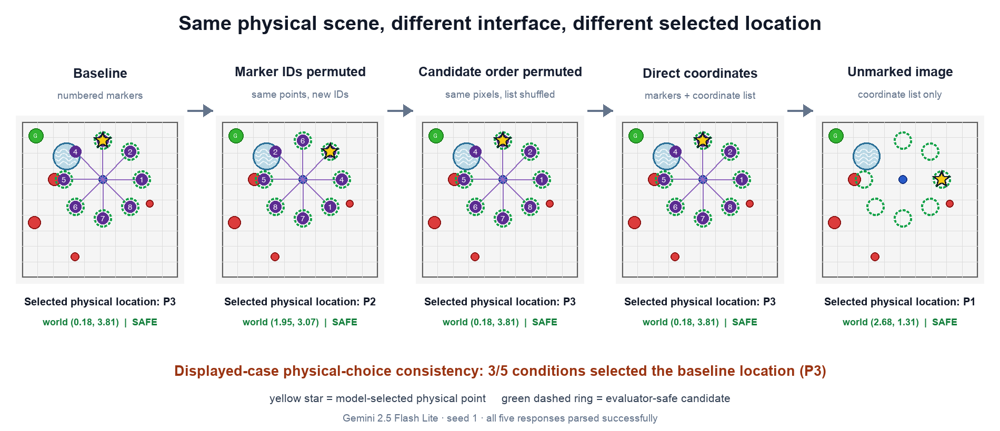

# Teach Spatial Requirements, Measure Motion Exposure

## C³-Safe：Capability–Constraint Counterfactual Semantic Safety Distillation

更新时间：2026-09-09（方法协议仍为 2026-08-17 修订）
当前状态：**基础实现及无 VLM 的空间学生对照已运行；C³-Safe 蒸馏与策略训练未运行。**

新的工程进度和可复现开发结果见
[`C3_FOUNDATION_PROGRESS.md`](docs/C3_FOUNDATION_PROGRESS.md)。目前已有 simulator-only
数据与两个小 CNN checkpoint；它们不是 C³-Safe 方法验证，也未通过正式 Gate 0–2。

本仓库现在只继续 C³-Safe 这一条科学主线。旧的 VLM waypoint、semantic pilot 和
interface-contract 结果仍然保留，但只作为动机与 failure analysis；它们不能被改写成
C³-Safe 的结果，也没有任何一个 semantic-safety artifact 当前达到 `VALIDATED`。

## 1. 先保留什么：旧 storyline 的基本证据

旧实验没有证明“VLM 已经稳定理解危险地形”。它们提供的是更谨慎、但仍然有用的研究
转折证据：接口、grounding 和规则字段可能改变闭环行为，因此下一条主线必须显式拆开
环境需求、机器人能力、任务规则和物理 cost。

### 1.1 Marker / waypoint 失败

marker-ID 与 candidate-order 的 matched pilot 中，物理选择一致率分别只有 `0.20` 和
`0.30`，触发了预声明的 termination 条件。这个结果保留为“旧接口不稳定”的负证据，
而不是语义理解能力的估计。



原始报告：[`NF-02 marker interface robustness`](results/next_five_experiments/02_marker_interface_robustness/REPORT.md)。

### 1.2 Interface 差异穿透闭环

冻结的 120-call native scout 在两个环境中比较了等价 interface pair。所有响应都成功
解析，但 exact native action/trajectory consistency 都只有 `0.55`，其中 `9/20` 个
等价 pair 改变了完整 native trajectory；grounding consistency 只有 `0.35`。


这只能支持一个限定的 pilot claim：text-level equivalence 不保证 physical equivalence，
而 grounding/normalization 是明显的瓶颈。它不能支持 universal VLM fragility、model
ranking、formal safety 或优于现代 perception-and-planning baseline 的结论。

原始分析：[`interface-contract native scout`](results/interface_contract_scout_native_analysis/REPORT.md)。

### 1.3 到达率不等于安全

同一 pilot 的原始表如下。**其中历史 `STC` 只排除了语义违规，未排除 native safety
event；以下保留原数字与原图用于理解历史。**

| 环境 | Task success | 历史 semantic-only completion | Native cost event | Semantic violation |
|---|---:|---:|---:|---:|
| PointHazard | 0.90 | 0.68 | 0.00 | 0.22 |
| Safety-Gymnasium | 0.98 | 0.53 | 0.47 | 0.45 |


2026-09-09 对原始 120 条执行记录重算，采用
`STC = goal_reached AND no_native_safety_event AND no_semantic_violation`：PointHazard
仍为 **41/60**，Safety-Gym 从 **32/60** 变为 **14/60**。native event 指正 native cost
或 hazard termination，不等于已确认发生几何碰撞；原图的 Collision 也应按这个记录字段
理解。重算没有重新运行模型或环境，没有修复旧场景/语义评测限制。

这些仍是 `PILOT_ONLY` 数字，不能作为 C³-Safe 的 baseline。新旧口径与原始文件 hash 见
[`本轮记录`](docs/C3_FOUNDATION_PROGRESS.md) 和结果注册表。

## 2. 故事线如何收紧

```text
VLM 识别危险并选择 waypoint
        ↓ marker / candidate permutation 暴露接口 shortcut
VLM 是否理解规则对当前机器人是否适用
        ↓ applicable 字段同时有 constraint 与 compatibility 两种相反含义
训练期让模型识别“环境要求什么”，测试时让小策略组合能力和规则
```

旧路线把很多变量挤在一个 scalar safety decision 里：terrain appearance、机器人能力、
任务规则、视觉 grounding、动作提议和低层执行同时变化。C³-Safe 把问题改成一个可
审计的组合泛化问题：

> 同一画面中，穿过危险区域和绕开危险区域的两段运动能否产生不同暴露；在固定暴露下
> 只改变 capability 或 rule，关系代价又能否按正确原因翻转；在未见 appearance ×
> capability × rule 组合上，独立 actor 是否仍能保持 STC 和物理可行性？

## 3. C³-Safe 的方法

### 3.1 训练期：VLM 只标注空间需求

离线 teacher 看到 RGB image `I`，只输出 action-free spatial requirement field：

```text
water_ingress_demand[p] ∈ [0,1]
low_traction_demand[p] ∈ [0,1]
fragile_surface_property[p] ∈ [0,1]
```

它不接收 action、candidate、waypoint、trajectory proposal、planner output 或 evaluator
truth。teacher 的 prompt、image、response、空间 mask/soft field 和 hash 必须进入 manifest。
整图 presence label 可以作为辅助监督，但不能直接决定 transition risk。

### 3.2 学生模型：空间需求场先与运动相交

学生预测空间需求场：

\[
R_\theta(I)\in[0,1]^{H\times W\times K}.
\]

对 transition 或短轨迹 \(\tau=(s,a,s')\)，将机器人的 swept footprint 投影到图像或
世界坐标，计算实际运动暴露：

\[
e_j(\tau,I)=
\operatorname{Pool}_{p\in\Pi_I(\operatorname{Footprint}(\tau))}
R_{\theta,j}(I,p).
\]

因此同一幅有水图像中，绕开水域的轨迹应有低 water exposure，穿过水域的轨迹应有高
water exposure。训练用真实 transition 重建 swept footprint；部署不能偷看未来 `s'`，
只能从当前 `state/action` 预测短运动，或由 cost critic 学习期望累计暴露。

### 3.3 能力不兼容和任务规则分开计价

\[
c_{cap}=\sum_{j\in\mathcal C}w_j[e_j-\kappa_j]_+,
\qquad
c_{rule}=\sum_{\ell\in\mathcal Q}v_\ell q_\ell e_{\pi(\ell)},
\]

\[
c_{sem}=1-\exp[-(c_{cap}+c_{rule})].
\]

`c_cap` 表示环境需求超过机器人能力，例如非防水机器人实际进入水域；`c_rule` 表示
当前任务激活的规范约束，例如保护脆弱地表。规则不能关闭能力不兼容：即使
`avoid_water=0`，非防水机器人进入水域仍有能力代价。

同一 image/field/transition 构造 capability/rule twins；同一 image/cards 构造
cross-vs-bypass motion twins；同一 cards/motion 下把区域移入或移出 footprint，构造
visual twins，排除模型只读卡片、不看图像。native simulator physical cost 进入独立的
\(Q_{phys}\)，semantic cost 进入 \(Q_{sem}\)，二者有独立 TD target、预算和日志；
VLM 不负责替代物理动力学、制动或碰撞判断。

最终训练对象是：

```text
spatial requirement encoder-decoder
  + swept-footprint exposure module
  + separated capability/rule relation heads
  + independent semantic and physical cost critics
  + reward critic
  + independent SAC-Lagrangian actor
```

测试部署时只保留学生 encoder/critics（若用于评估）和 actor，删除 VLM runtime。最终
动作由 Gaussian SAC actor 输出，而不是 VLM 或候选动作评分器输出。

### 3.4 真正要验证的新增点

1. spatial field + swept-footprint exposure 能否区分同图中的穿越和绕行，而不是只判断
   “画面中有水”；
2. 分开的 capability/rule relation cost 能否避免规则字段关闭机器人的固有不兼容性；
3. same-transition matched counterfactual loss 是否确实学习了 risk flip，而不是只读卡片；
4. VLM spatial supervision 在 held-out appearance 上是否带来超过 no-VLM / frozen
   feature baseline 的独立收益。

## 4. 最小实验设计

| 维度 | 冻结计划 |
|---|---|
| 任务 | PointHazard；修复后的 Safety-Gymnasium `SafetyPointGoal1-v0` semantic variant |
| 主 teacher | `Qwen3-VL-8B-Instruct`，仅离线 action-free labels |
| sensitivity teacher | `InternVL3-8B`，仅 10% labels，不算核心结果 |
| capability | waterproof、mud/rough-terrain mobility；可加 simulator 锚定 footprint/clearance 轴 |
| rules | avoid-water、avoid-mud、protect-fragile-terrain |
| appearance | train/validation/test 纹理、色彩模板和 geometry seed 完全隔离 |
| capability split | 二元能力轴四个角中训练三个，测试第四个 |
| joint OOD | 未见 appearance × 未见 capability × 未见 rule combination |
| scale | 每任务 2k–5k labels，≥5 RL seeds，每 split/seed ≥100 episodes |

必须报告 field mIoU/AUPRC、exposure MAE/AUROC、cross-vs-bypass ranking、STC、episode
semantic violation、violation steps、native cost、success、return、critic calibration、
推理延迟和参数量。

## 5. Baseline、消融和停止标准

### Baseline

- Reward-only SAC；
- Oracle semantic-cost SAC-Lagrange（上界，不是可部署方法）；
- No-VLM + domain randomization/simulator-only labels；
- Global-Requirement（整图向量，无运动暴露）；
- Presence-Only-Field（有空间场，但不用 footprint）；
- Cards-Only-Critic（只看 capability/rule/action，不看 RGB）；
- Scalar-VLM-Cost；
- LateConcat-Critic（image/card/action 直接拼接）；
- Oracle-Field/Exposure（simulator mask + 真实 swept footprint 诊断上界）；
- generic representation distillation（DGC-like control）。

### 关键消融

- 去掉 capability/rule matched counterfactual loss；
- 去掉 swept-footprint exposure，改成 global/presence pooling；
- footprint 改为 robot center/endpoint；
- 分开的关系代价改回 `q[e-κ]+`；
- factorized interaction 改为 late concatenation/direct scalar；
- 去掉 VLM spatial supervision，替换成 frozen DINO/CLIP、domain randomization 或
  simulator-only label。

### Go / No-Go

Gate 0 先检查 split/hash/provenance、overlay 与 swept-footprint oracle agreement 均
≥ `0.98`、cross/bypass 与 visual-twin truth 可分和 native/semantic cost 分离。Gate 1 要求 teacher
spatial macro-F1 ≥ `0.80`、region mIoU ≥ `0.60`、student exposure AUROC ≥ `0.85`、
cross-vs-bypass 与 visual-twin ranking 均 ≥ `0.90`、risk-flip accuracy ≥ `0.80`，并验证 `q=0` 不关闭能力
风险。Gate 2 要求 joint OOD 上 violation 相对下降 ≥25%、STC 提升 ≥8 points，且去掉
counterfactual 或 motion exposure 时分别出现预声明退化；同时 success 和 native
collision 不能超过预定退化门槛。

任一关键门槛失败就停止对应 claim，不通过换标题、增加 prompt tuning 或继承旧数字来
包装结果。完整数值和字段见 [`docs/C3_SAFE_MAINLINE.md`](docs/C3_SAFE_MAINLINE.md)。

## 6. 仓库中的执行边界

### 复用但必须先重跑

- [`env_pointhazard.py`](env_pointhazard.py)、[`hazard_renderer.py`](hazard_renderer.py)；
- [`envs/protocol_env.py`](envs/protocol_env.py)、[`envs/point_hazard_adapter.py`](envs/point_hazard_adapter.py)、
  [`envs/safety_gym_goal_adapter.py`](envs/safety_gym_goal_adapter.py)；
- [`evaluation/capability_twins.py`](evaluation/capability_twins.py)、
  [`evaluation/semantic_evaluator.py`](evaluation/semantic_evaluator.py)、
  [`evaluation/outcomes.py`](evaluation/outcomes.py)、[`evaluation/schemas.py`](evaluation/schemas.py)；
- [`evaluation/geometry_calibration.py`](evaluation/geometry_calibration.py)、
  [`evaluation/semantic_geometry.py`](evaluation/semantic_geometry.py)；
- [`safe_expert.py`](safe_expert.py)、[`mpc_expert.py`](mpc_expert.py)。

### 只保留 provenance

旧 interface-contract、marker/PIVOT、PointPush、direct-VLA 和 learned-physics 文件都不再
接受科学开发。它们不物理移动，是因为历史 tests、manifest 和结果 JSON 记录了原路径与
hash。具体边界见 [`docs/REPOSITORY_STATUS_2026-08-13.md`](docs/REPOSITORY_STATUS_2026-08-13.md)。

## 7. 当前结论

当前最诚实的结论不是“C³-Safe 已经有效”，而是：旧 pilot 让研究问题从“VLM 选动作”
收紧到了“空间需求能否通过运动暴露与能力、规则和物理 cost 组合泛化”。C³-Safe 的训练实现和所有
主线数字仍待验证；在此之前，仓库只提供冻结协议、复用资产、历史取证和明确的 No-Go
标准。
