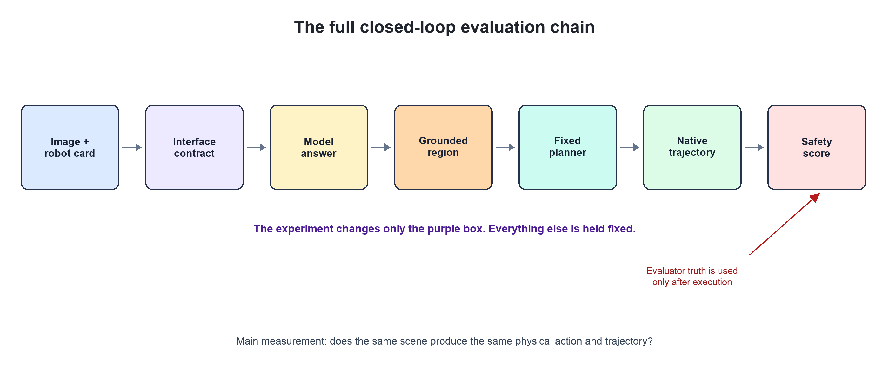
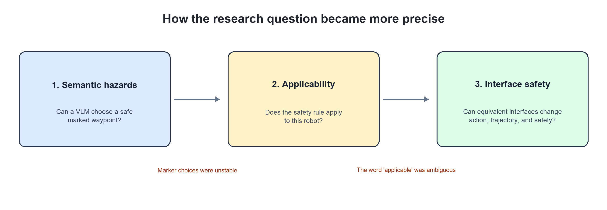

# When Equivalent Interfaces Change Robot Safety

Updated 2026-07-29 · Evidence status: **PILOT_ONLY**

## 1. Background

A modular robot system has many hand-offs. A VLM may identify the correct
hazard, but the system can still fail when different answers are converted into
common fields, a region is located in the image, an action is sent to a planner,
or a controller executes it. Our unit of evaluation is therefore the **whole closed loop**.

The evaluator's true hazard geometry is kept away from the model, planner, and
controller. It is used only after execution to score collision, semantic
violation, task success, and Safe Task Completion (STC).

## 2. How the project reached this question

The earlier project treated a VLM as the decision maker instead of training an
end-to-end vision-language-action policy. An online learned-physics model
rendered candidate consequences for PIVOT, and the VLM selected among them.
That approach improved the narrow PointHazard navigation task, but it did not
yet support a broader robotics claim. Recent modular robot systems also tend to
use VLMs for high-level semantic decisions and leave low-level motion to a
conventional controller. We therefore fixed an MPC-style controller underneath
the VLM and restarted from a deliberately simple question: can the model notice
a semantic hazard such as water and tell the controller how to act?

### Stage A — Marked waypoint selection

The original system asked a VLM to choose a numbered waypoint. This follows a
useful modular idea: the VLM supplies semantic knowledge, while a fixed
controller handles motion.

The first marker-based results looked positive, but the physical choice was not
stable under changes that should not alter the scene:

| Interface perturbation | Same physical choice as baseline |
|---|---:|
| Permute marker IDs | 0.20 |
| Permute candidate order | 0.30 |
| Use direct coordinates | 0.40 |
| Remove markers | 0.10 |

All four values were far below the predeclared 0.80 continuation threshold.
The original result could therefore have reflected a marker or ordering shortcut;
it did not cleanly show that the VLM understood water and repeatedly selected
the same safe physical location. The marker-based mainline was stopped, while
these numbers were retained as negative evidence.

### Stage B — Rule applicability

The next idea was that a model might recognize water but fail to decide whether
the safety rule applies to a particular robot.

The next audit supplied an explicit capability card—for example, a wheeled
robot that cannot enter water or an amphibious robot that can—and asked the VLM
to return an `applicable` field in its prompt response. That word was ambiguous:
it could mean either “the avoid-water constraint applies” or “the terrain is
compatible with this robot.” For a non-waterproof robot, these two natural
readings have opposite answers:

| Question | Answer |
|---|---|
| Does the **avoid-water rule** apply? | Yes |
| Is the **water terrain** applicable for travel? | No |

The old evaluator chose one meaning, while model responses often used the
other. A score built on this ambiguous field cannot cleanly measure model
reasoning. This exposed a second measurement failure rather than a clean test
of the model's capability reasoning.

### Stage C — Interface-conditioned safety

The ambiguity itself motivated a better research question:

> If the scene, robot, model, planner, and controller stay the same, can an
> equivalent interface description still change the robot's real action,
> trajectory, and safety result?

We compare interfaces with a frozen shared meaning, then check whether they
remain equivalent through the closed loop:

1. whether the code can read the answer;
2. meaning after conversion to common fields;
3. the physical region located in the image;
4. planner action and exact native controller action;
5. exact native trajectory and post-hoc safety outcome.

Each checkpoint is measured pairwise: for the same scene, robot, model, planner,
and controller, we report the fraction of equivalent-contract pairs that remain
identical at that checkpoint. STC is scored separately after execution.

## 3. What the current scout tested

The frozen scout used:

- 2 VLMs: Mistral and Qwen;
- 2 native environments: PointHazard and Safety-Gymnasium;
- 5 scene seeds per model;
- 5 kinds of equivalent interface pairs;
- 120 model calls, followed by zero-call native replay.

The five matched changes were concrete rewrites of the same required answer:

| Pair | What changed | Frozen shared meaning |
|---|---|---|
| Field order | JSON fields began with `terrain_class` or `action` | Same terrain, disk, and action |
| Structured vs. free text | JSON object or one semicolon-delimited line | Same terrain, disk, and action |
| Constraint polarity | `constraint_applies` or `constraint_does_not_apply` | Whether the terrain must be avoided |
| Compatibility polarity | `terrain_compatible` or `terrain_incompatible` | Whether the terrain may be traversed |
| Constraint vs. compatibility | `constraint_applies` or `terrain_compatible` | Same safety decision expressed with opposite label semantics |

For example, `constraint_applies=yes` and `terrain_compatible=no` both mean
that the robot must avoid the terrain. The scene, capability card, low-level
controller, and post-hoc evaluator stayed fixed within every comparison.

### Baseline native executions

Before using real model outputs, a provider-free bridge test ran **640 native
executions**. Equivalent fixture inputs produced identical actions and
trajectories (consistency 1.00). This control suggests that the replay and
coordinate-conversion code do not create differences by themselves.

## 4. Main result: clean text did not mean equal behavior

All 120 responses parsed successfully. Consistency then fell as the answer
moved through the robot stack:

| Level | Matched-pair consistency |
|---|---:|
| Parse | 1.00 |
| Meaning after conversion | 0.70 |
| Grounded region | 0.35 |
| Planner action | 0.75 |
| Exact native action | 0.55 |
| Exact native trajectory | 0.55 |

In a small closed-loop scout, only **11 of 20 matched interface pairs**
produced the same exact native action and trajectory. The other 9 pairs changed
both. This pilot used two models, two environments, five scene seeds per model,
and one scenario family; the effect appeared in both environments.

Here, **parse** means both responses satisfy their required syntax; **meaning
after conversion** means they normalize to the same terrain, safety meaning,
and proposed action; **grounded region** means the predicted disk has the same
normalized center and radius; **planner action** means both become the same
`avoid`, `traverse`, or `unknown` command; **exact native action** compares the
controller's complete action-sequence hash; and **exact native trajectory**
compares the complete executed trajectory hash.

The main message is simple: **a valid and apparently sensible text answer is
not enough**. Grounding and downstream interpretation can still change what the
robot actually does.

The clearest example was structured JSON versus free text. Their normalized
meaning and planner action matched, but their grounded regions did not. Only one
of four model-by-environment comparisons kept the same native action.

## 5. The changes reached real trajectories

For seed 20, constraint wording and compatibility wording produced different
paths in all four model-by-environment cells. In two cells, the planner changed
from `avoid` to `traverse` and STC changed from 1 to 0.

Across the full scout:

- **9 of 20** matched pairs changed the exact native action and trajectory;
- mean contract-induced STC range was **0.15** for equivalent contracts;
- mean STC range was **0.30** when ambiguous output mappings were included.

Both values passed the preregistered 0.10 continuation gate.

## 6. Reaching the goal was not the same as being safe

The robot usually moved and usually reached the goal, but its safety result was
weaker:

| Native environment | Task success | STC | Collision | Semantic violation |
|---|---:|---:|---:|---:|
| PointHazard | 0.90 | 0.68 | 0.00 | 0.22 |
| Safety-Gymnasium | 0.98 | 0.53 | 0.47 | 0.45 |

This is why the project reports task success and safety separately. A robot can
reach the goal after taking an unsafe route.

## 7. Where the differences started

Among the 20 matched pairs:

- 6 were fully consistent;
- 6 first differed while converting the answer to common fields;
- 7 first differed during grounding;
- 1 first differed at the planner.

The controller rescued some upstream errors, but not reliably. Grounding is the
clearest technical bottleneck in this pilot.

## 8. What we can and cannot claim

The current evidence supports these careful statements:

- Equivalent-looking interfaces changed physical behavior in this scout.
- Text-level evaluation would have missed part of the effect.
- Grounding and normalization were the main early sources of difference.
- The effect reached two native environments and two different models.

The current evidence does **not** support these stronger statements:

- all VLM robot systems are interface-fragile;
- one tested model is generally safer than the other;
- the system provides formal safety guarantees;
- the current pilot is a validated paper result;
- VLMs are better than a fair modern perception-and-planning baseline.

The official status remains `PILOT_ONLY`. No semantic-safety result in this
repository is currently `VALIDATED`.

## 9. Literature-supported next steps

The next work should test the mechanism more carefully, not simply make the old
experiment larger.

| Priority | Next step | Why it follows from this project | Literature support |
|---:|---|---|---|
| 1 | Freeze a second paired scenario family, such as robot clearance or capability, and preregister every equivalent interface pair. | The current result has only one scenario family. A matched family tests whether the effect is more than a water-scene special case. | [When Benchmarks are Targets (ACL 2024)](https://aclanthology.org/2024.acl-long.744/) shows that small choice-order and answer-selection changes can alter model rankings. [HazardArena (2026)](https://arxiv.org/abs/2604.12447) uses matched safe/unsafe twins to isolate semantic risk. |
| 2 | Replace coarse point/disk text grounding with mask or polygon grounding, and compare it with a strong open-vocabulary perception baseline. | Grounding consistency was only 0.35 and stage accuracy was 0.04. The next experiment must separate language reasoning from localization quality. | [PIVOT (ICML 2024)](https://proceedings.mlr.press/v235/nasiriany24a.html) and [CoNVOI (IROS 2024)](https://arxiv.org/abs/2403.15637) make spatial grounding explicit before control. [SCAN (CVPR 2024)](https://openaccess.thecvf.com/content/CVPR2024/html/Liu_Open-Vocabulary_Segmentation_with_Semantic-Assisted_Calibration_CVPR_2024_paper.html) provides a modern open-vocabulary segmentation reference. [CORE (2026)](https://arxiv.org/abs/2602.19983) also treats grounding as a required step before safety enforcement. |
| 3 | Keep the paired test in at least two native environments and report task success, collision, semantic violation, and STC separately. | Safety-Gymnasium had higher task success but lower STC, so goal completion alone hid safety failures. | [Safety-Gymnasium (NeurIPS 2023)](https://papers.nips.cc/paper_files/paper/2023/hash/3c557a3d6a48cc99444f85e924c66753-Abstract-Datasets_and_Benchmarks.html) provides standardized constrained robot environments and separate safety costs. |
| 4 | Add leak-free capability and appearance twins, including a text-only control. | The model should react to the true robot capability, not to a leaked terrain name or visual shortcut. | [VLSBench (ACL 2025)](https://aclanthology.org/2025.acl-long.405/) shows that text can leak visual safety information and make multimodal evaluation unreliable. HazardArena provides a recent robotics example of matched semantic twins. |
| 5 | Only after the measurement is stable, test an uncertainty gate or independent safety layer. | A controller sometimes rescued model errors, but it did not remove interface effects. A safety method should be evaluated on top of a clean measurement protocol. | CORE combines contextual grounding with a control-barrier-function layer; HazardArena evaluates a separate Safety Option Layer. Both support keeping semantic inference and enforcement conceptually separate. |

### Immediate work with no new paid calls

1. Freeze the second scenario family and its ground truth.
2. Add mask/polygon grounding and a modern perception baseline.
3. Run the full pipeline with fixtures and cached responses.
4. Predeclare the paired statistics, confidence intervals, and stop rules.
5. Freeze model revisions, reasoning-token limits, and the maximum budget.

### Paid work only after approval

Run one small, paired second-family scout under the repository's five-seed-per-key
ceiling. Do not start the full 1,440-call design until the second family repeats
the effect and the cost controls pass.

## 10. Recommended paper direction

The strongest current direction is a **measurement and evaluation paper**:

> Embodied safety scores should be reported as a closed-loop stability envelope
> across equivalent interface contracts, not as one number from one prompt and
> one parser.

This is stronger and more honest than claiming that the current VLM “understands
hazards.” A method paper should come later, after the measurement result repeats
across another scenario family and stronger grounding baselines.

## Evidence and reproducibility

- Result status authority: [`docs/RESULTS_REGISTRY.md`](docs/RESULTS_REGISTRY.md)
- Frozen current protocol: [`docs/INTERFACE_CONTRACT_PROTOCOL.md`](docs/INTERFACE_CONTRACT_PROTOCOL.md)
- Native scout analysis: [`results/interface_contract_scout_native_analysis/REPORT.md`](results/interface_contract_scout_native_analysis/REPORT.md)
- Machine-readable analysis: [`results/interface_contract_scout_native_analysis/ANALYSIS.json`](results/interface_contract_scout_native_analysis/ANALYSIS.json)
- Provider-free bridge: [`results/interface_contract_experiment_0/SUMMARY.json`](results/interface_contract_experiment_0/SUMMARY.json)
- Archived detailed Chinese narrative: [`legacy/docs/advisor_rewrite_2026-07/INTERFACE_CONTRACT_SCOUT_REPORT_ZH.md`](legacy/docs/advisor_rewrite_2026-07/INTERFACE_CONTRACT_SCOUT_REPORT_ZH.md)

All headline numbers above are copied from checked-in result artifacts. Figures
are rebuilt by `scripts/build_interface_contract_scout_report_figures.py` and
`scripts/build_research_story_figures.py`.
