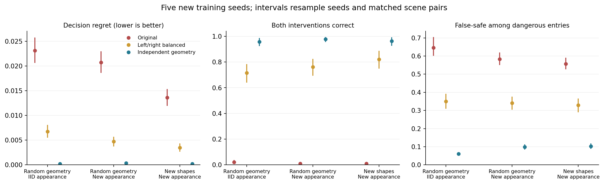

# C³-Safe：随机布局确认实验与论文推进

日期：2026-09-12。本轮承接
[`C3_PAPER_PROGRESS_2026-09-12.md`](C3_PAPER_PROGRESS_2026-09-12.md) 的前两项下一步。
所有数据生成、测试、训练、统计、权重复核和作图均在 Quest 的 Slurm allocation 内执行。

**核心进展：上一轮的位置平衡修复在更严格的新测试上获得支持；更充分的随机布局训练
进一步改善表现。但“动作排序接近正确”仍不等于“安全代价已经可靠”。**

本轮为预先冻结的组件研究。仓库主线状态仍为 `PILOT_ONLY / METHOD_NOT_VALIDATED`，
不等于 C³-Safe Gate 0–2 通过，也没有合格 VLM 标签或闭环策略结果。

英文论文补充稿：[`PAPER_ADDENDUM.md`](../research/independent_confirmation_20260912/reports/PAPER_ADDENDUM.md)。
数值真相源：[`SUMMARY.json`](../research/independent_confirmation_20260912/reports/SUMMARY.json)。
独立复核：[`VERIFICATION.json`](../research/independent_confirmation_20260912/reports/VERIFICATION.json)。

## 1. 把场景生成器里的固定答案去掉

新生成器先采样两个匿名、不重叠的区域，再用独立随机流分配属性。位置、尺寸、旋转、
形状均变化；训练形状为椭圆和矩形，额外测试菱形与超椭圆。
四条候选路径与区域属性、位置独立采样，拥有相同起终点和不同中间路点。
路径不会因为暴露值、不符合预期排序或存在安全绕行而被丢弃。

同一场景的两个版本交换可见属性纹理和目标场，保留形状占据、路径、足迹、卡片和背景随机种子。
候选使用匿名顺序；评分依据实际 16×16 暴露和公开代价公式，不依据候选名称。
模型输入仍然只有 RGB，路径不画入输入图像。

| Split | 场景对 | RGB 数 | 真正改变唯一最优动作的卡片对 |
|---|---:|---:|---:|
| 随机布局、训练外观 | 600 | 1,200 | 220 |
| 随机布局、新外观 | 600 | 1,200 | 224 |
| 新形状、新外观 | 600 | 1,200 | 154 |
| 旧布局回归检查 | 200 | 400 | 398 |
| 独立校准集 | 300 | 600 | 84 |

配对正确率只使用两个版本的最优动作都唯一、间隔至少为 0.002 且最优动作确实改变的卡片对。
其余场景仍计入 regret、误判安全和 coverage。并列预测按均匀随机选择的期望计分。

2,000 对测试场景由 15 个模型共用，不是 30,000 对独立场景。跨 split 图像/几何重合为零。
`DATASET_AUDIT.json` 中的原始 argmin 候选计数含并列时取第一个的诊断偏差；正式指标使用上述
均匀 tie 规则，不能用那组诊断计数判断候选角色泄漏。

## 2. 三个训练方案、五个新种子

模型种子为 20261011、20261023、20261037、20261051、20261069。
每组 800 张训练图、100 张验证图，使用同一 ResNet-18、损失、优化器、增强、checkpoint
选择方法、24 epoch 上限和时间上限。

- **原始训练**：保留历史左右位置关系。
- **左右平衡**：训练与验证各一半图像交换真实属性，重绘 RGB。
- **独立随机布局**：训练与验证都换成上述随机位置和形状分布。

这些是训练和验证分布的共同干预，不是仅修改训练集的消融。早停条件一致，但实际步数
并不完全相同：原始一颗种子运行 22 epoch，平衡一颗运行 17 epoch，其余为 24 epoch。
各自实际步数、训练时间、权重 hash 已记录，不据异构 GPU 比较训练速度。
独立方案还将源属性/足迹栅格由历史的 48×48 换成 64×64，再统一池化为 16×16。
因此它与平衡方案的差异是数据/渲染管道的共同变化，不能单独归因为“位置独立化”。
主要比较的原始和平衡训练均保持历史源栅格，二者没有这个差异。

## 3. 主要比较通过，同时保留次要比较的身份

事先规定的主要比较是：在“随机布局＋新外观”上，左右平衡相对原始训练降低 regret，
且 false-safe 增幅不超过 1 个百分点。统计同时重采样五个训练种子和场景对，保持方案、
图像版本、卡片与候选的配对关系，共 5,000 次。

regret 降低 **0.0160171**，95% 区间 **[0.0140600, 0.0181573]**。
false-safe 增幅的区间上界是 **−19.01 个百分点**，因此两项条件均通过。
这支持前一轮修复的可迁移性；不证明任何闭环安全保证。

下面是同一主要测试上的五种子均值。独立随机布局的比较属于预先列出的次要分析，
没有多重比较校正，不能事后改称唯一主要终点。

| 训练方案 | Field mIoU | A/C/D regret | 配对正确率 | 危险候选误判安全率 |
|---|---:|---:|---:|---:|
| 原始 | 0.10135 | 0.0207242 | 0.89% | 58.29% |
| 左右平衡 | 0.38996 | 0.0047071 | 76.07% | 34.08% |
| 独立随机布局 | 0.80489 | 0.0003475 | 97.77% | 9.85% |

这里“危险”按合成 mean-exposure 代价大于 0.02 定义，不是机器人真实碰撞概率。

独立训练的配对正确率区间为 **[95.50%, 99.43%]**，false-safe 区间为
**[8.47%, 11.30%]**。五个种子仍不足以精确刻画所有训练随机性，原始逐种子数值也保留。

新形状＋新外观下，独立训练配对正确率 **96.36%**，false-safe **10.29%**。
旧原始布局的 mIoU 从原始训练的 **0.94456** 变为独立训练的 **0.93024**，regret
从 **0.0008127** 变为 **0.0009171**。泛化改善伴随小幅原布局退化，应如实报告。

本轮主指标排除了恒为零代价的 B 卡，使用 A/C/D；上一轮部分表格是四卡平均。
新随机场景还包含零暴露绕行。不能直接比较两轮的 regret 绝对数值并宣称方法增益。

## 4. 风险校准暴露了下一处瓶颈

每个模型先导出 checkpoint，再用独立 300 对校准场景计算最大正向代价低估：覆盖一对内
两个图像、所有动作和 A/C/D。固定 5% 校准水平使用第 286 个顺序统计量，随后才打开测试集。

独立训练的校准偏移为 **0.04871–0.05541**；其余两组更大。所有偏移都高于事先固定的
安全阈值 **0.02**。因此三个方案在这个阈值下，校准后的动作接受率全部为 **0**。
条件危险率记为 undefined，不能把“所有动作都拒绝”写成“零风险且可用”。

未经校准的独立训练，在新外观下接受 **83.86%** 的决策，其中 **9.32%** 实际代价超过 0.02。
这与 9.85% 的危险候选漏报率是不同分母：前者看接受的决策，后者看所有危险候选条目。

校准只对同分布的随机布局 IID 场景具有交换性解释；新外观下，独立模型的整对代价上界
失败率达到 **20.60%**，新形状＋新外观为 **12.87%**。不能把 IID 校准保证扩展为 OOD 保证。
采用的是已有 split-conformal 框架在场景对最大残差上的应用，不是新的 conformal 方法。
参考：[Angelopoulos and Bates](https://arxiv.org/html/2107.07511v6)。

## 5. 关系头结论需要更精确

上一轮固定候选场景上，关系头和公式的 regret 完全相同。新随机候选下，这个结论不再处处成立。
在原始感知模型很差时，no-CF 关系头相对公式降低新外观 regret 约 **0.002538**；
左右平衡后反而增加约 **0.000743**，独立训练后增加约 **0.0000182**。

因此不能写成“学习关系永远没有作用”。当前证据是：关系头的结果依赖上游感知误差与
候选分布；在更好的独立感知下，公开公式仍是强对照，额外 CF loss 的必要性没有得到支持。
原始模型上的改善机制尚未被单独定位，不擅自归因为误差补偿或真正的语义推理。

## 6. 可追溯运行与复核

- Quest 根目录：`/projects/p33100/siosio/hazard_independent_confirmation_20260912`。
- 冻结时间：**2026-09-12 14:24:11 UTC**，早于正式数据生成。
- 数据作业：`6176529`；GPU array：`6176550`，15 个任务均 `COMPLETED / 0:0`。
- 13 项最终预检通过。第一次预检的 NumPy 负 stride 问题已在冻结前修复，保留失败日志。
- 208 个数据/运行 manifest 文件已校验；全部 15 份 checkpoint 留在 Quest。
- 独立复核逐项重算公式、regret、false-safe、有效配对、coverage 与条件风险，并在 Quest CPU
  重放每个模型的固定四张图。**15/15 模型、60 张图全部通过；二值场一致率 100%，最大概率差
  0.00259561**。GPU 预测仍是数值真相源，没有被 CPU 重放替换。
- 原报告作业 `6176551` 完成汇总与第一模型复核后，因反复解压 NPZ 耗时被主动停止。
  新增 `verify_cached.py` 仅缓存读取的数组，评分公式和容限完全相同；原冻结脚本、预测、
  汇总与日志不变。`VERIFIER_IO_AMENDMENT.txt` 记录时间和父/新脚本 hash。
- 恢复作业 **6177655 已 COMPLETED / 0:0**，完成全部独立复核和论文补充稿/两张图的生成。
- 绘图库仅安装在本次 Quest 目录的 `report_deps/`；共享训练环境和 Qwen 环境未修改。
- 本轮 VLM generation / 付费调用：**0**。没有训练 actor 或修改其他项目作业。

## 7. 下一步具体做什么

1. **固定采用独立随机布局模型作为下一阶段感知对照。** 保留五个种子，后续新干预使用新测试
   seed。当前测试已消费，不能边调校准边反复把它叫 untouched holdout。
2. **先定位高置信度低估，再冻结一次校准比较。** 分开考察继承的 −2 logit 偏移、输出场的
   边界误差、整对最大残差的保守性及外观偏移。目标同时约束危险漏报和有效接受率，保留
   原始策略、当前全局上界作为基线。不要通过临时提高安全阈值制造好看的 coverage。
3. **准备小规模 teacher 可辨识性资格审查。** 当前纹理仍是明确约定的程序化符号，并不能证明
   VLM 会把它们理解为真实水域/易损地面。先有可辨识渲染和人工语义参考，再扩展标签；
   不使用历史 unknown-only 回答训练学生。
4. **组件可用后再接闭环。** 先跑相同候选/规划权限下的 oracle 与 learned cost 控制对照，
   再考虑独立 semantic/native critics 和 SAC；静态配对正确率不能替代 success、native cost、
   semantic violations 和延迟测量。

论文当前最稳妥的论点是：**干预式评测发现并缓解空间捷径，但视觉判别与决策排序的改善
并没有自动解决可用的安全校准。** 这是本轮真实证据支持的推进方向。
