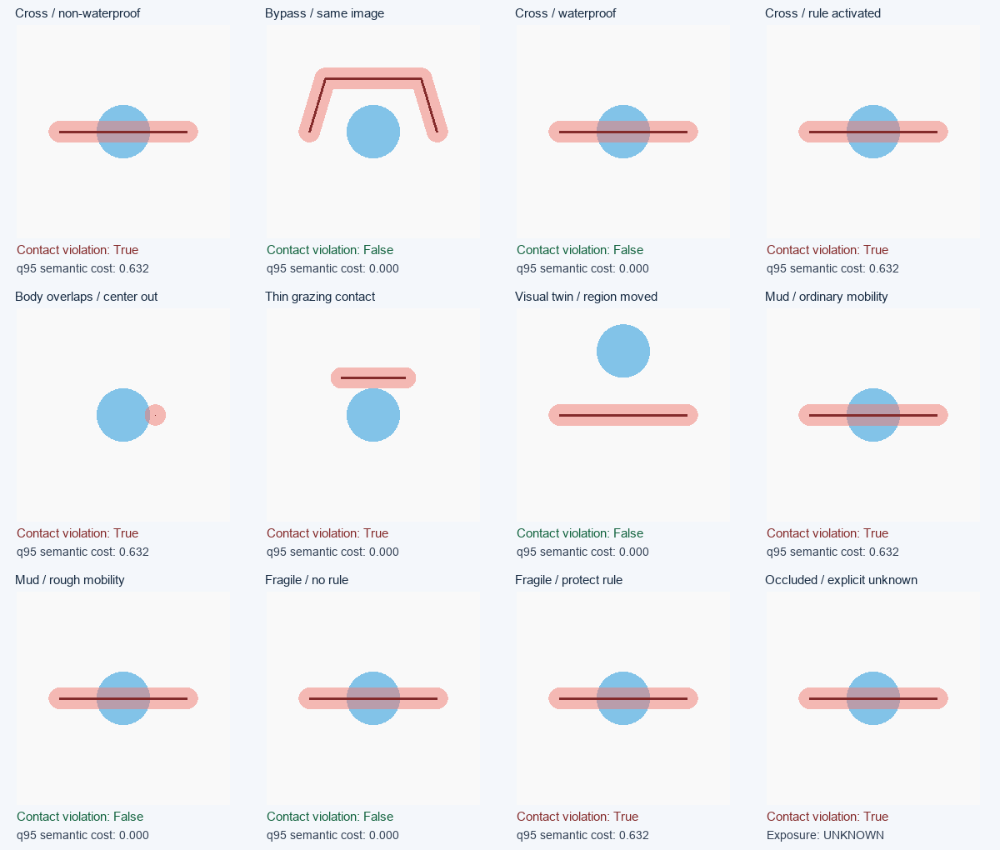
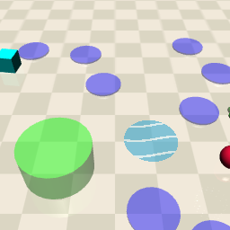
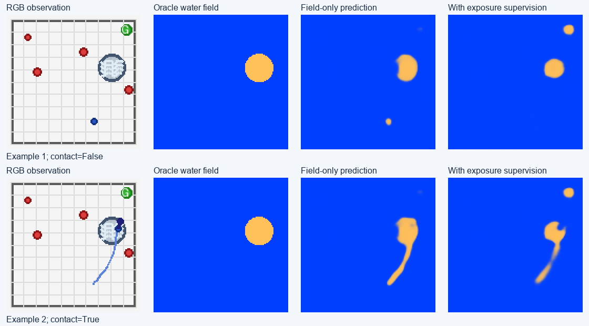

# C³-Safe 实施进度与开发证据

记录日期：2026-09-09；本轮运行跨 2026-09-08/09，精确 UTC 时间在各 run manifest 中。

> 本文是当时本地分支的实施快照。后续已定位 Quest 存储和模型、运行真实 teacher，并发现
> 另一条远端分支更多进展，见 [`2026-09-12 更新`](C3_QUEST_PROGRESS_2026-09-12.md)。
> 下文“需要提供模型路径”的资源缺口已经解决。

**现在已经有可运行的几何评测、数据采集与无 VLM 视觉学生训练管道。还没有真实 VLM
蒸馏、C³-Safe 策略训练或可作为论文主结果的证据。** 这次最有价值的发现是：像素识别的
分数、运动暴露的排序和安全阈值下的行为可能明显不一致，后续不能只看 AUROC。

工作目录为 `/Users/hanshuo/Desktop/hazard`，分支 `codex/c3-safe-foundation`，起点为
`eebf1b5a8331d79ce320cf5bf05ac679834a66b9`。这是从原项目
`/Users/hanshuo/Desktop/hazard-vlm-safe-control` 建立的独立副本；原目录保持不变。
本地原始产物在 `results/c3_*/`，完整数值摘要与 hash 已保存在
[`C3_FOUNDATION_RESULTS_2026-09-09.json`](C3_FOUNDATION_RESULTS_2026-09-09.json)。

## 1. 按优先顺序完成的工作

| 优先项 | 本轮完成内容 | 代码入口 | 当前边界 |
|---|---|---|---|
| 统一安全记账 | 到达、native safety event、semantic violation 分开记录；STC 由一个 reducer 计算 | `evaluation/outcomes.py`、`schemas.py`、`harness.py` | 新口径为 `safety-accounting-v2`；历史结果单独重算 |
| 运动与几何真值 | 世界坐标投影、圆形身体 swept footprint、q95/max/mean 暴露、解析接触真值 | `c3_safe/geometry.py` | q95 是软严重度，不能代替二元接触安全判定 |
| 能力/规则分离 | 独立 capability cost 与 rule cost；关闭规则不能关闭能力不兼容 | `c3_safe/costs.py` | 已实现解析关系，尚未学习 relation head/critic |
| 两个环境的评测接入 | PointHazard typed-region adapter；Safety-Gym 原生子步轨迹、身体半径、逐步违规与校准 overlay | `c3_safe/point_adapter.py`、`native_motion.py`、`envs/safety_gym_goal_adapter.py` | Safety-Gym 为受控地面注释 overlay，未实现真实水/泥动力学 |
| 开发数据和反事实 | 固定 splits、同 transition 重标能力/规则、禁止 held-out 组合进入训练 target、准备 action-free teacher requests | `c3_safe/data.py`、`scripts/collect_c3_oracle_data.py` | 已采集数据只有水域；其他关系仅有解析案例 |
| 无 VLM 学生对照 | RGB-only 小 CNN 的空间监督与加运动暴露监督两组训练、checkpoint 重载与指标比较 | `c3_safe/spatial_student.py`、`scripts/train_c3_spatial_baseline.py` | simulator masks；不输出控制动作；没有反事实学习损失 |
| 可追溯产物 | 开始运行时复制源码、记录版本/依赖/dirty/hash、拒绝覆盖非空 run、保留失败状态 | `c3_safe/artifacts.py` | 完成运行不代表科学有效性；旧 source manifest 按其记录的历史 commit 核验 |

另外修复了 PointHazard grid fallback 使用硬编码身体/目标半径的问题，以及 Safety-Gym
在最后一步达到目标时的 termination 归类。记录过原生安全代价后再超时，也被保留为合法
但不安全的 episode，不再与 outcome schema 冲突。

## 2. 安全记账重算：旧 Safety-Gym 的 32/60 应如何理解

当前定义为：

```text
native_safety_event = any(native_cost > 0) OR termination_reason == hazard
semantic_safe_success = reached_goal AND NOT semantic_violation
STC = reached_goal AND NOT native_safety_event AND NOT semantic_violation
```

`physical_collision` 是沿用的字段名，其含义是 native safety event；正的 native cost
不能自动翻译成已经发生几何碰撞。新代码显式保存 schema version 和
`semantic_safe_success`，使两种口径可以同时解释。

对旧 native scout 的原始 120 条执行记录逐条重算：

| 环境 | 原记录数 | 历史 semantic-only completion | 严格 STC |
|---|---:|---:|---:|
| PointHazard | 60 | 41/60（68.3%） | 41/60（68.3%） |
| Safety-Gymnasium | 60 | 32/60（53.3%） | 14/60（23.3%） |

产物：`results/c3_accounting_recount_20260909_v2/`。输入为
`results/interface_contract_scout_native_analysis/PRIMARY_EXECUTIONS.json`，SHA256 为
`6b57cc5c6b315f744c758a77087dd3abf8a7ee103af4e70eb639e9d7d9d54a1c`。
这是对定义的重算，没有重新调用模型，没有重放环境，也没有修复旧语义布局和旧 evaluator
的局限；不能把 14/60 视为一次新的有效实验。

## 3. 几何和真实 native 检查实际跑到了哪里

主检查产物：`results/c3_safe_native_checks_20260908_v2/`。

| 检查 | 观察到的结果 | 如何理解 |
|---|---|---|
| 12 个解析案例 | 二元判定 12/12 通过 | 包括穿越、绕行、身体接触但中心在外、能力/规则、motion/visual twins |
| 400 条随机运动的 raster 检查 | agreement 99.5% | 128×128 分辨率；参照独立的 3,001 点密集轨迹采样 |
| 零交集样本的暴露误报 | 0/254 | 当前几何分布的开发检查，不是视觉学生误报率 |
| 真实 MuJoCo 相机标记 | 100 次尝试，88 个可见；88/88 在 2 px 内 | 12 个被遮挡或位于视野外；最大偏差 1.395 px，平均 1.170 px |
| native transition 保持一致 | 12 个动作的 observation/reward/cost/termination flags 与原生参考一致 | 语义评测没有改写环境原生输出 |
| native 子步语义判定 | 每步记录 12 个位置样本；step 与独立 evaluator 一致 | 不是只连起动作起点/终点，也不是只检测机器人中心 |



Safety-Gym 的身体足迹采用接触几何的保守圆形包络，本机 Point 半径约为
`0.1866025404`。投影来自实际 `fixednear` 相机的外参和 fovy；渲染的是覆盖在 native
RGB 上的地面属性注释，不能声称已经模拟了水、泥、真实纹理或正确的物体遮挡。
通用 exposure API 接受 visibility mask；只要足迹投影越界、不可见或没有有效像素，就返回
`unknown_projection` 和空 cost。当前 annotation overlay 自身不能证明任意原生遮挡
情况下的暴露可观测性。



还有一个必须保留的边界案例：**很薄的擦边接触可以满足解析 contact=true，而 q95=0。**
这不是通过调小阈值就应被隐藏的问题。当前保存 exact swept-contact 的二元真值，并同时
记录 q95、max、mean；后续 actor/critic 的预算与安全评价必须明确处理两者的差别。

首次 native 检查在 MuJoCo 2.3.3 的 renderer cleanup 接口处失败，失败目录已标记，
修复后另建 `_v2` 重跑；没有覆盖首次记录。完整 Gate 0 仍未宣告通过。

## 4. 配对采集：先把 oracle 跑通，再准备 teacher

主数据产物：`results/c3_oracle_routed_dataset_20260908/`。

本轮首先运行纯局部 MPC，oracle 只到达 17/20，失败的 3 个场景是局部规划陷阱。
随后为 blind 和 oracle 两个 arm 同时接入相同的 A* + CEM-MPC：相同网格、边界、
身体半径、优化参数和局部执行器；oracle 额外知道当前能力/规则下需要避开的语义区域。
两个 arm 的初始 RGB 与几何按 hash 验证相同。

| Arm | Episodes | 到达 | 严格 STC | 语义违规 episodes | Native safety event |
|---|---:|---:|---:|---:|---:|
| Blind A* + MPC | 20 | 20 | 0 | 20 | 0 |
| Privileged oracle A* + MPC | 20 | 20 | 20 | 0 | 0 |

这说明当前开发场景里存在可执行的安全路径，oracle collector 能找到它。它不证明一个
学习策略已经会安全控制，也不证明视觉模块已从图像识别出区域。

采集结果：40 episodes；每 8 步采样 RGB，得到 **147 条 transition**；同 transition
重标得到 **1,452 条 capability/rule 记录**；按 RGB hash 去重准备了
**126 条 teacher requests**，全部为 `NOT_SUBMITTED`。原始动态状态/动作、终止与代价
序列保存在 episode 产物中，147 是有图像和空间场配套的采样 transition 数。

进一步去重审计：147 行对应 146 个不同 transition ID，同一 split 内有一组两个 arm
产生了相同 transition；没有跨 split 泄漏。1,452 条重标记录包含 147 条保留原卡片的
identity 对照和 1,305 条实际改变卡片的记录，只有 **38 条二元违规标签翻转**。因此不能
把 1,452 当成独立运动样本数或有效 risk-flip 样本数。当前困难是危险运动和有意义的关系
变化仍太少，反事实文件变大本身并不代表训练信号充足。

| Split | Geometry seeds | Appearance | 采样 transition | 唯一 RGB |
|---|---|---|---:|---:|
| train | 1000–1009 | water-blue-v1 | 70 | 59 |
| validation | 2000–2004 | water-teal-v1 | 38 | 33 |
| test | 3000–3004 | water-slate-v1 | 39 | 34 |

seed 与 appearance membership 固定；跨 split 的 geometry/RGB/twin hash 重叠为 0。
训练 target 也不能偷偷使用 held-out 的 `[1,1]` 能力组合或测试 rule 组合。原始行及其
counterfactual 行都检查 membership。数据 summary 的 split 行数包含原行和反事实，
因此与上表的 147 条原 transition 不是同一个计数。

**这些 splits 已用于开发与排错，不能再作为正式未查看的 test set。** 数据仅覆盖水域，
mud 与 fragile 目前只有解析 fixtures；即使能力/规则组合在形式上分开，也不能从这个
数据集宣称两能力轴或 joint OOD 泛化。

Teacher request 只包含 RGB 文件身份与固定环境属性 prompt，没有 action、candidate、
waypoint、轨迹、能力卡或规则卡。真实响应仍需接入并验证模型 revision、原始 response、
polygon/field、prompt/image/response/field hash；当前没有真实 teacher 标签，也没有把
simulator masks 伪装成 teacher 输出。

## 5. 两个小型视觉模型已经训练；结果暴露了什么

两组都采用 RGB-only 小 CNN，**11,739 个参数**，CPU PyTorch 2.5.1，训练 seed
`20260908`，59 张训练图，100 epochs，Adam，lr=0.003，batch size=16；固定最后一轮
checkpoint，没有在 test 上选 checkpoint。输入不包含 simulator state、动作或未来状态。
真实已发生的运动只参与训练期 exposure loss 和离线评测。

第一组使用 simulator field 的 weighted BCE；第二组在同一设置上加入权重为 1 的
motion-exposure BCE。这是看到第一组开发结果后的诊断性对照，不是预注册的正式消融。

下面均为开发 `test` 的 **34 张图 / 39 条 transition**；第二、第三 channel 没有正例，
明确记为未评估，没有用它们的全零预测抬高平均分。

| 指标 | Field-only | Field + exposure loss | 说明 |
|---|---:|---:|---|
| Water field IoU | 0.4748 | 0.3186 | 全图分割变差 |
| Water field AUPRC（average precision） | 0.6911 | 0.4477 | 空间泛化没有因暴露监督自动改善 |
| Water q95 exposure MAE | 0.8390 | 0.0957 | 实际运动区域的绝对误差明显下降 |
| Exposure AUROC | 0.9176 | 0.9294 | 第一组排序不差，但不能由此推出数值可用 |
| Exposure ECE | 0.8353 | 0.0725 | 当前小样本校准改善 |
| 固定 0.5 阈值漏检 | 0/5 | 1/5 | 第二组仍漏掉一个高暴露样本 |
| 固定 0.5 阈值误报 | 34/34 | 1/34 | 第一组把所有低暴露样本都报成高暴露 |



第一组有较高 AUROC，却在固定阈值下把安全运动全部误报。如果直接作为约束模块，可能
拒绝大量可行运动。第二组改善了这一点，但完整空间场质量下降，且仍有漏检。当前图例
还显示机器人/轨迹/目标的颜色可能与区域识别混淆；需要多外观和更多负例确认问题范围，
不能凭两个图例下普遍结论。

因此这一步只证明训练与 checkpoint 管道可用，并识别了要继续解决的感知/校准问题。
它没有回答“为什么需要 VLM”，没有学习 capability/rule counterfactual loss，也没有
actor、reward critic、semantic critic 或 physical critic。Gate 1/2 未通过。

两个 checkpoint 分别位于：

- `results/c3_spatial_baseline_20260909/spatial_student.pt`
- `results/c3_spatial_exposure_baseline_20260909/spatial_student.pt`

已用 `weights_only=True` 安全重载并验证输出一致。对照重评产物为
`results/c3_student_comparison_20260909_v2/`。原训练日志中的 `training_bce` 字段在第二组
实际记录总目标值；当前代码已更名为 `training_loss` 并记录目标表达式，旧日志保留原样。

## 6. 验证和产物保存

完整测试执行为 **208 passed，0 failed/error/skipped**，包含真实 native 环境检查，
耗时约 103 秒。之后新增的视觉学生测试 3 项及数据回归 8 项组成专项，结果
**11 passed**，总共覆盖 **211 个不同测试**。没有把两次运行相加成 219。

完整测试命令与结果：

```bash
PYTHONDONTWRITEBYTECODE=1 LAYOUT_TEST_SEEDS=25 python3 -B -m pytest -q \
  -p no:cacheprovider tests
```

JUnit 记录保存在 [`foundation_tests_208.xml`](assets/c3_foundation/foundation_tests_208.xml)。
25 是本轮 layout 回归规模，不代表又跑过历史 10,000-seed invariant sweep。后续专项为
`tests/test_c3_spatial_student.py` 与 `tests/test_c3_data.py`。`git diff --check` 通过。

对上面六个主要 run 的 **373 个 manifest artifact** 逐个重新计算 SHA256，全部匹配；
各 run 的源码副本也与其 source snapshot 匹配。学生比较脚本所导入的训练/evaluation
helper 也被保存在运行开始时的源码快照中。运行时均为父 commit 加 dirty 工作树，故
重建当时执行版本应使用源码快照，不能仅凭父 commit。

新 `results/c3_*/` 中的数据、checkpoint、源码副本保留在本机，受 `.gitignore` 忽略；
仓库保存小型 JSON 摘要、测试记录和三张 QA 图。历史结果目录没有被覆盖或重命名。

## 7. 复现命令

基础环境依赖见 `requirements.lock`；视觉训练的可选依赖见
[`requirements-learning.txt`](../requirements-learning.txt)。本机已有 Torch 2.5.1，
本轮未下载大模型、未安装 Transformers、未发起 provider calls。

每次使用新的输出目录，脚本会拒绝覆盖已有非空目录：

```bash
python3 scripts/audit_safety_accounting.py --output results/c3_recount_local
python3 scripts/run_c3_foundation_checks.py --native --output results/c3_checks_local
python3 scripts/collect_c3_oracle_data.py --output results/c3_data_local
python3 scripts/train_c3_spatial_baseline.py --dataset results/c3_data_local \
  --epochs 100 --seed 20260908 --exposure-weight 0 --output results/c3_field_local
python3 scripts/train_c3_spatial_baseline.py --dataset results/c3_data_local \
  --epochs 100 --seed 20260908 --exposure-weight 1 --output results/c3_exposure_local
python3 scripts/compare_c3_spatial_students.py --dataset results/c3_data_local \
  --field-only results/c3_field_local/spatial_student.pt \
  --with-exposure results/c3_exposure_local/spatial_student.pt \
  --output results/c3_compare_local
```

在本机，native RGB 需要正常图形上下文；此前 app sandbox 内曾超时，允许正常图形
执行后测试与校准成功。无 native renderer 时可先省略 `--native` 检查解析几何，但这不能
替代 native 校准证据。不同依赖/平台下浮点训练结果和渲染可能不同，应保留新 run manifest。

## 8. 接下来仍按这个顺序推进

1. **补齐数据覆盖。** 增加明确的第二类地形、fragile 的可观察定义、两种环境的数据采集，
   补足 crossing/bypass、边界运动、困难负例和真正发生标签翻转的 counterfactual；冻结新的
   正式 splits。当前水域小集继续只作开发。
2. **接入真实 action-free teacher。** 先检查少量真实响应的 polygon、unknown 和 provenance，
   再按原协议准备至少 200 张类别平衡的人审集。当前 126 条 request 可验证接入；不能用
   它们代替计划的 2k–5k 帧/任务或直接宣告 teacher 合格。
3. **把空间与运动指标一起做合格。** 在相同数据/backbone 下比较 VLM 与 simulator-only/
   其他非 VLM baseline，检查 field、exposure、motion/visual twins、risk flip、FNR 和 ECE。
   本轮全图 IoU 下降和 1/5 漏检都必须被保留为待解决的问题。
4. **再接学习控制器。** 独立 reward/semantic/physical critics、独立预算与 Lagrange multipliers、
   Gaussian SAC actor，先验证 oracle-cost baseline，再加入真实标签与 counterfactual loss。
   当前 A* + MPC 的 20/20 不可替代这一步。
5. **最后做正式方法判断。** 五个训练 seeds、joint OOD、足量 episodes、置信区间和关键消融，
   按原 Gate 2 阈值决定 Go/No-Go。

需要用户补充的资源是 **Qwen3-VL-8B-Instruct 的本地/Quest 模型目录，或可访问的推理服务
地址，以及对应计算环境的连接方式**。如果尚无模型或服务，需要先确定在哪里运行、如何
取得权重；当前不会把模拟器标签当成真实 VLM 回答。工程上尚有上述数据扩展与 learner
实现工作，并非只有取得模型这一项就能完成研究。
