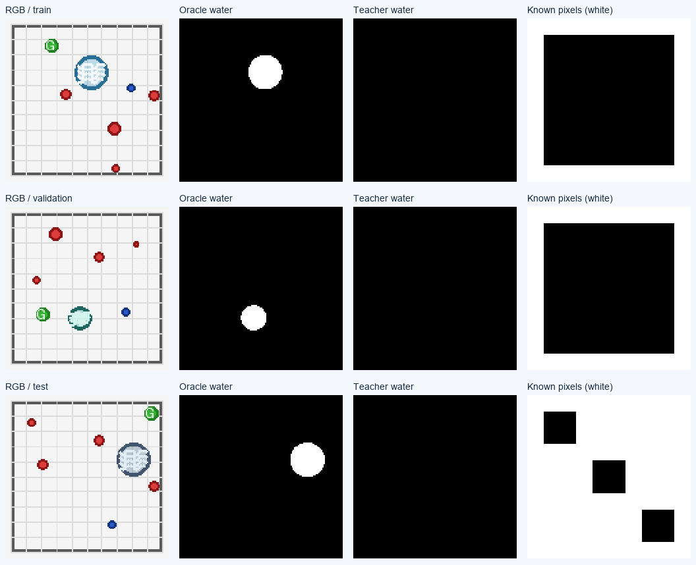

# Quest 资源接入、真实 teacher 检查与补充研究记录

记录日期：2026-09-12。本轮从 9 月 11 日开始，目录名保留创建日期；时间戳以各 artifact
明确记录的时区为准，Slurm 原始记账另行保存。

**计算与存储已经就绪，Qwen3-VL-8B-Instruct 已下载并完成真实 GPU 调用。当前阻碍变成了
teacher 输入的语义表达：首轮 126 个回答全部没有给出可用的水域等属性区域。**
颜色对照证明图像进入了模型；自然语言诊断将当前水域图案描述成带纹理的圆形图标，
其中一张被称为类似花朵/雪花。不能把这批空属性场继续当有效监督来训练安全模块。

完整数值、模型版本、作业命令和远端旧实验索引见
[`C3_QUEST_RESULTS_2026-09-12.json`](C3_QUEST_RESULTS_2026-09-12.json)。

## 找到的资源与实际使用位置

| 项目 | 本轮核实的状态 |
|---|---|
| SSH | `ssh quest.northwestern.edu` 可直接连接，用户 `shv7753`；本轮没有使用已不存在的 `/tmp/quest.sock` |
| 项目空间 | `/projects/p33100` 配额 1,024 GB，下载前约使用 372 GB，余量约 652 GB；这是项目级配额 |
| 用户工作区 | `/projects/p33100/siosio`；新的所有模型/运行文件都放在其下的独立 C3 目录 |
| 另一项目空间 | `/projects/p31777` 配额 1,024 GB、约使用 1 GB；用户目录 `/projects/p31777/shuo`；本轮未使用 |
| Scratch | `/scratch/shv7753` 配额 5,120 GB，本轮检查时为空；本轮未将权重放在这里 |
| 已有推理环境 | `/projects/p33100/siosio/envs/qwen-vlm/bin/python`，复用且未升级/修改 |
| 已有大模型 | Qwen3-VL-32B-Instruct，位于 `/projects/p33100/siosio/huggingface_cache/hub/` |
| 本轮新增权重 | Qwen3-VL-8B-Instruct，17,545,907,231 bytes，14 个文件全部校验通过 |

选择项目盘保存权重，是因为 Quest 的 scratch 存储会定期清理；项目盘适合持续使用的模型
和共享工作流。[Quest 存储文档](https://rcdsdocs.it.northwestern.edu/systems/quest/user-guide/filesystem/filesystem.html)、
[Quest Hugging Face 指南](https://rcdsdocs.it.northwestern.edu/tutorials/python/python-llm-huggingface.html)。

本轮独立远端目录：

```text
/projects/p33100/siosio/hazard_c3_safe_20260911/
    MODEL_DOWNLOAD_SPEC.json       官方文件身份和固定 revision
    model/                         8B 权重与 MODEL_VERIFIED.json
    teacher_bundle/                126 张 RGB 与同一固定 prompt
    vision_diagnostic/             5 次独立输入检查的图像与 prompt
    source/                        本轮在 Quest 执行的代码
    setup/                         Slurm 作业入口
    logs/                          下载、标注和诊断日志
    runs/qwen8b_labels_v1/          原始 126 个真实回答
    runs/vision_diagnostic_v1/      5 个独立视觉诊断回答
```

固定模型 revision：`0c351dd01ed87e9c1b53cbc748cba10e6187ff3b`，来自
[Qwen 官方模型仓库](https://huggingface.co/Qwen/Qwen3-VL-8B-Instruct)。下载用 safetensors，
验证 LFS SHA256 和非 LFS 文件的 Git blob identity；不执行模型仓库中的自定义 Python。
具体文件校验见 [`MODEL_VERIFIED.json`](assets/c3_quest/MODEL_VERIFIED.json)。

SSH 中的 ECDSA host-key proof 警告没有阻止本次认证和传输；没有禁用 host-key checking，
也没有改写用户的 SSH 配置。

## 实际跑完的作业

| 作业 | Job ID | 状态 | 运行时间 | 节点 |
|---|---|---|---|---|
| 8B 下载与逐文件校验 | 6156249 | COMPLETED，exit 0:0 | 3 分 56 秒 | qnode0329，CPU |
| 126 图 action-free teacher | 6156462 | COMPLETED，exit 0:0 | 10 分 27 秒 | qgpu0406，A100 40 GB |
| 5 次视觉输入对照 | 6157352 | COMPLETED，exit 0:0 | 1 分 59 秒 | qgpu2002 |

调度使用用户已有的 `p33100` account，推理只请求一张 GPU；没有取消或改动其他项目的
排队任务。原始状态见 [`SLURM_ACCOUNTING.txt`](assets/c3_quest/SLURM_ACCOUNTING.txt)。
GPU 申请方式参考 [Quest GPU 文档](https://rcdsdocs.it.northwestern.edu/systems/quest/user-guide/gpu/gpu.html)。

实际 runtime：Python 3.12.12，Torch 2.10.0，torchvision 0.25.0+cu128，Transformers
5.7.0，Hugging Face Hub 1.8.0，NumPy 2.2.6，Pillow 12.0.0，CUDA 12.8。使用 BF16、
SDPA、greedy decoding、最多 1,024 个新 tokens。主标注峰值 GPU allocation 为
17,614,182,912 bytes。当前本地 simulator-only 学生的原训练环境没有被更改。

共 **131 次本地模型 generation = 126 次原始标注 + 5 次独立诊断**，付费 provider calls
为 0。重解析和离线评估没有增加模型调用。

## 首轮 teacher 的结果与两个不同问题

输入使用上轮已冻结的 126 个 RGB/prompt 请求，dataset manifest SHA256 为
`e3e1cffc0ce36fb2cb3cab32e61068caa556e1fdce7ddb9380c666b4832a6bc1`。
发送包只含 PNG、prompt 和身份 hash。动作、轨迹、capability/rule、oracle mask、
native cost、collector 名称都没有进入模型消息；图片文件名也改为内容 hash。

第一是解析兼容问题。Qwen 在 `unknown_regions` 的 polygon 上返回了 `confidence`。
原 prompt 没有禁止这个字段，但初版解析器只允许 polygon/reason，因此 126 个原始记录
均被记为 `INVALID_RESPONSE`。这个拒绝不能被解释成 126 次模型格式失败。

本地增加了有界 confidence 的兼容，另建 artifact 对原始回答重新解析。**没有重新询问
模型，没有覆盖旧状态，也没有改变任何坐标或属性标签。** 新记录保留原始 status、
response hash 和 parent record hash。修正后 126/126 均可解析。

第二是实际标签质量问题：**126/126 都是 unknown-only，0/126 有任何 property region。**
因此水域、低附着、易损地表三个属性场都没有正标注。未知区域保持独立 known mask，
不会通过 confidence 被变成低严重度或安全零值。

| 开发 split | 图像数 | known pixels 比例 | 运动 exposure 可评估数 | unknown 运动数 | known pixels 上 water IoU |
|---|---:|---:|---:|---:|---:|
| train | 59 | 57.20% | 24/70 | 46 | 0 |
| validation | 33 | 38.07% | 2/38 | 36 | 0 |
| test | 34 | 59.63% | 13/39 | 26 | 0 |

147 条运动中 **108 条（73.5%）因 unknown 无法计算 teacher exposure**。原数据的
16 条高暴露运动中，15 条落入 unknown，剩余 1 条被预测为零暴露。

validation/test 的条件 exposure MAE 虽然为 0，但只剩 2/13 条可评估样本，且这些样本
都不是高暴露运动。**这是样本被 unknown 排除后的结果，不能解读成安全预测准确。**



这里的 oracle mask 只用于渲染几何诊断，不是 200 张人工审查的语义标签；正式 teacher
Gate 1 没有执行或通过，学生蒸馏与 SAC 也没有因这次接入而被视为有效结果。

## 视觉输入诊断说明了什么

为了区分接口错误与当前输入的语义表达问题，另做 5 个独立请求；这些回答不混入训练标签。

| 对照 | 实际回答/观察 |
|---|---|
| 左红右蓝 | `left: red, right: blue` |
| 左蓝右红 | `left: blue, right: red` |
| train 的第一张场景 | 识别为网格、彩色圆点、中央蓝色图标；内部图案被描述成花朵或雪花 |
| validation 的第一张场景 | 识别为网格上分布的彩色圆点，以及浅蓝绿色圆形 |
| test 的第一张场景 | 识别为带灰色边框和纹理的蓝色圆形、红/蓝/绿圆点 |

两个颜色对照的 processor pixel hash 不同，所有图片的输入 pixel variance 均非零。
这支持图像实际进入模型、且影响了回答。自然描述仍有物体个数/位置误差，不能把这个
smoke check 当成可靠 grounding 的证明。

我的判断是：**当前低分辨率、符号化地形和原 property prompt 的组合，不足以稳定地产生
环境需求标注。** 证据不支持把失败归因于“没接上 GPU”，也不支持“VLM 普遍无法理解水域”。
继续扩大同一组合的调用数，或把空场直接交给学生，不能解决这个问题。

## 本次补发现的 Quest 分支进展

`/home/shv7753/hazard` 是较早的源码/实验目录，不是 Git checkout。
`/home/shv7753/hazard-autoresearch-exp01b-r2` 是另一条更完整路线的部署副本，也没有
`.git`；其报告声明来自 `codex/autoresearch-exp01b-r2`，包含各自 commit 和代码 hash。
**本地上一轮报告不能被当成对这份远端副本的完整进度描述。**

已取回 **17 份 COMPLETE 结果和 2 份 FAILURE 记录**。旧 handoff 仍写着 baseline
作业在等待，但本轮 Slurm 查询显示 5199820/5199822 已完成，目录也已有多轮搜索及确认
结果。这里不能只看 handoff 的旧状态。

下面是三训练 seeds 的 confirm 记录中，Factorized/no-CF 的 appearance-OOD 开发指标：

| Run | Field mIoU | Pair ranking | False-safe | Decision regret |
|---|---:|---:|---:|---:|
| baseline-confirm-v2 | 0.1739 | 0.7826 | 0.3621 | 0.007460 |
| ar03-calibrated-polarity-confirm | 0.9334 | 0.9522 | 0.01577 | 0.0006913 |
| ar05-runtime-margin-confirm | 0.9365 | 0.9554 | 0.01827 | 0.0005920 |
| ar10-cosine-schedule-confirm | 0.9409 | 0.9550 | 0.01813 | 0.0006001 |

这些记录使用 11,275,266 参数的视觉模型、800 个训练 scenes、三个 model seeds，并且明确
标为 `DEVELOPMENT_ONLY`、`formal_holdout_evaluated=false`。它们与本地 11,739 参数、
59 张图的学生不是相同模型/数据/评测，不能直接比较绝对分数。这轮只取回并核对记录，
没有重新运行训练或复核全部 protected hashes，也没有宣布哪一项获得正式 KEEP。

远端路线的 README 已将重点转为 factorized composition，不再要求 counterfactual
auxiliary loss 必须有明显增益；这些 confirm 表里 no-CF/full 的多个指标也近乎一致。
其正式 decision-amendment 文档未随这份部署副本提供，不能只凭 README 替代正式决策记录。

还发现一个交付缺口：这些 confirm 报告的 `checkpoint_sha256` 字段为空，run 目录中只有
报告与 per-scene 指标；不能把好看的指标直接当成已经可部署的视觉学生 checkpoint。
远端另外保留了先前的三个关系代价模型 checkpoint，不能与本轮搜索学生混为一谈。

因此后续应先统一研究协议和复用边界，避免一边重新开始很小的视觉 baseline，一边漏掉
已经做过的多 seed 开发搜索；更不能继续默认“CF loss 增益”已经是成立的贡献。

## 代码、验证和后续顺序

新增入口：

- `c3_safe/teacher_io.py`：输入白名单、图片/prompt hash、严格 JSON/polygon、独立 unknown mask。
- `scripts/download_c3_teacher_model.py`：固定官方版本下载和逐文件校验。
- `scripts/prepare_c3_teacher_bundle.py`：导出仅 RGB/prompt 的包。
- `scripts/run_c3_teacher_labels.py`：真实 GPU teacher、逐次原始回答与源码记录。
- `scripts/materialize_c3_teacher_fields.py`：零新调用的兼容重解析，保留 parent 记录。
- `scripts/evaluate_c3_teacher_labels.py`：同时报告空间质量、unknown 覆盖与条件运动指标。
- `scripts/diagnose_c3_teacher_vision.py`：五次独立视觉对照。
- `setup/c3_teacher_*.sbatch`：独立的下载、推理和诊断入口。

本轮新增 **14 项测试通过**，覆盖内容白名单、目录逃逸、图片身份、坏 JSON、异常 polygon、
unknown propagation 和 confidence/严重度分离。四个主要新产物的 **444 个文件 hash**
全部匹配。最后将这 14 项与 11 项既有数据/学生回归一起运行，结果 **25 passed**，见
[`teacher_tests_25.xml`](assets/c3_quest/teacher_tests_25.xml)。前期 211 项测试记录仍保留；
本轮没有声称重跑了那整套历史测试。

本地离线复现（新的非空目录不会被覆盖）：

```bash
python3 scripts/materialize_c3_teacher_fields.py \
  --labels results/c3_qwen8b_labels_20260912 --output results/c3_reparse_local
python3 scripts/evaluate_c3_teacher_labels.py \
  --dataset results/c3_oracle_routed_dataset_20260908 \
  --labels results/c3_reparse_local --output results/c3_teacher_eval_local
```

Quest 的 `source/` 保留本轮生成时使用的代码；兼容修正在本地新 artifact 上离线执行，
没有修改正在运行的生成进程，也没有覆盖原始 `INVALID_RESPONSE` 记录。将来部署新的
生成版本时，应使用新 source/run 目录，并保存新的源码与输入 manifest。

下一步顺序：先对齐远端更成熟分支的研究定义和可复用学生实现；再验证地形图像是否具有
足够明确的可见语义，并在小型、类别平衡、有人审查的样本上检查真实 teacher；之后才
扩大标签集，比较 matched no-VLM 学生并考虑闭环控制。**模型路径、存储和 GPU 已不再是
需要用户补充的信息。**
