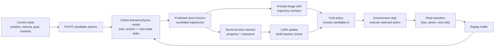

# Hazard PIVOT Experiment Notes

## Core Claim

In inertial hazard navigation, telling the VLM which actions are unsafe is not
enough. The strongest signal is a counterfactual dynamics prompt: show what
each candidate action will do under the environment physics, then let the VLM
choose among the outcomes.

Short version:

- Safety filtering mainly prevents crashes, but can leave the agent too
  conservative and timeout-prone.
- Drawing candidate momentum / rollout consequences gives the VLM a more useful
  decision surface: it can compare where actions actually lead, not just where
  forces point.
- History-only self-iteration helps efficiency, but is unsafe because past
  feedback is not a substitute for current counterfactual rollouts.
- Frontier VLM + correct PIVOT trajectory / physics is the positive upper-bound:
  when the model sees the physics consequences, it can solve the task.
- Based on this insight, the proposed module learns local physics online, renders
  candidate rollouts for the VLM, and optionally uses a score-function teacher
  to LoRA-tune the smaller VLM toward better PIVOT choices.

## Main User-Note Results

| Variant | Prompt / control signal | Success | Hazard hit | Timeout | Return | Final dist | Readout |
|---|---|---:|---:|---:|---:|---:|---|
| Safe-filtered primitive PIVOT | Tell the VLM which actions definitely will not work; choose among the remaining actions. | 4/10 | 0/10 | 6/10 | 37.7 | 3.75 | Safe but stalls; avoids hazards at the cost of many timeouts. |
| Momentum / rollout-rendered PIVOT | Draw each action's dynamics consequence / resulting trajectory. | 5/10 | 0/10 | 5/10 | 48.0 | 3.33 | Better progress and fewer calls, still safe, but with lower clearance. |
| Self-iterating PIVOT | Give past 3 steps of action-result history; do not draw future dynamics. | 5/10 | 5/10 | 0/10 | 24.5 | 2.35 | Efficient and aggressive, but unsafe; retrospective feedback alone is not enough. |
| Frontier model + PIVOT trajectory | VLM sees the physical trajectory / environment dynamics. | 10/10 | 0/10 | 0/10 | n/a | n/a | Upper-bound evidence: with explicit physics, frontier VLM can solve the task. |

## Interpretation

The three ablations separate "safety knowledge" from "dynamics knowledge":

- Safe filtering answers: "Which actions are forbidden?"
- Momentum / rollout rendering answers: "What will happen if I take this action?"
- History-only self-iteration answers: "What happened recently?"

The results suggest that the decisive prompt ingredient is not just safety
constraints or retrospective feedback. The VLM needs current, counterfactual
physics information. Otherwise it either behaves too conservatively
(safe-filtered PIVOT) or becomes unsafe while trying to make progress
(history-only PIVOT).

## Proposed Module

The module turns the ablation insight into a reusable control loop:

1. Generate PIVOT candidate actions from the current state.
2. Use a small online physics model to predict each candidate's short-horizon
   trajectory. This avoids using oracle rollout dynamics while still giving the
   VLM explicit consequences.
3. Render those predicted trajectories in the prompt image.
4. Ask the VLM to select one candidate.
5. Execute the selected action in the real environment.
6. Add the real transition back into the physics replay buffer and update the
   learned dynamics model.
7. Optionally score all candidates with a hand-written teacher,
   `score = goal_progress + clearance_weight * min_clearance`, and use LoRA to
   tune the small VLM toward the teacher's choice.



This makes the VLM a visual decision-maker over physically meaningful choices,
while the learned physics module supplies the missing dynamics information and
the LoRA path gradually aligns the small VLM with a known candidate-ranking
objective.

## Learned-Physics Results

| Variant | Model / setting | Episodes | Success | Hazard hit | Timeout | Return | Final dist | Min clearance | Physics loss | VLM calls/ep | Parse | Readout |
|---|---|---:|---:|---:|---:|---:|---:|---:|---:|---:|---:|---|
| Plain PIVOT baseline | Qwen3-32B, 8 dirs x 1 mag, diffusion ON, no learned/oracle rollout | 100 | 28/100 | 72/100 | 6/100 | 30.4 | 2.43 | n/a | n/a | n/a | n/a | Baseline struggles badly without explicit physics trajectories; most failures are hazard hits. |
| Learned-physics PIVOT | Qwen3-32B, 3-step horizon, diffusion OFF, oracle rollout OFF | 100 | 85/100 | 14/100 | 1/100 | 77.8 | 0.87 | 0.52 | 0.000395 | 22.6 | 100% | Learned physics recovers most of the frontier-model benefit without oracle rollouts. |
| Learned-physics PIVOT | Qwen2/7B-scale smaller model, diffusion OFF, oracle rollout OFF | 200 | 148/200 | 52/200 | 0/200 | 60.5 | 1.24 | 0.31 | 0.001611 | 46.0 | 100% | Even the smaller VLM becomes useful once candidate rollouts expose the physics. |
| Learned-physics PIVOT + LoRA | 1000-episode run with score-function teacher distillation | 1000 | 87.8% | 12.1% | 0.1% | 81.5 | 0.77 | 0.53 | n/a | 25.5 | 100% | LoRA improves alignment over time: teacher agreement and safety both rise substantially. |

The 32B result shows that learned rollouts can replace oracle physics in the
prompt. The 7B result is the more important systems point: a smaller model can
still perform meaningful hazard navigation if the controller externalizes the
hard dynamics reasoning into a learned physics module.

The LoRA run tests whether the small VLM can be taught to imitate a structured
candidate-ranking teacher. The teacher scores every predicted trajectory with:

```text
score = goal_progress + clearance_weight * min_clearance
```

The LoRA trend is encouraging: VLM-teacher agreement rises from 31.3% in the
first 100 episodes to 84.4% in the last 100 episodes, while hazard hits fall
from 32.0% to 10.0%. This suggests the VLM is not merely using the trajectory
rendering at inference time; it is also becoming more aligned with the physics
score function over training.

## Local Files

| File / directory | Meaning |
|---|---|
| `shared_autonomy_hazard_primitive_pivot.py` | Safety-filtered motion-primitive PIVOT. This is the "tell it which actions are safe / unsafe" family. |
| `shared_autonomy_hazard_momentum_pivot.py` | Momentum-aware PIVOT that renders short dynamics rollouts for candidate actions. |
| `shared_autonomy_hazard_self_iterating_pivot.py` | Self-iterating PIVOT with past-step feedback but no future rollout prompt. |
| `shared_autonomy_hazard_learned_physics_pivot.py` | Online learned-physics PIVOT: learns one-step dynamics from real transitions, then draws predicted candidate rollouts. |
| `20260504_193226/analysis/analysis_report.md` | 1000-episode learned-physics + LoRA analysis. |
| `hazard/paper_figures/03_learned_physics_lora_module.png` | Structure diagram for the learned-physics + LoRA module, ready for slides. |
| `hazard/paper_figures/03_learned_physics_lora_module.svg` | Editable vector version of the same structure diagram. |
| `hazard/paper_figures/04_vlm_prompt_views.png` | Five-panel comparison of what each VLM prompt variant actually shows the model, including the frontier upper-bound prompt. |
| `hazard/logs_hazard_primitive_pivot_or_vlm/20260503_130049/summary.json` | Local saved primitive PIVOT run with frontier/OpenRouter VLM; summary shows 10/10 success in that saved run. |
| `hazard/logs_hazard_pivot_or/*/summary.json` | Earlier frontier VLM PIVOT runs without the same primitive/physics setup; success ranges from 30% to 70% with high hazard hit rates. |
| `hazard/paper_figures/` and `make_paper_figures.py` | Existing paper-style figure generation artifacts. |

## Additional Local Evidence

The saved 1000-episode learned-physics run at `20260504_193226` reports:

- Success: 87.8%
- Hazard hit: 12.1%
- Timeout: 0.1%
- First 100 episodes success: 68.0%
- Last 100 episodes success: 90.0%
- First 100 hazard hit: 32.0%
- Last 100 hazard hit: 10.0%
- Predicted progress vs real one-step progress correlation after warmup: 0.948
- Predicted clearance vs real next clearance correlation after warmup: 0.980

This supports the same story from a different angle: as the physics model
becomes informative, the controller becomes more successful, faster, and safer.
It also supports the proposed LoRA distillation path: as the VLM-teacher
agreement improves, the policy becomes both faster and less collision-prone.

## Paper / Slide Framing

Possible claim:

> For VLM control in inertial safety tasks, action labels and past feedback are
> weaker than counterfactual dynamics visualization. The VLM needs to see what
> candidate actions will cause, not only which actions are allowed.

Possible figure layout:

1. Three prompt designs: safe-filtered, momentum-rendered, history-only.
2. Outcome table: success / hazard hit / timeout.
3. Main takeaway arrow: constraints prevent some failures, but rollouts teach
   physics.
4. Proposed module: online learned physics provides rollouts, score-function
   teacher provides labels, LoRA teaches the small VLM to choose better PIVOT
   candidates.
5. Frontier-model upper bound: explicit physics trajectory reaches 100% success.

## Next Clean Experiment

Run a matched-seed comparison with the same model, seeds, episode count, and
max steps:

1. Safe-filtered primitive PIVOT.
2. Momentum / rollout-rendered PIVOT.
3. Self-iterating history-only PIVOT.
4. Frontier VLM + oracle or trusted rollout prompt.
5. Learned-physics rollout prompt, with and without LoRA if compute allows.

Report success, hazard hit, timeout, mean return, final distance, min clearance,
VLM calls per episode, parse success, and fallback rate. Use at least 30 episodes
for the quick table and 100+ episodes for a stable paper number.

## Direct VLA Baseline Findings

The direct-VLA runs in `hazard_result_gpu` help answer the advisor's concern:
directly converting the same Qwen2-VL backbone into a VLA is possible, but the
result is much more sensitive to action-decoder and fine-tuning choices than the
PIVOT + learned-physics formulation.

The strongest controlled comparison is same-backbone Qwen2-VL-7B:

| Variant | Train data / setting | Eval | Success | Hazard hit | Timeout | Readout |
|---|---:|---|---:|---:|---:|---|
| Expert controller demos | 1000 expert episodes | collection | 98.1% | 1.9% | 0.0% | The expert data itself is strong, so poor VLA performance is not just bad demonstrations. |
| Direct VLA + regression head | 1000 expert episodes | heldout 1000 eps | 36.9% | 60.4% | 2.7% | Head-only imitation does not safely learn the inertial dynamics. |
| Direct VLA + regression head | 3000 expert episodes | heldout 1000 eps | 40.6% | 57.4% | 2.0% | More data helps only slightly. |
| Direct VLA + regression head | 5000 expert episodes | heldout 1000 eps | 36.0% | 62.8% | 1.2% | No clean scaling trend from more demos. |
| Direct VLA + regression head + LoRA | 1000 expert episodes | heldout 1000 eps | 63.4% | 36.6% | 0.0% | LoRA gives a large gain, but hazard rate is still high. |
| Direct VLA + flow action head | 1000 expert episodes | heldout 1000 eps | 10.0% | 67.5% | 22.5% | Flow head is not automatically better; it is very tuning-sensitive. |
| Direct VLA + flow action head + LoRA | 1000 expert episodes | heldout 1000 eps | 66.1% | 33.9% | 0.0% | LoRA rescues flow, again showing sensitivity to fine-tuning. |
| Learned-physics PIVOT + LoRA | online learned physics, 3-step rollout | 1000 eps | 87.8% | 12.1% | 0.1% | Best local result: higher success and much lower hazard rate. |

This supports the paper argument:

- Direct VLA entangles visual perception, physical dynamics, continuous action
  decoding, and safety into one learned policy.
- The VLA baseline has many high-impact tuning choices: expert data count,
  regression vs flow action head, LoRA on/off, LoRA rank/lr, action sampling,
  epochs, dropout, and validation choice.
- PIVOT + learned physics keeps the VLM as a visual decision-maker over a finite
  action set and externalizes the missing physics into explicit counterfactual
  rollouts. The main tuning knob is interpretable: rollout horizon. In the local
  Qwen2-VL + LoRA runs, horizon 1 gives 60.1% success / 39.9% hazard, while
  horizon 3 gives 87.8% success / 12.1% hazard.

The generated analysis artifacts are in
`hazard_result_gpu/vla_pivot_analysis/`:

| File | Meaning |
|---|---|
| `analysis_report.md` | Advisor-facing VLA vs learned-physics PIVOT summary. |
| `summary_table.csv` | Parsed local summary metrics. |
| `main_comparison.png` | Main success / hazard / timeout comparison. |
| `data_sweep.png` | Direct VLA 1k/3k/5k data-size sweep. |
| `horizon_ablation.png` | Learned-physics PIVOT rollout-horizon ablation. |
| `related_work_framing.md` | Related-work positioning and next experiments. |
