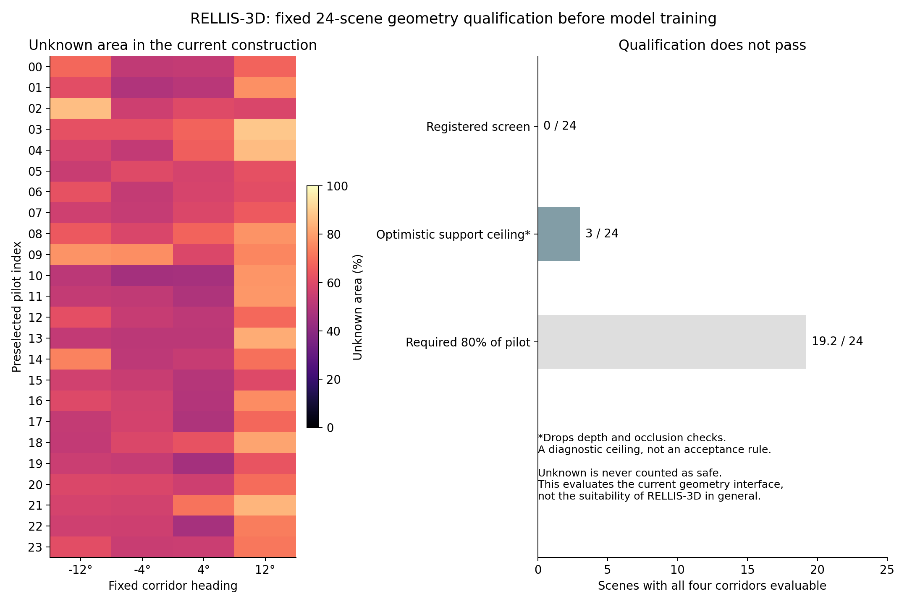

# 诊断论文正文与 RELLIS-3D 资格检查

输入为[第二轮 Pro 指导](../research/rellis_external_20260912/PRO_REVIEW.md)，
受控实验的基准版本是 `c31ed74e65465fbf73cc2b144fa73128ba7216a5`。

**本轮完成了完整英文正文重写和 RELLIS-3D 的固定小样本资格检查。当前走廊评价接口没有通过
资格门槛，已按 Pro 的停止条件停止进入外部模型训练；不能报告机制迁移成功。**

## 论文已推进到哪里

[完整英文稿](../paper/visual_risk_diagnosis/manuscript.md)以三个科学问题组织：
测量口径如何改变风险数字、后处理如何在相同权重下改变决策、全候选上界不可用是否代表
固定选择器也不能运行。[主张—证据表](../paper/visual_risk_diagnosis/CLAIMS_AND_EVIDENCE.md)
逐项列出了支持证据和不利于夸大的事实。

固定 0.02 阈值的简单基线放在正文中心：合成 IID 危险率 1.07%、η=96.93%，五模型认证通过。
选择规则后的 2.51%、98.82% 被解释为更多放行与更多风险预算的交换。
明确保留新 E3 的 −2 基线经验危险率也已低于 5%、不同保护对象不能当成同一保证的算法胜负、
low16 与高分辨率标签差异不能算作模型修复收益这三点。

核对并补入了 Egocentric Conformal Prediction、Conformal Decision Theory、Learn then Test、
Perceive with Confidence 的原始论文。相关工作围绕最接近的决策校准和保守性研究展开。
当前定位为**机制清楚的受控案例研究**，不是新安全算法，也没有升级为跨任务普遍结论。

## 数据来源与冻结

- 官方仓库固定为 `c17a118fcaed1559f03cc32cc3a91dedc557f8b8`。
- 从官方公开下载入口取得相机内外参、扫描位姿和图像划分；原始数据与权重来源未混用。
- [资格协议](../research/rellis_external_20260912/qualification_protocol.json)在读取样本标签前冻结。
  从 `00000` 的官方训练列表按时间排序，等距选定 **24 帧**，不按语义或模型成绩筛选。
- 从公开 ZIP 的目录与字节区间取得固定 RGB、人工标签和 PLY；全部 24 组均有≤50 ms 的时间戳匹配。
  未打开非 pilot 的图像/标签内容，未运行外部最终测试。
- 候选固定为四条 1.2 m 宽、6–12 m 区间、航向 −12°/−4°/4°/12° 的走廊段，各有 720 个面积采样点。
  范围从 LiDAR 原点计；6 m 前的路段不属于被审批对象，不能解释为从当前位置安全驶达。

## 资格检查的实际结果

| 检查 | 结果及含义 |
|---|---|
| 坐标方向 | 官方 URDF 显示点云前向轴与车体前向相反；预检拦截后按正式变换链修复，未改候选或门槛 |
| 投影公式复核 | 与 OpenCV 的最大差为 1.82×10⁻¹² 像素；仅验证实现一致性，不证明物理标定精度 |
| 全部四候选未知面积≤5% | **0/24 场景**；80% 门槛需要至少 20/24 |
| 单候选未知面积 | **45.97%–88.47%** |
| 忽略深度空缺和遮挡的乐观支撑上限 | **3/24 场景**；这是不能用于放行的诊断上限 |
| 数值/未知处理测试 | 六项不同测试通过；重复执行不重复计数 |
| 独立标量复核 | 26 个 manifest 文件、96 个候选计数、69,120 个采样标签通过 |

未知面积的主要来源是当前单扫描投影中没有直接深度支撑的部分。全候选平均的缺少投影深度
比例为 52.19%，缺少局部地面支撑为 6.87%，遮挡为 8.89%，视野外为 0.20%；这些原因重叠，
**不能相加**。表中的未知面积及成本区间均依赖当前几何构造，不是实测物理标定误差。

这套实现采用非语义局部表面拟合、0.35 m 最近表面支撑、8 像素深度分箱和 0.35 m 前景深度余量。
当前失败应写为**这个单扫描表面/可见性接口不合格**，不能写成“RELLIS-3D 不适合研究”、
“真实感知模型失败”或“原诊断不能迁移”。完整重力对齐和独立配准误差界也尚未验证。

## 统计划分也需要重新设计

官方列表中，`00000` 的验证/测试帧与训练帧最短间隔为 0.2 秒，`00002` 测试也有同样情况。
它不是按帧完全随机的划分，但不能直接继承为本研究的空间独立性证明。
发布的位姿没有时间戳，不同序列的共同世界坐标亦未核实；不能把图像编号直接当扫描位姿行号。

官方 HRNet-W48+OCR 是事先指定的唯一候选架构。其已发布权重仍未通过本研究的训练/验证区域
隔离审核，故没有拿它直接生成所谓“独立验证”成绩。本轮外部模型训练、风险认证和最终测试均为零。

## 本轮决定与后续进入条件

本轮到资格检查结束。保留完整案例论文和失败的接口记录，不调未知门槛、不选择更容易的图像、
不填成安全值，也不追加关系头、VLM 或 RL。

继续 RELLIS-3D 之前，需要先有可审核的几何改进：例如用可靠时间映射和运动补偿构造几何支撑，
明确遮挡和配准误差，同时建立包含重复经过区域的空间块划分。这是待验证方向，尚未证明可行。
任何新方案须另行登记，并在新的固定资格样本上检查；当前 24 帧已经消费。
只有通过这一步，才进入开发集、锁定一个主要机制预测，再做校准和独立最终测试。

## Quest 执行与材料

根目录：`/projects/p33100/siosio/hazard_rellis_external_20260912`。
全部下载、数值检查、统计汇总及出图均在 Quest 完成；本地保存源码、正文和精简证据。

- `6186376`：官方元数据获取成功。
- `6186684`：计算节点无 `git`，在样本分析前退出；兼容修复后 `6186742` 完成元数据审核与固定数据获取。
- `6187158`：坐标前向检查正确拦截错误假设，在读取 pilot 图像前退出；正式坐标转换修复后 `6187239` 完成。
- `6187394`：独立标量计数复核完成。
- `6187474`：审计汇总图和完整固定样本图册已生成并完成可视检查。

原始失败源码、日志和冻结 hash 均保留；这些运行修复不改变样本、科学门槛或候选集。
数据来源、许可和复现入口见[外部研究 README](../research/rellis_external_20260912/README.md)。
