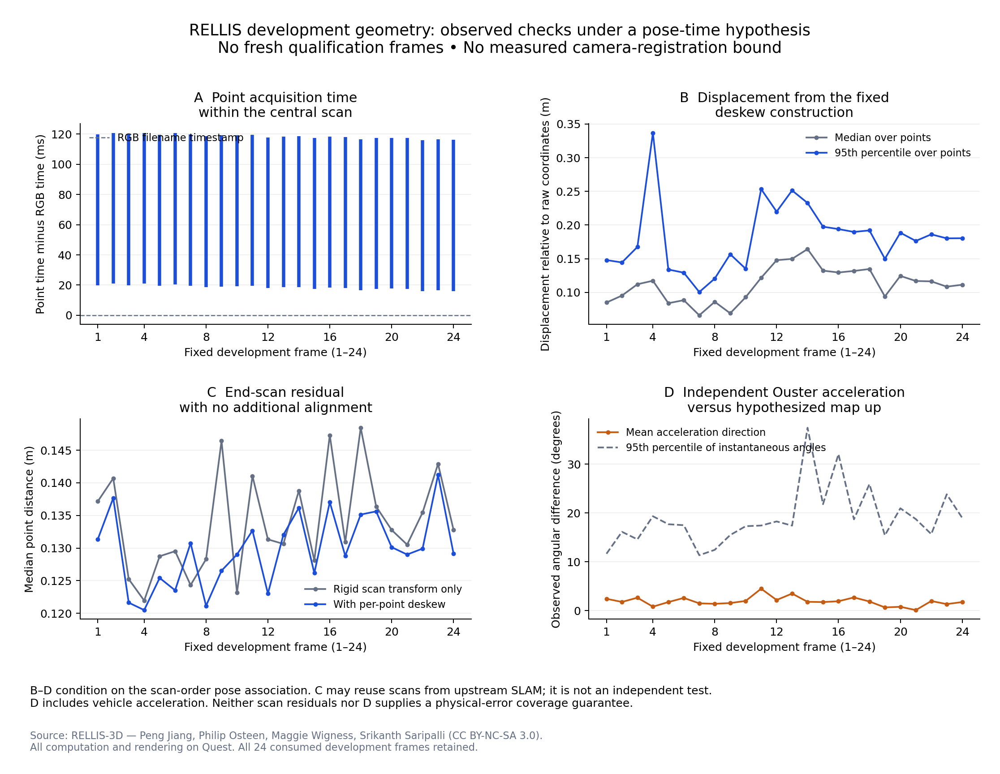

# RELLIS 测量接口修订：前置证据审计与提前停止

本轮依据 [Pro 第三次指导](../research/rellis_revision_20260912/PRO_REVIEW.md)，
在 Quest 完成固定开发窗口的原始传感器追溯和运动补偿诊断。
**结论是 `STOP_PREREQUISITES_UNCERTAIN`：在新的 48 帧资格集之前停止。**
这不是 0/48，也不是外部机制失败；新样本的可评价性、混合候选数量和成本精度均未测量。

这是本轮作出的**提前停止决定，尚未耗尽两日工程预算**。已有来源与一致性证据没有建立
足以支撑合规标签的独立几何误差范围。依照预登记的“不通过或证据仍不确定”分支，
不把可执行的运动补偿程序升级为合格真值，也不进入下一阶段选样或模型实验。

## 固定了什么

[新协议](../research/rellis_revision_20260912/revision_protocol.json) 的首次 Quest 冻结
发生在本轮原始传感器读取前。上限为 16 个工程小时、两日截止、最多两个几何版本，
只允许旧 24 帧及必要邻近传感器数据。窗口最多一秒、每个目标最多 11 扫描。
本轮实际取得每目标 10 扫描。没有训练分割模型、运行风险机制实验、调用 VLM 或接入 RL。

协议预先保留三种结论：完全通过、仅二元审批资格通过、不通过或仍不确定。
若前置条件满足，才会另行冻结 48 个新身份、至少 12 个空间块、全部支撑扫描，
以及覆盖六块的 12 帧独立人工审查身份。**该第二次冻结未发生。**

二元门槛为至少 39/48 帧的四候选均可判定，至少八帧存在合规/不合规混合，
且混合场景分布于至少四块。连续成本、regret 和残差分析另需包含几何误差的成本区间
宽度 95 分位不超过 0.005。门槛未依据本轮结果调整。

成本统一以**完整走廊面积**为分母：已知禁止比例为下界，已知禁止加未知比例为上界，
再对有独立依据的几何误差范围取保守包络。上界≤0.02 才可确认合规；下界>0.02 可确认
不合规；其余未知。已知禁止 1%、未知 4% 的 `[0.01,0.05]` 不能确认合规。
旧协议的“可评价面积”文字与其完整面积代码不一致；本轮明确修订文字，旧协议原件保留。

## 取得的实际证据

| 检查 | 本轮结果 | 能支持到哪里 |
|---|---|---|
| 原始扫描与旧中心 PLY 的 x/y/z/t/ring | **24/24 完全一致** | 确立这些发布扫描与原始消息的内容身份 |
| 固定开发窗口 | **240 个有效 Ouster 扫描**，每目标 10 个 | 时间戳、逐点偏移和邻近传感器可用；不是新资格样本 |
| 原始包静态 LiDAR/body 链与固定官方 URDF | 数值一致 | 同一坐标定义；不是独立物理标定精度 |
| 发布扫描文件名与原始消息时间差 | 0.0014–0.9987 ms | 与毫秒文件名精度相容；不是相机曝光同步误差界 |
| 中心扫描各点相对当前 RGB 文件名时间 | 约 **15.95–120.73 ms** | 扫描时间接近不意味着每个点同时采集 |
| 固定逐点运动补偿的每帧位移 p95 | **0.101–0.337 m**，帧间中位 0.180 m | 条件于位姿时间假设的修正量，不是真实配准误差 |
| 两端扫描中位最近邻残差 | 21/24 帧下降；帧间中位约 0.132→0.130 m | 仅一致性诊断；保留三帧未改善 |
| 独立 Ouster 平均加速度方向与假定地图上向 | 约 **0.093°–4.476°** | 含动态加速度和安装误差，不能直接当重力误差界 |
| `/imu/data_raw` 格式检查 | **1,295 条**多出一个未解释字节 | 原消息完整保留、标为不可用；其他传感器另行检查 |

完整数字在 [停止记录](../research/rellis_revision_20260912/artifacts/REVISION_DECISION.json)，
逐场景记录在 [时间链审计](../research/rellis_revision_20260912/artifacts/DEVELOPMENT_CHAIN.json)
与 [运动审计](../research/rellis_revision_20260912/artifacts/MOTION_AUDIT.json)。
逐帧身份还可查看 [精确源时间对应表](../research/rellis_revision_20260912/artifacts/TIME_POSE_CORRESPONDENCE_EXACT.md)。

图中运动补偿结果条件于发布位姿的扫描顺序对应假设。C 中的点云可能已参与上游 SLAM；
D 中的加速度包含车辆动态运动。两者都不能直接生成本轮要求的独立几何误差包络。

## 为什么不进入新样本

本轮追溯了作者在 [issue 7](https://github.com/unmannedlab/RELLIS-3D/issues/7#issuecomment-830183291)
指向的 Cartographer 导出程序，并固定其源码版本。该程序按点云消息导出传感器到地图
的矩阵，但不保存相应时间戳；它的 PointCloud2 转换还把点内时间设为零。
历史 Ouster 驱动及实际消息则保留每点相对于扫描起点的纳秒偏移。

我们能实现并检查一个有来源依据的时间对应与逐点补偿**假设**，但以下证据仍未建立：

1. 发布位姿与该次导出运行之间的完整时间记录，以及独立的完整三维配准误差检查。
   原始扫描身份已核实，不等于位姿精度已核实。
2. 独立相机配准/投影误差与地表插值、当前可见性误差的可信范围。程序一致、点更密、
   最近邻残差更小都不能代替这些观测。
3. 可传播到成本区间的重力误差范围。Ouster 是独立观测来源，但目前没有分离其比力中的
   动态加速度与姿态/安装误差。
4. 包含所有融合支撑的空间隔离。没有建立跨序列共同坐标与重访合并，不能凭序列名划分。

官方链接中的 Cartographer 离线配置使用 **VectorNav IMU**。将 VectorNav 再作为独立姿态
验证会复用证据；把可能参加过上游 SLAM 的扫描对齐残差当作独立配准精度也不成立。
GPS 消息标记定位协方差未知，不能把其中零矩阵解释成零定位误差。

没有为得到更窄成本区间而编造平移/旋转误差，也没有将未知地面或未来可见区域视为
当前 RGB 的已知区域。逐点补偿原型没有被提升为合格的单扫描/多扫描走廊语义评价器。
新 48 帧、对应的独立人工审查、二元/连续资格分数和模型实验均**未进入**。

## 计算验证与保存

六项不同判定测试覆盖完整面积分母、阈值等号、未知与几何扰动、二元/连续资格分离、
缺失样本保留，以及物理证据缺失或系统假支撑时的停止。重复运行不增加不同测试数量。
独立复核逐项检查 240 个点云文件和 1,295 条异常消息，并用独立 `struct` 解码核对
24 个中心 PLY 的 **960 个固定标量字段**。首次核查共验证 1,542 个文件 hash。
这是计算完整性验证，不能解释为物理测量资格通过。
最终图版式修正后复核再次通过，覆盖 24 条源码冻结记录和同样的 1,542 个文件。

原始数据、解码失败、旧图布局、首次校验和全部源码冻结留在 Quest。
全部计算、统计、测试和出图均在
`/projects/p33100/siosio/hazard_rellis_revision_20260912`。
成功开发窗口记录的 HTTP 读取总量约 3.19 GB；大压缩包未全量下载。

本轮外部扩展到此关闭。论文在 [更新正文](../paper/visual_risk_diagnosis/manuscript.md) 中保留
受控案例定位：内部测量、后处理和保护对象的诊断证据不变；本轮只说明外部测量接口的
前置资格尚不充分，不支持或否定机制迁移。没有自动开启第三轮几何修订。
