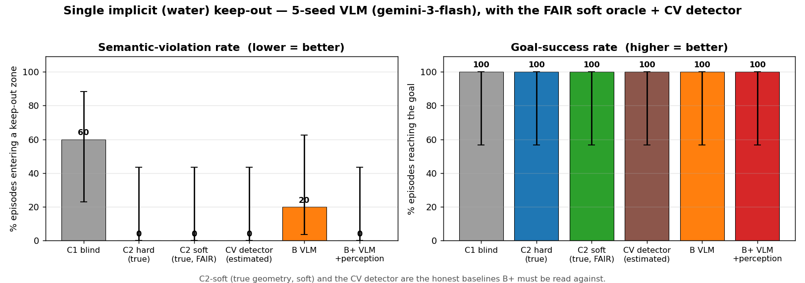
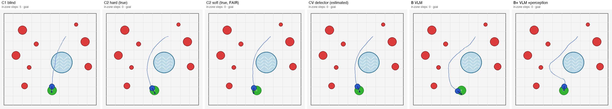
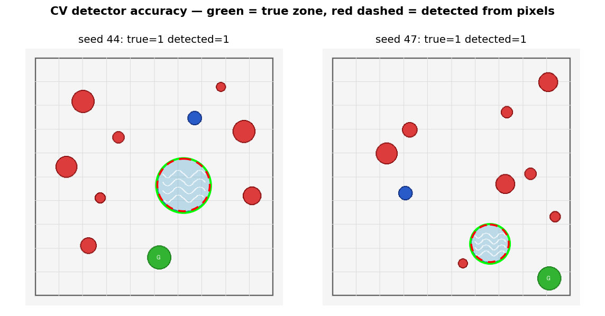
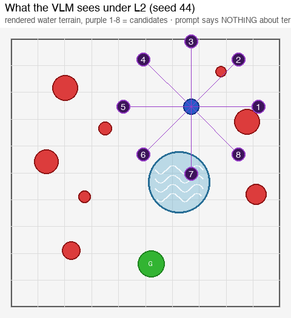
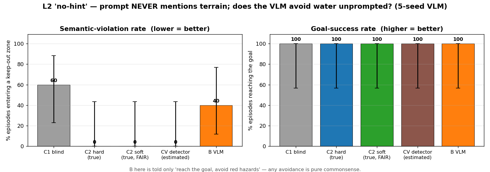

# Fair baselines + commonsense (L2) — results of the kill-shot fixes

Date: 2026-06-29 · Model: `google/gemini-3-flash-preview`, `temperature=0`,
`vlm_fallback=hold`, 5 matched seeds (43–47), `n_hazards=8`.
Script: [`../subgoal_pivot_hazard.py`](../subgoal_pivot_hazard.py) ·
Detector: [`../zone_detector.py`](../zone_detector.py) ·
Figures: [`../scripts/make_killshot_figures.py`](../scripts/make_killshot_figures.py).
Motivation + plan: [`ICLR_PLAN.md`](ICLR_PLAN.md). Supersedes the "B+ out-robusts
the oracle" framing in [`RESULTS_AMPLIFY.md`](RESULTS_AMPLIFY.md) / `RESULTS_SEMANTIC.md` §11–12.

---

## 一句话中文总结

我们补上了三个会被审稿人一秒打死的对照：**(1) 公平的软成本 oracle**（用真禁区几何 + 和
B+ 完全相同的软机制，而不是之前那个被硬约束逼到超时的 oracle）；**(2) 一个 CV 颜色检测器
baseline**（从像素直接读出禁区喂给同一个控制器）；**(3) L2 真常识测试**（prompt 完全不提地
形）。真 VLM（n=5）结果很诚实：**单区时 B+ 追平 oracle，但也只是追平——公平 oracle 和那个
便宜的检测器同样拿到 0% 违规，B+ 并没有赢过它们**；而 **L2 下 VLM 的违规从 20%（有提示）涨
到 40%（无提示），但它仍自发把禁区叫成 "water hazard / blue obstacle"**。结论：在这个干净 toy
上 VLM 不靠"性能"取胜；论文的卖点必须是**无泄漏协议 + 可替代性（一个 VLM 顶 N 个检测器）+
泛化到没见过/没提过的地形**，不是"VLM 打败经典规划"。

---

## TL;DR

Three baselines were missing; adding them changes the story honestly.

1. **The old marquee claim does not survive a fair oracle.** "B+ out-robusts the
   hand-coded oracle" came from comparing B+ (a *soft* keep-out) against an oracle
   forced to *hard*-avoid every zone (which over-constrains and times out). With a
   **fair soft oracle** (true geometry, the *same* soft mechanism B+ uses), the
   single-zone result is a flat tie: **C2-hard = C2-soft = CV-detector = B+ = 0%
   violations / 100% success**; only blind C1 (60%) and plain B (20%) are worse.
2. **A trivial CV detector matches the oracle on this toy.** A hand-coded colour
   detector reads the zone off the pixels (IoU ≈ 0.9) and, fed to the same
   controller, also hits **0% / 100%**. So on a clean render the VLM is *not* better
   than the standard perception stack — its value must be argued elsewhere
   (leakage-cleanliness, generalisation, no per-terrain engineering), not raw score.
3. **The true commonsense test (L2) is a partial, honest win.** When the prompt says
   **nothing** about terrain ("reach the goal, avoid the red hazards"), the VLM still
   beats blind C1 (40% vs 60%) and **spontaneously calls the patch "water hazard" /
   "blue obstacle" though never told** — but violations roughly **double vs L1
   (20% → 40%)**, so a large part of the L1 win was instruction-following, not
   commonsense. n=5: directional, not significant.

This is exactly the reframe in [`ICLR_PLAN.md`](ICLR_PLAN.md): stop selling "VLM
beats classical"; sell the leakage-audited substitution study + the commonsense
ladder.

---

## 1. What changed (the new arms)

| arm | what it is | where the keep-out comes from | new? |
|---|---|---|---|
| `mpc` (**C1**) | blind classical | never (not in obs) | — |
| `mpc_oracle` (**C2-hard**) | classical + zone as a **hard** obstacle | human label, true geometry | — |
| **`mpc_oracle_soft` (C2-soft)** | classical + zone as a **soft** cost (hard core + soft halo), the SAME mechanism B+ uses | **human label, true geometry** | ✅ the fair oracle |
| **`mpc_detector`** | a hand-coded CV colour detector → same soft controller | **pixels (estimated)**, one detector per terrain colour | ✅ the perception-stack baseline |
| `subgoal` (**B**) | VLM picks waypoints; controller zone-blind | VLM sees it in the image | — |
| `subgoal_perceive` (**B+**) | B + the VLM's own `avoid` markers → soft keep-out | **VLM (estimated)** | — |

The three arms now differ *only* in **where the keep-out comes from** — human-true
(C2-soft), CV-estimated (detector), VLM-estimated (B+) — holding the controller and
the soft mechanism fixed. That is the apples-to-apples design the old tables lacked.
Also new: `--prompt_level {L0,L1,L2}` (decouples prompt text from rendered
appearance) and `--seed_list` (disjoint tuning/eval seeds).

---

## 2. Result 1 — single implicit (water) zone, with the fair oracle + detector

5-seed VLM, seeds 43–47. `fb%=0` everywhere (every VLM decision was genuine).

| policy | success | hazard | **sem_viol** | min-clr | VLM/ep |
|---|---|---|---|---|---|
| `mpc` (C1, blind) | 100% | 0% | **60%** | +0.475 | 0 |
| `mpc_oracle` (C2-hard, true) | 100% | 0% | **0%** | +0.494 | 0 |
| **`mpc_oracle_soft` (C2-soft, true, FAIR)** | 100% | 0% | **0%** | +0.497 | 0 |
| **`mpc_detector` (CV, estimated)** | 100% | 0% | **0%** | +0.483 | 0 |
| `subgoal` (B, VLM) | 100% | 0% | **20%** | +0.330 | 3.0 |
| `subgoal_perceive` (B+, VLM) | 100% | 0% | **0%** | +0.277 | 3.4 |



**Reading.** B+ does reach 0% (it fixes B's one corner-cut, on seed 47) — but so do
the fair soft oracle *and* the cheap CV detector. **B+ matches them; it does not beat
them.** The single-zone "win" of the VLM over a *fair* baseline is therefore zero;
the only honest single-zone gap is B+ (and the detector, and the oracle) over **plain
B** and over **blind C1**.

Trajectories on seed 44 (blue = path driven). C1 ploughs straight through the pond
(5 in-zone); **every zone-aware arm — hard oracle, fair soft oracle, CV detector, B,
B+ — curves around it (0 in-zone)**:



Per-seed: B violates only on **seed 47**; B+ fixes it. So at n=5 the entire B+-vs-B
difference is **one corner-cut seed** — not statistically separable (Wilson CIs
overlap fully).

---

## 3. Result 2 — the CV detector is near-perfect on a clean render

The "why not just write a detector?" baseline. A per-colour blob detector
([`zone_detector.py`](../zone_detector.py)) recovers each zone's (x, y, r) from pixels
alone — no env ground-truth, no VLM. Self-test over 20 seeds: **single-zone IoU 0.91,
heterogeneous water/mud/grass IoU 0.81, every zone found**. Detected (red dashed) vs
true (green) on the two figure seeds:



**Reading.** On a clean rendered toy the CV detector ≈ the oracle. This is the
audit's most important warning made concrete: **the VLM's advantage on PointHazard is
not performance.** It is (a) needing **no per-terrain detector** (the detector needs
one hand-coded colour rule per appearance — water/mud/grass/amber — and is blind to
an unseen terrain until a human adds it), and (b) working from **leakage-clean
language** with **no coordinates**. Those are the claims the paper must quantify
(one VLM vs N detectors; generalisation to a held-out terrain), not "VLM beats
classical".

---

## 4. Result 3 — L2 "no-hint": commonsense is real but weaker

L2 strips the category hint: the prompt says only *"reach the goal, avoid the red
hazards"* — **nothing about terrain, water, or unsafe ground**. The zone is still
rendered as water and still scored. B+ is dropped (its `avoid`-marker question would
itself be a hint), leaving C1/C2/detector/B.

What the VLM sees under L2 (no terrain label anywhere; candidate 7 sits in the pond):



| policy | success | **sem_viol (L2)** | (L1 for ref) |
|---|---|---|---|
| `mpc` (C1) | 100% | **60%** | 60% |
| `mpc_oracle` / `_soft` / `mpc_detector` | 100% | **0%** | 0% |
| `subgoal` (B, VLM) | 100% | **40%** | 20% |



**Reading — two honest halves.**
- **Commonsense is present.** With *zero* terrain instruction the VLM still cuts
  violations below blind C1 (40% vs 60%), and its free-text **spontaneously names the
  patch** in its own words, although the prompt never did:
  > seed 44: *"…avoiding the large red hazard to the right and **the water hazard
  > below**."* · *"…a safe distance from the red hazards and **the blue obstacle**."*
  > seed 47: *"…a safe distance from the red hazards and **the water obstacle**."*
- **But instruction-following carried much of the L1 win.** Removing the hint roughly
  **doubles** B's violations (20% → 40%); it adds seed 46 as a new failure. So the
  L1 result is *partly* "obey the avoid-instruction", not pure world knowledge. The
  decisive prompt-ladder figure (L0 → L1 → L2 violation curve, at n≥100) is the
  paper's cleanest mechanism plot; this n=5 pilot shows the trend, not significance.

---

## 5. What this means for the paper

| claim | old framing | after fair baselines |
|---|---|---|
| vs hand-coded oracle | "B+ **out-robusts** it" | **ties** a fair soft oracle (single zone); the multi-zone "win" was the hard oracle's over-constraint |
| vs perception stack | (not tested) | **ties** a trivial CV detector on a clean render — VLM edge is not performance |
| commonsense | "implicit ⇒ commonsense" | **partial**: L2 beats blind C1 and names terrain unprompted, but ~half the L1 win was instruction-following |
| where the contribution lives | "VLM beats classical" | **leakage-audited substitution + one-VLM-vs-N-detectors + the L0→L1→L2 ladder** |

Net: the kill-shots did their job — the inflated claims are gone, and what remains is
a sharper, defensible thesis. Next per [`ICLR_PLAN.md`](ICLR_PLAN.md): scale to
~100 seeds with the full ladder, add the heterogeneous one-VLM-vs-N-detectors scaling
curve (with a held-out unseen terrain), and ≥1 more backbone.

---

## 6. Honest caveats

- **n=5 pilot.** Wilson CIs are very wide (e.g. B at 20% is [3.6, 62.4]); none of the
  single-zone arms is statistically separable. This validates the new arms + pipeline,
  not a paper number.
- **Single model** (`gemini-3-flash`), single arena, single zone (plus offline hetero).
- **Tuning-seed overlap.** Seeds 43–47 reuse the seeds B+'s knobs were tuned on
  (45/47). The fix is built (`--seed_list` for a disjoint held-out set) but this pilot
  prioritised comparability to the historical runs; the held-out evaluation is the
  next run.
- **L0 not re-run here** (explicit amber-X). We have L1 (category hint) and L2 (no
  hint); the full L0→L1→L2 ladder is a one-command add.
- **Detector is hand-coded to the renderer palette** — that *is* the baseline (a
  per-appearance detector). It gets no leakage-clean credit; it is the classical
  competitor, deliberately strong on this clean toy.

---

## 7. Reproduce

```bash
# offline sanity for the new arms (no API): n=100 single-zone, all 6 arms
python subgoal_pivot_hazard.py --pilot_mode heuristic --n_semantic_zones 1 \
  --zone_semantics implicit --episodes 100

# CV detector accuracy self-test (no API)
python zone_detector.py

# the two 5-seed VLM runs of record
OPENROUTER_API_KEY=... python subgoal_pivot_hazard.py --pilot_mode vlm \
  --n_semantic_zones 1 --zone_semantics implicit --episodes 5 --seed 43 \
  --model google/gemini-3-flash-preview --temperature 0 --vlm_fallback hold \
  --log_transcripts --out outputs/vlm5_single_l1.json
OPENROUTER_API_KEY=... python subgoal_pivot_hazard.py --pilot_mode vlm \
  --n_semantic_zones 1 --zone_semantics implicit --prompt_level L2 --episodes 5 \
  --seed 43 --model google/gemini-3-flash-preview --temperature 0 \
  --vlm_fallback hold --log_transcripts --out outputs/vlm5_l2.json

# figures in this doc
python scripts/make_killshot_figures.py

# (anti tuning-on-test) evaluate on a HELD-OUT seed set disjoint from tuning
python subgoal_pivot_hazard.py --pilot_mode vlm --n_semantic_zones 1 \
  --zone_semantics implicit --seed_list 100,101,102,103,104 \
  --model google/gemini-3-flash-preview --temperature 0 --vlm_fallback hold \
  --log_transcripts --out outputs/vlm_heldout.json
```
