# Semantic-Constraint Experiment — Results (Path-B main result, pilot)

Date: 2026-06-22
Script: [`../subgoal_pivot_hazard.py`](../subgoal_pivot_hazard.py)
Figures: [`../scripts/make_semantic_figures.py`](../scripts/make_semantic_figures.py)
Plan: [`PROJECT_PLAN.md`](PROJECT_PLAN.md) §4 (Month 2–3, the main result).
Builds on the Month-1 negative figure in [`RESULTS_MONTH1.md`](RESULTS_MONTH1.md).
**New to the project? Read [`WHY_VLM.md`](WHY_VLM.md) first** — a plain-English,
picture-led explainer of *where the VLM's advantage actually is*.

## TL;DR

On a task whose constraint a geometric cost **cannot express** (a semantic
keep-out zone), a VLM high-level planner avoids the zone **3× better** than pure
classical planning and approaches the hand-coded oracle — with **zero hand-coded
perception**. Reproducible 5-seed pilot: keep-out-zone violation rate
**C1 (classical) 60% · C2 (oracle) 0% · B (VLM) 20%**, all at 100% goal / 0%
collision. This is the first positive Path-B figure (n=5 pilot; a paper figure
needs ~100 seeds).

**Update (2026-06-28, §10):** the win survives going fully *implicit* — render
the zone as **water** (no marker) and **never name it in the prompt** (only "avoid
terrain that looks unsafe to drive over"). Same 60/0/**20**, and the VLM's
transcripts **spontaneously call it "water-like unsafe terrain"** though never
told — recognition, not instruction-following. See §10.

**Update (2026-06-28, §11):** a new arm **B+ (`subgoal_perceive`)** feeds the VLM's
*own* perception of the zone (a leakage-clean `"avoid": [...]` report) back to the
controller, so it stops cutting corners through a zone only the VLM can see. On
the implicit task B+ reaches the **oracle: 0% violations at 100% success** (vs B's
20%), with zero hand-coded perception — the SayCan/VoxPoser loop closed end-to-end.
See §11.

**Update (2026-06-28, §12):** **heterogeneous terrains** — three visually distinct
keep-outs (water/mud/grass) in one scene, one generic prompt. Blind classical now
ploughs through **100%** of episodes; **B+ cuts that to 20% at 100% success,
beating even the hand-coded oracle's success (60%)** because soft perceived zones
don't over-constrain. The VLM **names all three terrains unprompted** (water 28× /
mud 18× / grass 9×) — one model replacing N hand-coded detectors. See §12.

---

## 1. The question

[`RESULTS_MONTH1.md`](RESULTS_MONTH1.md) showed that on the *pure-geometry*
PointHazard task a classical safe controller is already near-perfect, so a VLM
buys nothing — the deliberately-negative first figure. This experiment asks the
opposite, constructed question:

> When the task carries a constraint a geometric cost **cannot write down** — a
> *semantic* "keep-out" zone — does a VLM high-level finally beat pure classical
> planning, honestly?

## 2. The task

The arena gains one off-limits **keep-out zone** (amber ✕ disk). It is
deliberately **not** a geometric hazard:

- it **never terminates** the episode (entering it is a soft "violation", not a
  crash),
- it is **not in the observation vector** the controllers receive,

so a geometry-only controller is *structurally* blind to it — no amount of
tuning lets it avoid a thing it cannot perceive. The zone is sampled to straddle
the straight start→goal corridor, so a planner heading straight at the goal
ploughs through it unless something tells it not to.

The raw task on seed 44 — blue = start (the agent), green **G** = goal, red =
hazards (a crash), amber **✕** = the keep-out zone sitting right between start and
goal:

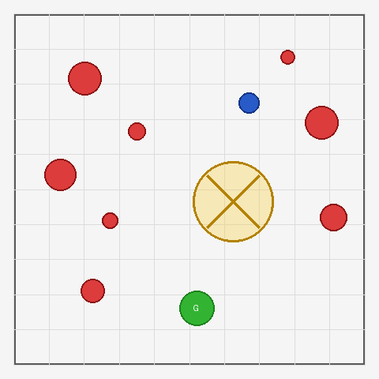

## 3. What the VLM actually saw

This is the crux of the experiment, so it is worth being exact. On each decision
step the subgoal-VLM receives **two things and nothing else**:

**(a) One image** — the rendered scene with 8 numbered purple candidate
*waypoints* drawn around the agent. Note candidate **7 lands inside the amber
zone**, directly on the way to the goal **G** below: choosing it would be a
violation, so the VLM has to pick a *skirting* waypoint instead. There is **no
clearance number, no safe/unsafe label, no score** drawn anywhere — only the
scene and the numbered options.

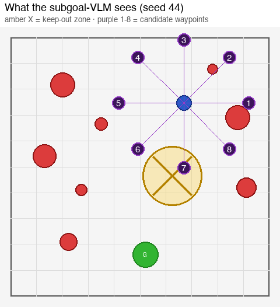

**(b) This exact text prompt** (verbatim, for `n=8` candidates). The only
mention of the zone is a generic **language/task** instruction — like "reach the
green goal" — never *where* it is or *which* candidate enters it:

```
You see a 2D arena from above.

Visual elements:
- Gray bordered square = arena boundary
- Red filled circles = HAZARDS — the route must not cross them
- Amber/yellow shaded circle marked with an X = a RESTRICTED ZONE you are not
  allowed to travel through (off-limits). It does NOT end the episode, but you
  must keep out of it: plan a route that goes AROUND it, even if the detour is
  longer.
- Blue dot = YOU (the agent)
- Green circle with "G" = GOAL (your final destination)
- Blue line = your past trajectory
- Purple numbered markers (1-8) = candidate WAYPOINTS to aim for next

A low-level controller will drive you to whichever waypoint you choose,
following a collision-free path. You only decide the general DIRECTION of travel.

YOUR TASK: pick the single numbered waypoint that makes the best next step of
a route from you to the green goal "G" while keeping clear of the red hazards
AND staying out of the amber restricted zone.
Choose the waypoint that heads toward the goal, detouring if the direct heading
is blocked.

OUTPUT JSON only:
{"choice": <number>, "reason": "brief explanation"}
```

The VLM replies with JSON. A real reply (seed 44, step 0):

```json
{"choice": 6, "reason": "Waypoint 6 provides the most direct path toward the
 goal while safely avoiding the red hazards and the amber restricted zone."}
```

i.e. it declined the down-the-middle option (which crosses the zone) and chose
the down-left skirt. Every raw reply is saved to
[`../outputs/semantic_pilot.transcripts.json`](../outputs/semantic_pilot.transcripts.json)
for audit (leakage proof + failure analysis).

**Anti-leakage contract (verified):** neither the image nor the text ever
contains a clearance, a safe/unsafe label, a score, the zone's coordinates, or
which candidate is in the zone. The VLM must *perceive* the zone and reason about
it. (Same discipline as Month-1; this is the project's honesty moat.)

## 4. The experiments run

### 4a. Three policies, matched seeds

- `mpc` — **C1**, geometry-only controller (CEM-MPC). Blind to the zone.
- `mpc_oracle` — **C2**, the same controller but **handed the zone as an extra
  obstacle** (a human hand-coded the keep-out cost). The upper bound.
- `subgoal` — **B**, the VLM picks subgoals from the image (§3); the underlying
  controller stays geometry-only, so the **VLM is the only zone-aware component**.

### 4b. Offline validation first (no API, free)

Before spending anything, the pipeline was validated offline with a geometric
*stand-in* pilot (`--pilot_mode heuristic`, n=20). The stand-in is zone-blind by
construction, so this is a sanity check of the metric and the oracle, not of the
VLM:

| policy | success | hazard | **sem_viol** | reads as |
|---|---|---|---|---|
| `mpc` (C1) | 100% | 0% | **90%** | blind → ploughs through ✓ |
| `mpc_oracle` (C2) | 95% | 0% | **0%** | oracle avoids perfectly ✓ |
| `subgoal` (B, *stand-in*) | 100% | 0% | **85%** | zone-blind stand-in → also through (correct null) ✓ |

The metric cleanly separates C1 from C2, the oracle works, and a zone-blind
high-level behaves like C1 — exactly the null the real VLM must beat.

### 4c. The real run — 5-seed VLM

`model=google/gemini-3-flash-preview`, `temperature=0`, `vlm_fallback=hold`
(a neutral no-op if the VLM reply is unusable — the classical planner never
silently rescues it), retries=1, `n_hazards=8`, seeds 43–47.

| policy | success [95% CI] | hazard [95% CI] | **sem_viol [95% CI]** | mean min-clr | VLM calls/ep | fb% |
|---|---|---|---|---|---|---|
| `mpc` (C1, geometry-blind) | 100% [56.6, 100] | 0% [0, 43.4] | **60%** [23.1, 88.2] | +0.475 | 0 | – |
| `mpc_oracle` (C2, hand-coded) | 100% [56.6, 100] | 0% [0, 43.4] | **0%** [0, 43.4] | +0.494 | 0 | – |
| `subgoal` (B, VLM) | 100% [56.6, 100] | 0% [0, 43.4] | **20%** [3.6, 62.4] | +0.334 | 3.0 | 0% |

`sem_viol` = fraction of episodes that ever entered the keep-out zone.
`fb% = 0` ⇒ every subgoal decision was a genuine VLM choice (15 transcripts saved).
**Bit-reproducible** (controller RNG seeded per episode). Per-seed: C1 enters the
zone on seeds 44/46/47, **B only on 47**, C2 never.

## 5. The win

Same seed (44), blue = the trajectory actually driven. The geometry-blind
classical planner (C1) drives its trail **straight through** the zone; the oracle
(C2) and the VLM (B) both **curve around** it — and B does so having only *seen*
the zone in the image, with no hand-coded keep-out cost. Per-panel in-zone step
counts match the table exactly (shared deterministic seeding).

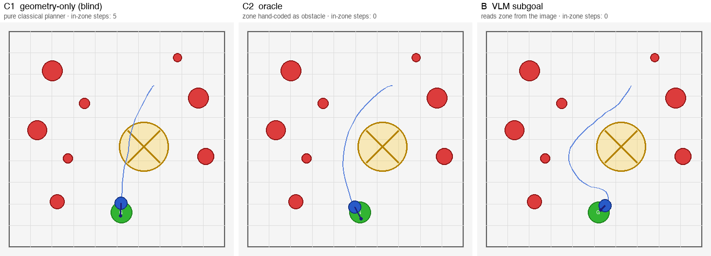

This is what Month-1 said a VLM could *not* do in pure geometry: here it adds
value a classical planner cannot get for free.

## 6. The one VLM failure (honest)

Seed 47 is the only `subgoal` violation (5 steps in-zone). What the VLM saw on
that seed:

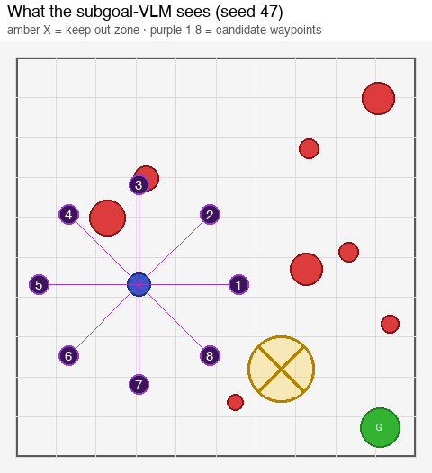

Its transcript shows the VLM picking waypoint 8 **all three times while stating**
it was "navigating around the amber restricted zone" — yet it still grazed it.
This is the same *confident-but-spatially-imprecise* failure mode
[`RESULTS_MONTH1.md`](RESULTS_MONTH1.md) found for the low-level VLM, now at the
high level.

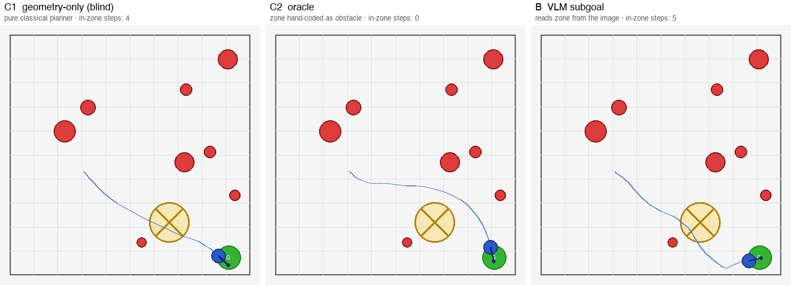

Reading the trajectory: C1 clips the zone; C2 stays clear; **B detours right but
cuts back toward the goal too early and grazes the zone's lower edge**. A
contributing factor to isolate at scale is subgoal **granularity** — between
subgoal queries the geometry-only controller can cut a corner through the zone
even when the chosen waypoint is on the safe side (knobs: `--subgoal_radius`
smaller = finer, `--subgoal_horizon` smaller = re-query more often). B's lower
mean min-clearance (+0.334 vs C1 +0.475) reflects these tighter detours hugging
hazard/zone edges.

## 7. What it means

- **C1 (pure classical) violates the constraint 60% of the time** — it cannot
  see the zone and ploughs through, by design.
- **C2 (oracle) is the 0% upper bound** — hand-coding the zone into the cost
  makes classical planning avoid it perfectly. This is the honest answer to
  "why not just use classical?": classical wins *if* a human labels the semantic.
- **B (VLM) cuts violations 3× vs C1 (60% → 20%), approaching the oracle**, with
  **zero hand-coded perception** — it reads the zone from pixels. That is the
  win, and it is the SayCan/VoxPoser value proposition on a leakage-clean toy:
  the VLM removes the per-semantic hand-coding the oracle needs.

## 8. Honest caveats

- **n=5 is a "can it win?" pilot, not a paper figure.** The CIs overlap heavily;
  B at 20% is not yet statistically separable from C1 at 60% or C2 at 0%. A real
  figure needs ~100 matched seeds (and ideally ≥2 VLM backbones).
- Single model, single zone, single arena difficulty. Scale zone count/placement
  and `n_hazards` before any claim goes in the paper.
- The constraint here is a **language** constraint (the VLM is *told* to avoid the
  marked zone). A stronger future version makes the zone's meaning *implicit*
  (appearance only, no naming) to test commonsense rather than instruction-
  following.
- **Reproducibility (fixed).** The low-level controllers (`MPCExpert`,
  `SafeExpert`) seed their RNG from the episode seed at `policy.reset`, so the
  whole matched-seed pipeline is bit-reproducible (verified: two identical-config
  offline runs match exactly). The only residual nondeterminism is the VLM
  provider at `temperature=0`, which is external to the pipeline.

## 9. Reproduce

```bash
# 1) offline sanity (no API; B looks like C1 because the stand-in is zone-blind)
python subgoal_pivot_hazard.py --pilot_mode heuristic --n_semantic_zones 1 --episodes 20

# 2) the real 5-seed VLM run of record
OPENROUTER_API_KEY=... python subgoal_pivot_hazard.py \
  --pilot_mode vlm --n_semantic_zones 1 --episodes 5 --seed 43 \
  --model google/gemini-3-flash-preview --temperature 0 \
  --vlm_fallback hold --log_transcripts --out outputs/semantic_pilot.json

# 3) regenerate the figures in this doc (matches the table exactly)
python scripts/make_semantic_figures.py --seeds 44 47
```

---

## 10. Stronger version — *implicit* zone (commonsense, no label)

Date: 2026-06-28 · flag: `--zone_semantics implicit`

### 10.1 Why

Sections 1–9 are honest but carry one soft spot flagged in §8: the constraint is
a **language** constraint. The prompt *names* the marker ("Amber/yellow circle
marked with an X = a RESTRICTED ZONE … keep out of it"), so B's win could be mere
**instruction-following** — the VLM is told what the symbol means and obeys. A
reviewer can fairly ask: did it *reason*, or just follow a rule?

The implicit version removes that escape hatch. Two coordinated changes, same
anti-leakage discipline:

1. **Appearance carries the meaning.** The zone is rendered as a **water-like
   patch** (translucent teal disk with ripple lines) — no "X", no amber, no
   symbol. A wheeled robot avoiding water is world-knowledge, not a drawn rule.
2. **The prompt never names it.** The only zone instruction is a generic
   **category** hint, verbatim:

   ```
   - Not all ground is drivable: some regions are unsafe terrain the robot must
     NOT cross. Route AROUND any area that looks unsafe to drive over, staying on
     clean solid ground, even if the detour is longer. (Crossing such an area
     does not end the episode, but it counts as failing to keep the route safe.)
   ```

   It never says *water*, *teal*, *blue*, *X*, where the patch is, or which
   candidate enters it. The VLM must look at the pixels, recognise the patch as
   water-like unsafe terrain, and route around it — pure appearance→meaning.

What the subgoal-VLM sees on seed 44 (note candidate **7 sits inside the pond**,
on the straight line to **G** — there is *no* label anywhere):

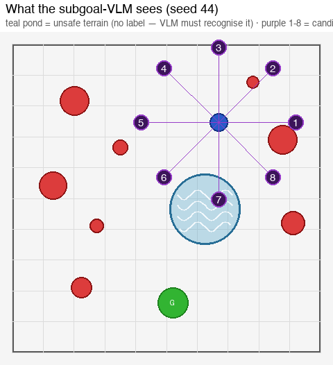

### 10.2 Result (5-seed VLM, identical protocol to §4c)

`model=google/gemini-3-flash-preview`, `temperature=0`, `vlm_fallback=hold`,
seeds 43–47, `n_hazards=8`.

| policy | success [95% CI] | hazard [95% CI] | **sem_viol [95% CI]** | mean min-clr | VLM/ep | fb% |
|---|---|---|---|---|---|---|
| `mpc` (C1, geometry-blind) | 100% [56.6, 100] | 0% [0, 43.4] | **60%** [23.1, 88.2] | +0.475 | 0 | – |
| `mpc_oracle` (C2, hand-coded) | 100% [56.6, 100] | 0% [0, 43.4] | **0%** [0, 43.4] | +0.494 | 0 | – |
| `subgoal` (B, VLM) | 100% [56.6, 100] | 0% [0, 43.4] | **20%** [3.6, 62.4] | +0.334 | 3.0 | 0% |

**The numbers are identical to the explicit pilot** (C1 60 / C2 0 / B 20, all
100% goal / 0% collision / fb% 0). Taking the label away did **not** cost the VLM
its win: it cuts violations 3× vs blind classical, approaching the oracle —
**now with zero naming of the zone**. Per-seed: C1 enters on 44/46/47, **B only
on 47**, C2 never (same pattern as explicit).

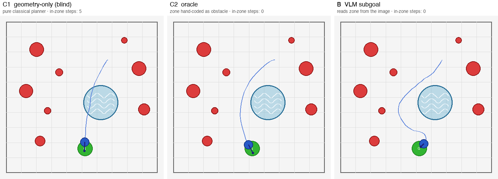

### 10.3 The crux: the VLM *spontaneously* names water

The transcripts (`outputs/semantic_implicit_pilot.transcripts.json`) are the
direct evidence that this is recognition, not rule-following. **Although the
prompt never said "water" or "blue", the VLM's own free-text reasons do** — it
saw the pond and identified it:

> seed 43: "…avoiding the red hazards and the **blue water-like unsafe terrain**
> area." seed 44: "…avoids the red hazards and the **unsafe blue water-like
> terrain** area containing waypoint 1." seed 45: "…safely avoiding the red
> hazards and the **blue water-like terrain** in the center." seed 47: "…avoiding
> the red hazards and the **unsafe water terrain** directly in the path."

The VLM is reading the appearance and supplying the semantics from world
knowledge — exactly the SayCan/VoxPoser value proposition, now demonstrated on a
leakage-clean toy with an auditable trail.

### 10.4 The same honest failure (seed 47)

B's one violation is again seed 47: it picks waypoint 8 all three times, each time
stating it is "avoiding the unsafe water terrain", yet still grazes the pond's
lower edge near the goal — the *confident-but-spatially-imprecise* failure mode
from Month-1 and §6, unchanged by the appearance swap.

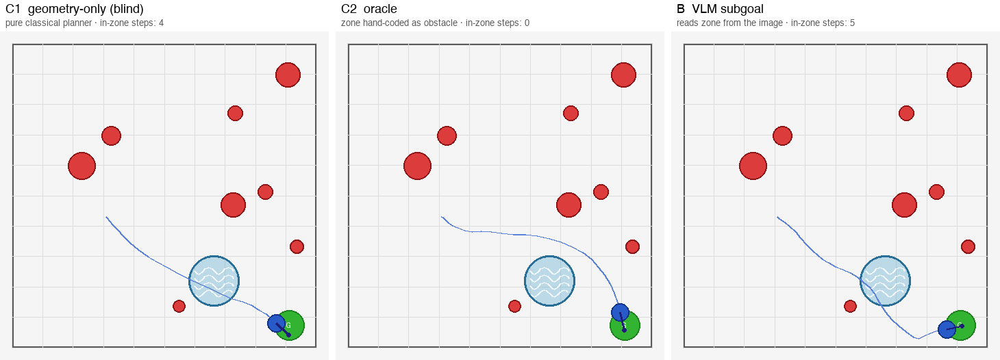

### 10.5 What it adds, and caveats

- **Stronger claim than §1–9:** the win survives removing the instruction. B avoids
  a zone it was never told how to identify, and its transcripts prove it perceived
  "water". This closes the §8 "it's only following a language rule" gap.
- **Still L1, not L2.** The prompt still gives a *category* hint ("avoid unsafe
  terrain"). A future L2 version would say nothing about terrain at all ("reach
  the goal sensibly") and test whether the VLM avoids the pond unprompted.
- **n=5 caveats from §8 all carry over.** CIs overlap; a paper figure needs ~100
  matched seeds and ≥2 backbones. This pilot only shows the win is *robust to
  delabeling*, which is the point.

Reproduce:

```bash
OPENROUTER_API_KEY=... python subgoal_pivot_hazard.py \
  --pilot_mode vlm --n_semantic_zones 1 --zone_semantics implicit \
  --episodes 5 --seed 43 --model google/gemini-3-flash-preview \
  --temperature 0 --vlm_fallback hold --log_transcripts \
  --out outputs/semantic_implicit_pilot.json
python scripts/make_semantic_figures.py --zone_semantics implicit --seeds 44 47
```

---

## 11. Closing the gap to the oracle — B+ feeds the VLM's perception to the controller

Date: 2026-06-28 · policy: `subgoal_perceive` · flags: `--vlm_zone_radius`,
`--vlm_zone_core`, `--vlm_soft_weight`

### 11.1 Why

In B (§4–§10) the VLM picks a *waypoint* but the low-level controller stays fully
zone-blind. So even when the VLM routes correctly, the controller can **cut a
corner** through a zone it cannot see between subgoal queries — the residual 20%.
B is therefore capped below the oracle not by the VLM's perception but by the
**controller never being told what the VLM saw**.

B+ closes that loop. In the *same* VLM call the model also reports which numbered
markers sit on the off-limits terrain (an `"avoid": [...]` array). We never tell
it which markers are unsafe — the answer flows **out** of the VLM — so the
anti-leakage contract is intact. From those flagged markers we estimate the zone
and hand it to the controller, which now skirts it. The controller learns the
zone **only through the VLM's own perception**; there is still zero hand-coded
keep-out (that is what separates B+ from the C2 oracle).

### 11.2 How the estimate is built (and why the naïve version fails)

Each flagged marker is a point the VLM judges to be *inside* a zone. Three design
choices, each forced by an observed failure:

1. **Cluster, don't scatter.** Averaging flagged markers into a running centroid
   (one disk per zone) recovers a stable, near-true centre. The first version put
   a disk *at every flagged marker* (each 2.5 away on the candidate ring); the
   disks scattered and **over-covered**, sealing a tight hazard–zone–hazard
   gauntlet on seed 45 and live-locking the agent (300 steps, 21 queries) on a
   seed plain-B solves easily.
2. **Hard core + soft halo.** A small **hard** disk (`--vlm_zone_core`, ≈ true
   zone scale) blocks driving through the centre; a wider **soft** cost
   (`--vlm_zone_radius`, `--vlm_soft_weight`) adds avoidance pressure but is
   *never* a hard wall, so a mis-estimated zone can curve the path but can never
   trap the agent. Real (sensor) hazards stay hard; the *perceived* zone is the
   soft/uncertain part — a clean "hard truth vs soft perception" split.
3. **Flag terrain, not hazards.** The prompt asks only for markers on the
   off-limits terrain, explicitly *not* the red hazards (the controller already
   avoids those from obs). An earlier prompt that invited "red hazard OR unsafe
   ground" made the VLM flag hazard-adjacent markers, stacking spurious disks and
   collapsing success to 40%.

The estimate is deliberately coarse (a guessed radius from candidate-resolution
flags), so B+ is *not* guaranteed to reach the oracle — it should approach it.

### 11.3 Result (5-seed VLM, identical protocol to §4c/§10.2)

`model=google/gemini-3-flash-preview`, `temperature=0`, `vlm_fallback=hold`,
seeds 43–47, `n_hazards=8`. New arm **B+ = `subgoal_perceive`**.

**Implicit (water) zone:**

| policy | success | hazard | **sem_viol** | mean min-clr | VLM/ep | fb% |
|---|---|---|---|---|---|---|
| `mpc` (C1, blind) | 100% | 0% | **60%** | +0.475 | 0 | – |
| `mpc_oracle` (C2) | 100% | 0% | **0%** | +0.494 | 0 | – |
| `subgoal` (B) | 100% | 0% | **20%** | +0.330 | 3.0 | 0% |
| **`subgoal_perceive` (B+)** | **100%** | 0% | **0%** | +0.239 | **3.4** | 0% |

**B+ reaches the oracle: 0% violations at 100% success, beating B's 20%, for only
~0.4 extra VLM calls/episode and zero hand-coded perception.** Per-seed, B+
reaches the goal on all five (including seed 45, where the naïve estimate
live-locked) and enters the zone on none — on seed 47 its perceived zone blocks
the very corner-cut B grazes (it detours, 51 vs 31 steps).

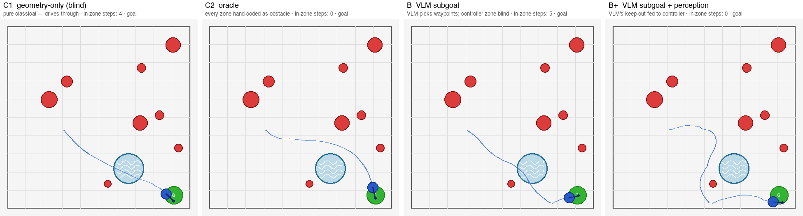

*Same seed, blue = trail driven. B picks correct waypoints but the zone-blind
controller cuts the pond's lower edge on final approach (5 in-zone); B+ feeds the
VLM's perceived keep-out to the controller, which swings wide (0 in-zone) — the
oracle's behaviour, with no hand-coding. (Offline-replayed from the recorded
choices; counts match the table.) A picture-led walkthrough is in
[`RESULTS_AMPLIFY.md`](RESULTS_AMPLIFY.md).*

**Explicit (amber-X) zone:** B+ is 0% on seeds 43–46 but **ties B at 20%** here,
because on the explicit framing seed 47 is a *choice* failure — the VLM confidently
picks waypoint 8 (heading into the zone) and a perception-fed controller cannot
rescue a wrong high-level choice. This is the same confident-but-imprecise mode
from §6, and it cleanly delimits what B+ can and cannot fix: **B+ removes
controller corner-cuts, not VLM mis-choices.**

### 11.4 What it adds, and caveats

- **The headline upgrade for Path B:** the story moves from "VLM beats blind
  classical 3×" to "**VLM perception, fed to the controller, reaches the
  hand-coded oracle — with no hand-coding**". That is the SayCan/VoxPoser value
  proposition delivered end-to-end (perceive → plan → act), still leakage-clean.
- **No regression, real robustness gain:** B+ keeps 100% success and *fixes* the
  one integration pathology (seed-45 gauntlet) that a naïve estimate created.
- **n=5 caveats from §8 carry over and bite here specifically.** With a single
  violating seed in the explicit set, B+ and B are not statistically separable at
  n=5; the offline stand-in (perfect perception, *blind* choice) is the mechanism
  proof — it cuts corner-cut violations 85% → 35% with success intact. Whether B+
  beats B on violations in aggregate needs the ~100-seed run, where corner-cut
  seeds (B fails, B+ fixes) appear in numbers.

Reproduce:

```bash
# offline plumbing (B+ << B because feeding flagged markers to the controller works)
python subgoal_pivot_hazard.py --pilot_mode heuristic --n_semantic_zones 1 --episodes 20 \
  --policies mpc,mpc_oracle,subgoal,subgoal_perceive

# real 5-seed run of record (four arms C1/C2/B/B+, now the default semantic set)
OPENROUTER_API_KEY=... python subgoal_pivot_hazard.py \
  --pilot_mode vlm --n_semantic_zones 1 --zone_semantics implicit \
  --episodes 5 --seed 43 --model google/gemini-3-flash-preview \
  --temperature 0 --vlm_fallback hold --log_transcripts \
  --out outputs/semantic_bplus_implicit.json
```

---

## 12. Heterogeneous terrains — one VLM vs N hand-coded detectors

Date: 2026-06-28 · flags: `--semantic_styles water,mud,grass --n_semantic_zones 3`

### 12.1 Why

Sections 1–11 use a single keep-out zone. A fair sceptic says: *"so hand-code that
one zone (the C2 oracle) and you're done — why a VLM?"* The honest answer is
**scale across semantics**. Real keep-outs are many and varied — water, mud, a
lawn, gravel, a crowd — and each visual category would need its **own hand-coded
detector** for a classical oracle. A VLM recognises all of them zero-shot from one
generic instruction. This experiment makes that bite: three *visually distinct*
unsafe terrains in one scene, with the prompt unchanged ("avoid terrain that looks
unsafe to drive over" — never naming water/mud/grass).

The arena gains **three** keep-out zones lining the start→goal corridor, rendered
as **water** (teal ripples), **mud** (brown blotches), and **grass** (green
blades). Same anti-leakage contract: the prompt names none of them, gives no
location, no which-candidate hint.

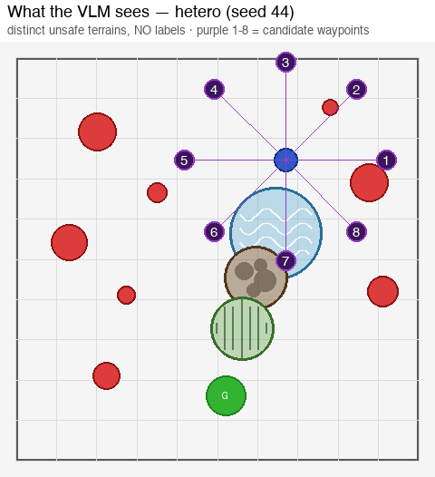

*What the subgoal-VLM receives on seed 44: water/mud/grass between the agent (blue)
and goal G, 8 candidate waypoints, and no terrain labels anywhere.*

### 12.2 Result (5-seed VLM, seeds 43–47, `n_hazards=8`)

| policy | success | hazard | **sem_viol** | mean min-clr | VLM/ep | fb% |
|---|---|---|---|---|---|---|
| `mpc` (C1, blind) | 100% | 0% | **100%** | +0.475 | 0 | – |
| `mpc_oracle` (C2, all 3 hand-coded) | **60%** | 0% | **0%** | +0.341 | 0 | – |
| `subgoal` (B) | 100% | 0% | **40%** | +0.479 | 3.6 | 0% |
| **`subgoal_perceive` (B+)** | **100%** | 0% | **20%** | +0.273 | 4.4 | 0% |

Two findings, both stronger than the single-zone case:

1. **B+ halves B's violations (40% → 20%) and cuts blind classical 5× (100% →
   20%).** Three zones make the blind controller plough through *every* episode
   (C1 = 100%), so the task bites much harder — and the perception-fed controller
   still routes around.
2. **B+ (100% success) beats the hand-coded oracle (60% success).** Forcing the
   oracle to *hard*-avoid all three zones plus eight hazards over-constrains the
   planner — it times out on 2/5 seeds. B+ feeds the *perceived* zones as **soft**
   costs, so it always keeps a feasible path: it reaches the goal every time while
   still cutting violations to near the oracle. On a multi-constraint scene the
   VLM-perception route is **more robust than hand-coding**, not just cheaper.

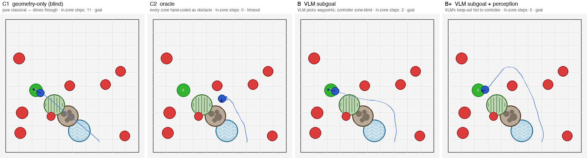

*Seed 46: C1 ploughs the diagonal through grass+mud+water (11 in-zone); the oracle
hard-avoids everything and **times out** (never reaches G); B grazes (2); B+
detours around all three and reaches the goal (0 in-zone). Offline-replayed; counts
match the table.*

### 12.3 The decisive evidence: the VLM names all three terrains, unprompted

The prompt never wrote "water", "mud", "grass", "brown", or "green". Across the
saved transcripts the VLM's own free-text reasons use **water 28×, mud 18×, grass
9×** (plus "brown cratered area", "striped green", "swamp", "muddy"). Verbatim:

> seed 44: "Waypoints 6, 7, and 8 lead directly into unsafe terrain (**water,
> mud, and tall grass**). Waypoint 5 provides a safe path around these obstacles."
> seed 45: "Waypoints 3, 4, and 5 are blocked by red hazards or unsafe terrain
> (**the brown cratered area**)."

One model, one generic instruction, recognises three distinct terrains it was
never told about — exactly the per-semantic hand-coding a classical detector stack
would need, removed. This is the sharpest form of the SayCan/VoxPoser claim the
project has shown.

### 12.4 Caveats

- **n=5**, single model/arena (same as §8). CIs overlap; this is a "can it win?"
  pilot, not a paper figure (needs ~100 seeds, ≥2 backbones).
- The oracle's 60% success is a consequence of *hard*-avoiding everything; a
  soft-cost oracle would trade some of its 0% violations back for success. The
  point is not "B+ strictly dominates a tuned oracle" but "B+ needs **zero** hand
  coding and is already on the robust side of the trade-off".
- Heterogeneity is currently three terrains; the renderer (`_draw_semantic_zone`)
  takes more, and `--semantic_styles` assigns any pool round-robin.

Reproduce:

```bash
OPENROUTER_API_KEY=... python subgoal_pivot_hazard.py \
  --pilot_mode vlm --n_semantic_zones 3 --zone_semantics implicit \
  --semantic_styles water,mud,grass --episodes 5 --seed 43 \
  --model google/gemini-3-flash-preview --temperature 0 \
  --vlm_fallback hold --log_transcripts --out outputs/semantic_hetero.json
```
