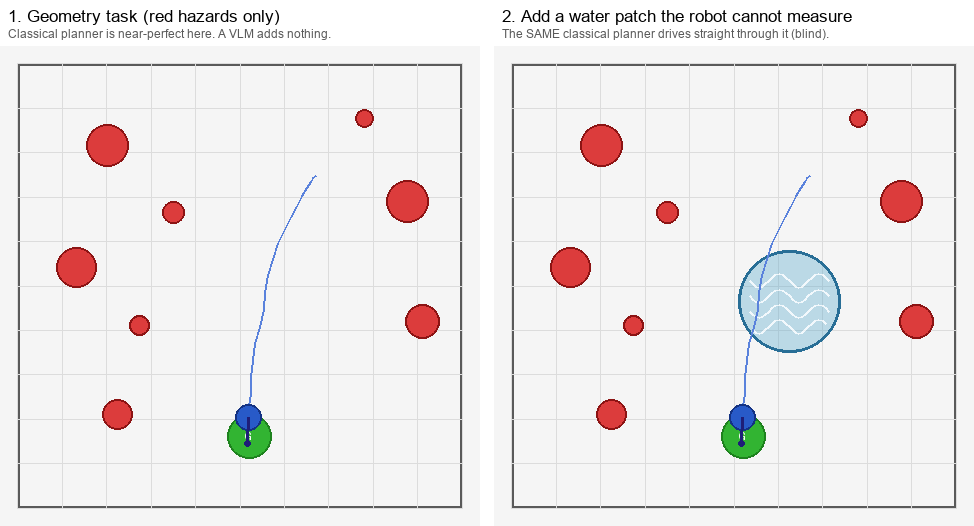

# Why use a VLM at all?

> **状态：SUPERSEDED FRAMING（2026-07-11 复核）。** 本文保留“为什么需要语义层”的
> 直觉，但“一个 VLM 顶 N 个 detector”“自发命名即理解”都还是待验证假设；现有 semantic
> 数字因 sampler bug 和 router confound 已失效。当前贡献路线是按层归因的 **Safety
> Accounting**，不是“VLM 打败经典规划”。写作以 [`ICLR_PLAN.md`](ICLR_PLAN.md)、
> [`RESEARCH_REVIEW_COMMENTS.md`](RESEARCH_REVIEW_COMMENTS.md) 和
> [`RESULTS_REGISTRY.md`](RESULTS_REGISTRY.md) 为准。

*Plain-English explainer. Read this first if the project's point is unclear.*
*Companion to [`RESULTS_SEMANTIC.md`](RESULTS_SEMANTIC.md) (the numbers) and
[`PROJECT_PLAN.md`](PROJECT_PLAN.md) (the roadmap).*

---

## The honest worry this project answers

A reasonable advisor asks: **"We already have classical motion planners (A\*,
MPC) that are fast and often effective empirically. Why bring a big slow VLM into the
control loop at all?"**

That worry is correct — *most of the time*. This project's whole job is to find
the **one situation where the worry is wrong**, and to prove it honestly (no
cheating, no leaking the answer to the VLM).

The short answer:

> A classical planner can only avoid what it can **measure** and what someone has
> **written into its cost function**. A VLM can avoid things it has only **seen**
> and **understood**. The VLM's advantage is exactly the constraints that are
> hard to measure or hand-code — *semantic* constraints.

---

## 1. The setup, in one picture

The robot (blue dot) must reach the goal **G** (green). Red circles are
**hazards** — solid obstacles the robot *can* measure (they are in its sensor
data). A classical planner handles these perfectly.

Now we add one **water patch** (teal). It is deliberately built so the robot
**cannot measure it**: it is *not* in the robot's sensor data, and touching it
does not end the episode — it is just a place the robot *should* know not to
drive through.



- **Left (geometry task):** only red hazards. The classical planner drives a
  clean, safe path to the goal. **A VLM here would add nothing.**
- **Right (same scene + water):** the *exact same* classical planner drives
  **straight through the water** (5 steps inside it). It is not "wrong" — it
  literally cannot see the water, so it has no reason to go around.

This is the gap. The question is: **who can avoid the water?**

---

## 2. Three ways to avoid the water

We compare three "drivers" on the **same** scenes (matched seeds):

| Driver | How it learns where the water is | Needs a human to label it? | Water-violation rate |
|---|---|---|---|
| **C1 — pure classical** | It doesn't. The water isn't in its sensors. | — (blind) | **60%** (ploughs through) |
| **C2 — classical + hand-coding** | A **human** manually marks the water as an obstacle. | **Yes, every time** | **0%** (perfect) |
| **B — VLM** | It **looks at the image** and recognises the water itself. | **No** | **20%** |

Read this table slowly — it *is* the whole result:

- **C2 proves classical planning CAN be perfect** — but only if a human sits there
  and hand-codes "this region is off-limits" for every new scene. That does not
  scale.
- **B (the VLM) gets most of the way to C2's performance with NO human labelling.**
  It just looks and understands. **That removal of human hand-coding is the
  VLM's advantage.**

Here are the three drivers on the same scene. Watch the blue trail:


- **C1** drives through the pond (blind).
- **C2** curves around it — *because a human told it to*.
- **B** also curves around it — *because it recognised the water from pixels,
  with no human help.*

---

## 3. What the VLM actually sees (and why this is not cheating)

This is the part that keeps the result honest. On each step the VLM gets **only**
this image plus a short text prompt. The 8 purple markers are candidate
directions to go next. Notice **marker 7 sits inside the water**, right on the
straight line to the goal:


Crucially, **we never tell the VLM where the water is.** The prompt does not say
"avoid the teal circle", does not give its location, does not say which marker is
inside it, and gives no safety score. It only says, in general terms: *"some
ground is unsafe to drive over — stay on safe ground."* The VLM must **see** the
water and **decide** which marker avoids it. (If we leaked the answer into the
prompt, the result would be meaningless — avoiding that leak is the project's
core discipline.)

---

## 4. The proof it is *understanding*, not *rule-following*

Here is the strongest evidence. We never wrote the word "water" anywhere in the
prompt. Yet when the VLM explains its choices, **it spontaneously calls the patch
"water" on its own**:

> *"…avoiding the red hazards and the **blue water-like unsafe terrain** area."*
> *"…avoids the red hazards and the **unsafe blue water-like terrain** containing
> waypoint 1."*
> *"…avoiding the red hazards and the **unsafe water terrain** directly in the
> path."*

The VLM looked at the pixels, recognised water, knew a robot should not drive
through it, and acted on that — using world knowledge a classical planner simply
does not have. **That is the advantage, demonstrated and auditable.**

---

## 5. Where the VLM does NOT help (the honesty moat)

Just as important — and what makes this project credible — is being clear about
where a VLM is **useless**:

- **Measurable obstacles** (the red hazards, left panel of §1): classical
  planning is near-perfect and far faster. Using a VLM here would be silly.
- **The VLM is not even as good as the oracle** (B 20% vs C2 0%): it is
  imperfect and sometimes grazes the zone. The claim is *not* "VLM beats
  classical". The claim is precise: **"VLM beats classical *when the constraint
  cannot be written as a geometric cost*, and it does so without the per-scene
  hand-coding the oracle needs."**

So the project deliberately shows a **negative** result first (geometry → VLM
redundant) and only then the **positive** one (semantics → VLM earns its place).
That contrast is the point.

---

## 6. One-line summary

> Classical planning wins on what you can **measure** or **hand-code**. The VLM
> wins on what you can only **recognise** — and it removes the human who would
> otherwise have to label every such case by hand.

## 7. Real-world analogy

A self-driving car:

- *Avoid the other cars* → measurable with lidar → **classical planning**, a VLM
  adds nothing.
- *Don't drive through that flooded dip · that looks like wet cement · that's a
  school zone* → cannot be measured, and you can't hand-write a rule for every
  such case in advance → needs something that **looks and understands** →
  **a VLM**.

This project is that second bullet, shrunk down to the smallest possible
leakage-free toy so the claim can be proven cleanly.

---

*Numbers, confidence intervals, failure analysis, and reproduce commands:
[`RESULTS_SEMANTIC.md`](RESULTS_SEMANTIC.md) (see §10 for this water/implicit
version). Figures regenerate with:*

```bash
python scripts/make_why_figure.py                                      # fig_why_vlm.png (§1, no API)
python scripts/make_semantic_figures.py --zone_semantics implicit --seeds 44 47  # §2–4 figures (needs VLM)
```
