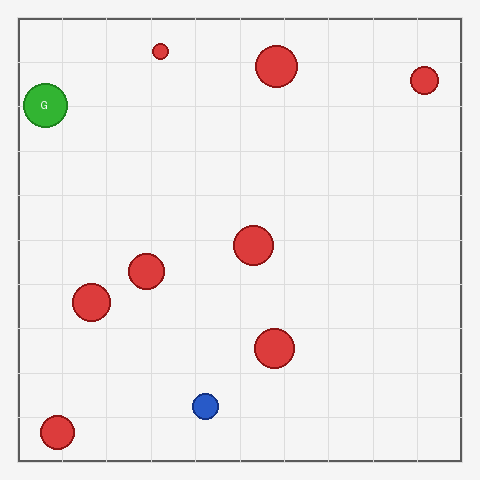
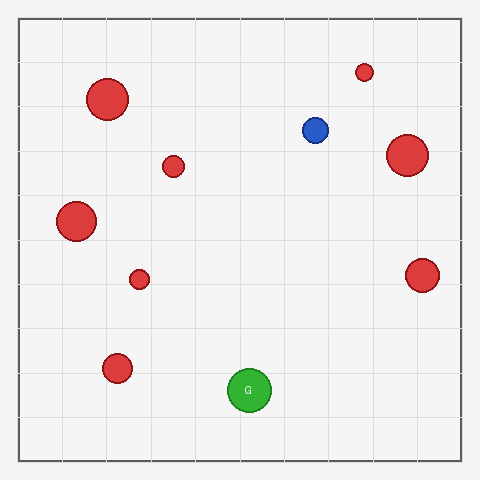
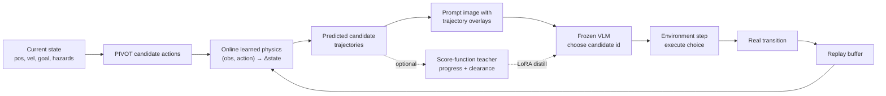
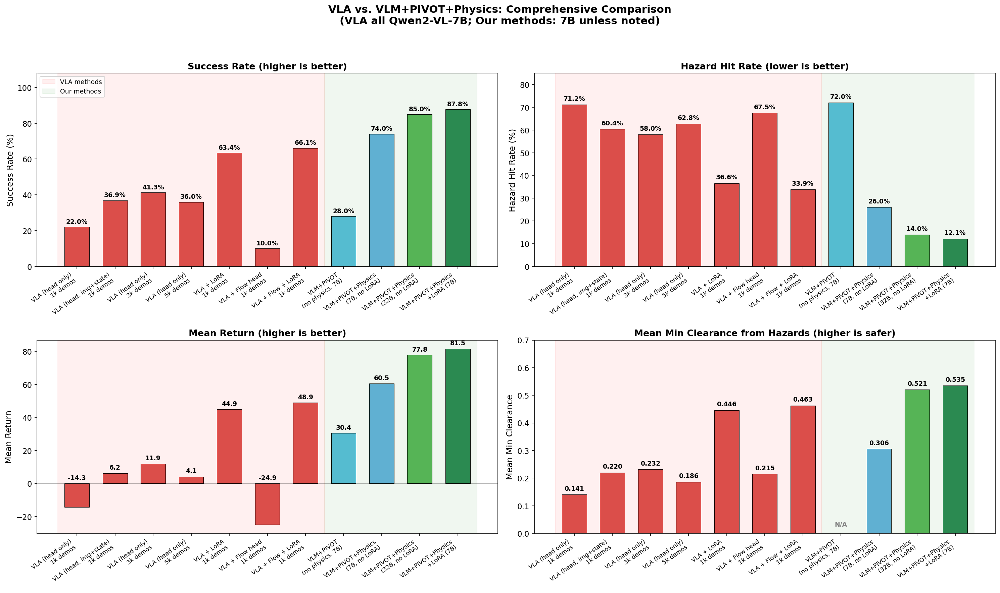
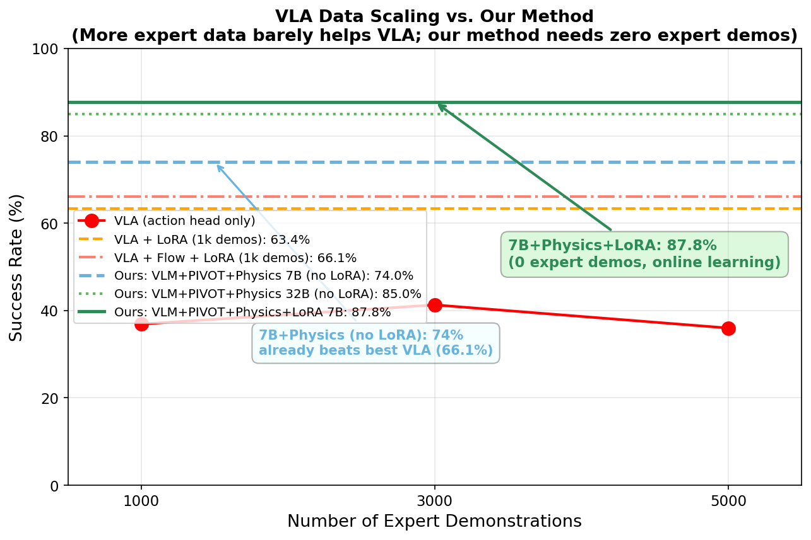
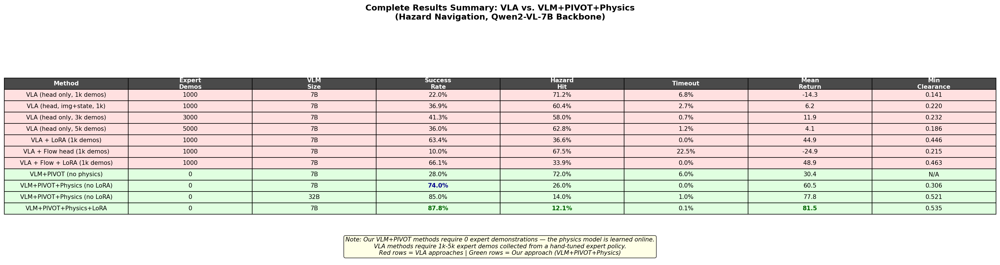

# Physics-Grounded VLM

> **ARCHIVED / INVALIDATED RESEARCH SNAPSHOT (reviewed 2026-07-11).** This directory
> preserves the learned-physics PIVOT code, media, and write-up as part of the research
> record. Its strongest numbers were affected by prompt leakage and must not be cited as
> current paper evidence. The active project is documented in
> [`../docs/ICLR_PLAN.md`](../docs/ICLR_PLAN.md), the audit in
> [`../docs/RESEARCH_REVIEW_COMMENTS.md`](../docs/RESEARCH_REVIEW_COMMENTS.md), and the
> evidence status in [`../docs/RESULTS_REGISTRY.md`](../docs/RESULTS_REGISTRY.md).

## Archive boundary

This directory and the frozen experiment modules listed in
[`../STRUCTURE.md`](../STRUCTURE.md) are historical assets. They are kept for
forensic reproduction and provenance, not as an active development surface.

Do not add new features, dependencies, claims, paid runs, or performance tuning
to any of these routes:

- protocol lexical/numeric/serialization expansion or P4 precision work;
- PointPush as an independent scientific line;
- direct VLA training/evaluation scaffolds;
- old PIVOT/B+ performance and renderer-palette detector results;
- unpaired paid VLM sweeps or terrain-name expansion without matched controls.

The maintained code is the PointHazard accounting slice under `evaluation/`,
`envs/`, `tests/`, and the shared executor. In particular, preserve exact
prompt/image bytes, replay identity, capability/appearance twins, STC
components, layout invariants, and registry/run-manifest provenance.

### Can a Vision-Language Model fly a point-mass through a hazard field — and what does it actually need to see to do it safely?

A research study on **using a Vision-Language Model (VLM) as a closed-loop controller** for a
safety-critical, inertial navigation task. Instead of fine-tuning a large Vision-Language-Action
(VLA) policy, the VLM stays frozen and makes **visual multiple-choice decisions** over candidate
actions whose **physical consequences are rendered into the image**. A small *online-learned physics
model* supplies those consequences, so the system needs **zero expert demonstrations**.

> **TL;DR** — The decisive ingredient for VLM control here is not "which actions are allowed" or
> "what happened last step." It is **counterfactual dynamics**: *show the model where each candidate
> action will actually take it.* When you do, a frozen 7B VLM with an online physics model reaches
> **~88% success** on a task where the same backbone fine-tuned as an end-to-end VLA — on 5,000
> expert demos — tops out near **66%**.
>
> ⚠️ This archive is presented as an **honest research analysis, not a benchmark claim.** A later
> prompt-leakage audit (see [§ Scientific honesty](#-scientific-honesty-the-leakage-audit)) showed
> the strongest numbers were partly inflated by safety information leaking into the prompt. That
> finding — *VLMs do not reliably read safety margins out of raw rollout images* — is the most
> valuable result in the project, and it is what motivated the follow-up work.

<p align="center">
  
  
  
</p>
<p align="center"><em>Left/center: VLM-controlled agent (blue) reaching the goal (green) while avoiding lava hazards (red).
Right: an honest failure — a collision episode. Both outcomes are kept and reported.</em></p>

---

## The task: PointHazard

A 2D point-mass lives in an open arena with **inertia and drag**. Every episode randomly samples
8 circular **lava hazards** and a single **goal**. The agent applies a 2D force each step; touching a
hazard ends the episode with a large penalty. There are no walls — the only thing to learn is
*momentum-aware collision avoidance.*

This is deliberately a **toy** — small enough to run hundreds of controlled, matched-seed episodes
against a paid VLM API, but with the one property that makes VLM control hard: **the safe action
depends on velocity, not just position.** A force pointing "away from lava" can still drive you into
it if you are already moving fast.

| Property | Value |
|---|---|
| State | agent `(x, y, vx, vy)`, goal `(gx, gy)`, k-nearest hazards `(hx, hy, hr)` |
| Action | 2D force `[fx, fy] ∈ [-1, 1]²` |
| Dynamics | numpy point-mass with inertia + drag + bouncing boundary (no MuJoCo) |
| Render | custom PIL top-down renderer (no OpenGL) |
| Failure | hazard contact → terminate, large penalty |

---

## The idea: render the consequence, then let the VLM choose

Classic visual prompting (**PIVOT**, Nasiriany et al. 2024) draws candidate **force arrows** on the
image and asks the VLM to pick one. The problem: an arrow tells the model *where a force points*, not
*where the agent will end up* once inertia is taken into account. So this project asks a sharper
question:

> What **form of physical information** does a VLM actually need to choose a safe action?

and answers it with an ablation that isolates three different things you can put in the prompt:

| Prompt design | Question it answers | What the VLM sees |
|---|---|---|
| **Safety-filtered** | *"Which actions are forbidden?"* | candidates with unsafe ones removed |
| **Self-iterating** | *"What happened recently?"* | last 3 steps of action→result history |
| **Counterfactual rollout** | *"What will happen if I do this?"* | each candidate rendered as its predicted short-horizon **trajectory** |

The headline finding: **counterfactual rollout wins.** Constraints prevent some crashes but make the
agent timid and timeout-prone; retrospective history makes it aggressive and unsafe; *showing the
future trajectory* gives the VLM a decision surface it can actually reason over.

### The system

The contribution is turning that finding into a reusable, demo-free control loop. A tiny MLP learns
one-step dynamics **online** from the real transitions the agent collects, then recursively predicts
each candidate's trajectory — no oracle simulator, no expert dataset.



The optional dashed path is a **LoRA self-improvement loop**: a hand-written teacher scores every
predicted trajectory (`score = goal_progress + w · min_clearance`), and the small VLM is LoRA-tuned
toward the teacher's choice — so the policy keeps getting safer as it runs.

---

## Results

> Numbers below are from the original research runs. Read them **together with**
> [§ Scientific honesty](#-scientific-honesty-the-leakage-audit) — they are directional evidence for
> a design principle, not a clean leaderboard.

### 1. The ablation — what kind of prompt information matters

Matched model, seeds, and episode budget; only the prompt design changes.

| Prompt design | Success | Hazard hit | Timeout | Reading |
|---|---:|---:|---:|---|
| Safety-filtered ("which actions are unsafe") | 4/10 | **0/10** | 6/10 | Safe but stalls — times out a lot |
| Self-iterating (past-3-step history, no future) | 5/10 | 5/10 | 0/10 | Aggressive but **unsafe** |
| Momentum / rollout-rendered | 5/10 | **0/10** | 5/10 | Better progress, still safe |
| Frontier VLM + explicit physics trajectory | **10/10** | **0/10** | 0/10 | Upper bound — with physics, it's solvable |

### 2. Demo-free VLM control vs. fine-tuned VLA — same Qwen2-VL-7B backbone

The central systems comparison. **VLA** = fine-tune the backbone end-to-end on expert demos.
**Ours** = frozen backbone + online physics + visual choice.

<p align="center"></p>

| Method | Expert demos | Success | Hazard hit |
|---|---:|---:|---:|
| Direct VLA, regression head | 1,000 | 36.9% | 60.4% |
| Direct VLA, regression head | 5,000 | 36.0% | 62.8% |
| Direct VLA + flow head + LoRA | 1,000 | 66.1% | 33.9% |
| **Ours: VLM + PIVOT + physics (7B, no LoRA)** | **0** | 74.0% | 26.0% |
| **Ours: VLM + PIVOT + physics (32B)** | **0** | 85.0% | 14.0% |
| **Ours: VLM + PIVOT + physics + LoRA (7B)** | **0** | **87.8%** | **12.1%** |

### 3. Why not just add more demos? — data scaling

End-to-end VLA barely improves from 1k → 5k expert demonstrations, while the demo-free method already
sits well above it. The hard part of this task is **dynamics**, and stuffing more imitation data into
a single network does not teach it cleanly.

<p align="center"></p>

<details>
<summary><strong>Full results table (click to expand)</strong></summary>

<p align="center"></p>

</details>

---

## ⚠️ Scientific honesty: the leakage audit

The most important result in this project is a **negative** one, and it is kept front-and-center on
purpose.

After the runs above, a careful prompt audit found that some of the stronger configurations had
**safety information leaking into the prompt** — candidate **clearance values**, **safe/unsafe
labels**, or **score-like hints** were present alongside the rendered trajectory. That means the VLM
may have been *reading an explicit safety oracle* rather than *inferring safety from the image*. When
the leaked quantities are removed:

- PointHazard success drops from near-100% to **~90%** (informal diagnostic);
- Reacher-style tasks need progressively more explicit physics to work at all;
- LunarLander-style terminal-constraint tasks reach only **~20%**.

**The honest conclusion is the valuable one:**

> A VLM does **not** reliably extract safety-critical physical quantities (like minimum hazard
> clearance) from raw trajectory images. It needs either explicit physical abstractions, or — better —
> a **separate low-level controller** that owns safety, with the VLM promoted to high-level strategy.

This is exactly the consensus design in the literature (SayCan, VoxPoser, VLM-MPC): *VLM for
semantics, physics/MPC for low-level safety.* So the negative result is not a blemish — it is the
**motivation for the follow-up project**, where the VLM picks a high-level subgoal and a
safety-oriented sampling MPC controller (empirical) executes it. See [`docs/LEAKAGE_AND_LIMITATIONS.md`](docs/LEAKAGE_AND_LIMITATIONS.md)
for the full audit table and the information-level taxonomy (L0–L6) it produced.

---

## Repository structure

```
physics-grounded-vlm/   (this directory)
├── README.md                          you are here
├── assets/                            figures + episode GIFs
├── docs/
│   ├── METHOD.md                      counterfactual physics prompting, in detail
│   ├── RESULTS.md                     full result tables + interpretation
│   ├── LEAKAGE_AND_LIMITATIONS.md     the leakage audit + L0–L6 taxonomy
│   └── STRUCTURE.md                   file-by-file map
│
├── VLM-guided control (VLM intent + diffusion safety copilot)
│   ├── shared_autonomy_hazard.py              VLM force-intent + guided-diffusion safety prior
│   ├── test.py                                proximity-adaptive copilot strength
│   ├── ddpm.py                                minimal conditional DDPM for vectors
│   ├── train_diffusion_hazard.py             train diffusion as a hazard-aware *safety prior*
│   ├── train_sac_hazard.py                   SAC expert + safe-demo collection
│   └── augment_safe_actions.py               expand demos with all safe actions per state
│
├── PIVOT family (VLM picks a numbered candidate)
│   ├── pivot_primitive.py                     safety-filtered motion-primitive candidates
│   ├── shared_autonomy_hazard_primitive_pivot.py   "which actions are unsafe?" ablation
│   ├── shared_autonomy_hazard_momentum_pivot.py    rollout-rendered candidates
│   ├── shared_autonomy_hazard_self_iterating_pivot.py  history-only ablation
│   ├── shared_autonomy_hazard_learned_physics_pivot.py ★ online learned-physics rollouts
│   ├── shared_autonomy_hazard_dual_mlp_pivot_openrouter.py  physics-MLP + safety-MLP
│   └── *_openrouter.py / *_pivot.py           API + local-Qwen variants of the above
│
└── env_hazard_gym.py                  gym wrapper (archived)
```

Two backends are supported throughout: a **local Qwen2-VL** path and an **OpenRouter API** path
(`*_openrouter.py`), so the same experiment runs against either a self-hosted model or a frontier
model behind an API.

---

## Quick start

```bash
pip install numpy pillow torch openai

# Offline smoke test (no API / no GPU — heuristic stand-in pilot)
python shared_autonomy_hazard_learned_physics_pivot.py --help

# Learned-physics PIVOT against an OpenRouter VLM
OPENROUTER_API_KEY=sk-... \
python shared_autonomy_hazard_learned_physics_pivot.py \
    --pilot_mode vlm --episodes 100
```

> Model weights, run logs, and rollout GIFs are reproducible artifacts and are not committed.
> The `*_openrouter.py` entry points read `OPENROUTER_API_KEY` from the environment.

---

## What this project demonstrates (for reviewers / hiring)

- **End-to-end ML research**: environment design, a custom physics renderer, online dynamics
  learning, diffusion safety priors, SAC experts, VLM visual prompting, and LoRA self-distillation —
  all wired into one closed-loop system.
- **Systems thinking over a single model**: getting a *frozen* VLM to beat a *fine-tuned* VLA by
  moving the hard dynamics reasoning **out** of the network and into an explicit, learned module.
- **Scientific integrity**: finding a leakage confound in my own best result, auditing it, reporting
  the deflated numbers, and turning the negative finding into the design principle that motivated the
  next project. Honest negative results are kept, not hidden.

### Follow-up work

This study directly motivated a follow-up where the VLM is promoted to a **high-level planner** and a
**safety-oriented sampling MPC controller (empirical)** owns low-level hazard avoidance — the design the leakage audit
pointed to. See [`docs/METHOD.md`](docs/METHOD.md) and [`docs/LEAKAGE_AND_LIMITATIONS.md`](docs/LEAKAGE_AND_LIMITATIONS.md).

## Related work

PIVOT · MOKA · RoboPoint (visual prompting) · SayCan · VoxPoser · Code-as-Policies (LLM planner +
affordance) · VLM-MPC · Traj-VLMPC · SIMPACT (VLM + world model) · RT-2 · OpenVLA · π0 (end-to-end
VLA). A full positioning map is in [`docs/RESULTS.md`](docs/RESULTS.md).
