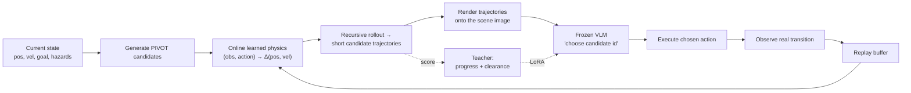

# Method: Counterfactual Physics Prompting for VLM Control

> **ARCHIVED / INVALIDATED AS CURRENT METHOD (reviewed 2026-07-11).** This is the
> historical learned-physics PIVOT method description. Prompt leakage prevents its
> headline evidence from supporting the active paper. Current route:
> [`../../docs/ICLR_PLAN.md`](../../docs/ICLR_PLAN.md).

## Problem

We want a Vision-Language Model to act as a closed-loop controller on **PointHazard** — a 2D
point-mass with inertia that must reach a goal without touching any lava hazard. The action is a
continuous 2D force; the safe action depends on **velocity**, not just position.

Two obvious approaches both struggle:

1. **End-to-end VLA.** Fine-tune the VLM backbone to emit actions directly from pixels. This
   entangles perception, dynamics, continuous-action decoding, and safety into one network, and is
   extremely sensitive to tuning (action head, LoRA rank/lr, demo count). On this task it tops out
   near 66% even with thousands of demos.
2. **Naive PIVOT.** Draw candidate **force arrows** on the image and let the VLM choose. An arrow
   shows where a force *points*, not where the agent *ends up* under inertia. The VLM has no
   reliable way to reason about momentum.

## Core idea

Keep the VLM **frozen** and give it the one thing it is missing: **action-conditioned dynamics.**
For each candidate action, render the **trajectory the agent would follow** if it took that action,
and let the VLM pick among rendered *consequences* rather than rendered *forces*.

> The VLM is not bad at choosing goals or comparing scenes. It is bad at integrating physics in its
> head. So compute the physics outside the model and draw it.

## The control loop



1. **Generate candidates** — a fixed fan of force directions × magnitudes from the current state.
2. **Predict consequences** — a small MLP predicts one-step `(Δpos, Δvel)` and is rolled out
   recursively for a short horizon (1–3 steps) per candidate.
3. **Render** — draw each predicted trajectory, numbered, onto the top-down scene.
4. **Choose** — the VLM returns a single candidate id.
5. **Execute** — step the environment with the chosen action.
6. **Learn online** — append the real transition to a replay buffer and update the physics MLP. No
   expert demonstrations, no oracle simulator.

### Why "online learned physics" matters

The physics model is trained **from the agent's own transitions, during deployment.** This is what
makes the system **demo-free**: it never needs a hand-built simulator or a dataset of expert
trajectories. After a short warm-up the learned model tracks the real dynamics closely (predicted vs.
real one-step progress correlation ≈ 0.95, predicted vs. real next-step clearance correlation ≈ 0.98
in the long runs), which is why its rendered rollouts are useful to the VLM.

## Optional: LoRA self-distillation

A hand-written teacher scores every predicted candidate trajectory:

```text
score = goal_progress + clearance_weight · min_clearance
```

The small VLM is LoRA-tuned to imitate the teacher's top choice. Over a long run, VLM–teacher
agreement rose from ~31% (first 100 episodes) to ~84% (last 100), while hazard hits fell from ~32% to
~10% — i.e. the policy keeps getting safer as it runs, without any external demonstrations.

## Ablation design (the scientific core)

To isolate *what kind of information* the VLM needs, three prompt designs are compared under matched
seeds, model, and episode budget — changing **only** the prompt:

| Design | Information | Implemented in |
|---|---|---|
| Safety-filtered | unsafe candidates removed (constraint) | `shared_autonomy_hazard_primitive_pivot.py`, `pivot_primitive.py` |
| Self-iterating | last-3-step action→result history | `shared_autonomy_hazard_self_iterating_pivot.py` |
| Counterfactual rollout | predicted future trajectory per candidate | `shared_autonomy_hazard_momentum_pivot.py`, `shared_autonomy_hazard_learned_physics_pivot.py` |

The result (see [`RESULTS.md`](RESULTS.md)): **counterfactual rollout** is the decisive ingredient.
Constraints keep you safe but timid; history makes you aggressive but unsafe; *showing the future*
gives both progress and safety.

## A separate baseline family: shared autonomy with a diffusion safety prior

Before the PIVOT family, an earlier design (`shared_autonomy_hazard.py`, `test.py`) let the VLM emit a
**force intent** while a **conditional DDPM** acted as a *safety copilot* — a diffusion model trained
(`train_diffusion_hazard.py`) on hazard-aware safe demonstrations that knows where the hazards are but
**not** where the goal is, so it only ever nudges the agent away from danger. VLM uncertainty (or
proximity to the nearest hazard, in `test.py`) controls how much the copilot intervenes. This is kept
as a baseline and as a second, independent take on the same question: *how do you let a VLM drive
while guaranteeing it stays safe?*

## Honest caveat

The strongest configurations were later found to leak safety information into the prompt. The method
above is sound; some of the **numbers** are inflated. See
[`LEAKAGE_AND_LIMITATIONS.md`](LEAKAGE_AND_LIMITATIONS.md). The corrected takeaway — *don't make the
VLM the low-level safety controller; give it explicit physics or promote it to high-level planning* —
is what this method ultimately argues for.
