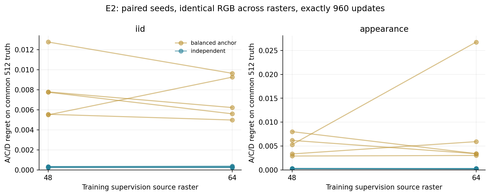
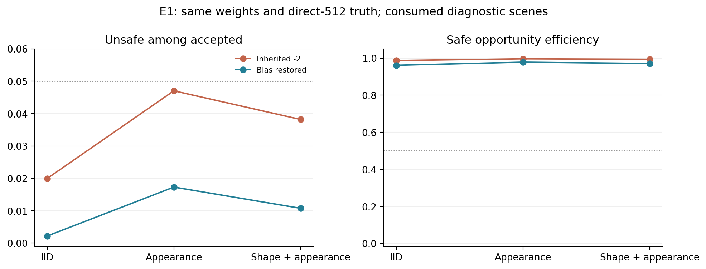
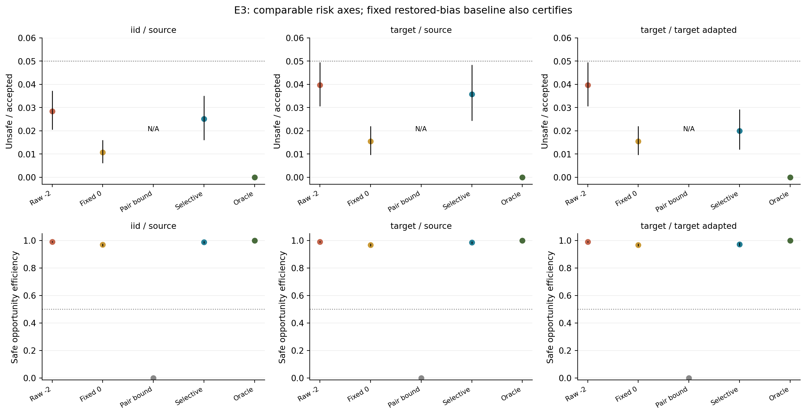

# From Visual Risk Scores to Action Acceptance: Diagnosing Measurement, Postprocessing, and Protection Scope

**Working manuscript, 12 September 2026.** Controlled-case evidence is complete.
The initial RELLIS-3D corridor construction does not pass its geometry qualification
screen and contributes no confirmed external mechanism result. Authorship and submission venue are
not assigned here. This draft supersedes the earlier method-centered narrative;
the original manuscript and frozen reports remain unchanged.

## Abstract

A visual system can rank candidate actions accurately and still reject every
action after uncertainty calibration. This outcome is often interpreted as
insufficient perception or a need for more expressive risk learning. We study
these explanations in an explicitly decomposed visual risk pipeline, separating
spatial attributes, action footprints, and a public cost function. A controlled
audit holds model weights fixed while varying output postprocessing, separates
cost discretization from perception error, and compares protection of all
candidates with the requirements of a fixed action selector. A matched
geometry-by-raster experiment trains 20 models at equal budgets, followed by
independent calibration and testing. Low-resolution and reference cost labels
disagree on approximately 2.6%–3.3% of candidate entries. Removing an inherited
logit shift reduces unsafe acceptance without retraining, while joint residual
bounds continue to reject every action. On fresh synthetic IID data, the
restored-output baseline at its original fixed threshold is certified under the
registered simultaneous risk procedure; its empirical conditional unsafe rate
is 1.07%, and it uses 96.93% of oracle-safe opportunities. Searching the registered
acceptance rules increases opportunity use to 98.82% while increasing empirical
unsafe rate to 2.51%. Thus additional rule selection is unnecessary to pass the
study's research screen. The contribution is a reproducible diagnosis of mistaken
attribution in this controlled case, not a new calibration algorithm or a
robot-safety guarantee. A bounded real-image qualification study identifies
insufficient evaluable support in the chosen corridor construction; cross-task
mechanism transfer remains unestablished.

## 1. Introduction

An action-conditioned visual cost is an interface between perception and a
decision rule. Its usefulness depends on more than average prediction error:
which actions are considered, which target defines danger, which errors a bound
must cover, and when a decision is accepted all matter. If these choices remain
implicit, a failure at the interface can be attributed to the learning component
that happens to precede it.

Our motivating case arose in a procedural visual risk study. Repairing a
position–attribute shortcut substantially improved decision ranking. Nevertheless,
adding a scene-level calibrated upper bound yielded zero action acceptance.
Possible explanations included a lack of feasible candidates, persistent
one-sided perception error, discretization differences, and protection of
outcomes irrelevant to the deployed selector. They imply different research
decisions. Only some would motivate a more complex perceptual or learned cost
model; none can be identified from a ranking score alone.

We organize the investigation around three questions:

1. **How much apparent risk change comes from changing the cost reference?**
2. **How much does output postprocessing change decisions with perception weights fixed?**
3. **Does an unusable joint upper bound imply that the fixed selector cannot operate reliably?**

The evidence establishes a controlled case in which these distinctions change
the justified next step: retain the simple baseline and public formula instead
of adding a learned relation module or policy learner. It does not establish
that the same mechanisms dominate visual safety systems in general. The
RELLIS-3D extension addresses that separate empirical question.

## 2. Decision objects and the audit design

### 2.1 Pipeline and target

Let an image be x, a capability/rule card be k, and the four fixed candidate
footprints be F_a. A visual predictor produces two spatial property fields.
Their mean exposure along a footprint is e=(e_w,e_f). The public synthetic cost
is g(e,k): e_w for card A, zero for B, e_w+e_f−e_we_f for C, and e_f for D.
The nontrivial deployment mixture uses A/C/D. Ground truth follows this same
equation. A learned relation cannot discover an unknown law from labels defined
by the public equation; its possible contribution would instead be error
compensation under predicted exposure.

For a frozen selector aπ(x,k), let A indicate acceptance and let cπ be the true
selected cost. We report

\[
C=\Pr(A=1),\quad J=\Pr(A=1,c_\pi>\tau),\quad
R_{\rm sel}=J/C,
\]

and

\[
C_{\rm oracle}=\Pr(\min_a c(x,a,k)\leq\tau),\qquad
\eta=\frac{\Pr(A=1,c_\pi\leq\tau)}{C_{\rm oracle}}.
\]

Unsafe acceptance never contributes to η. Conditional risk is undefined when
C=0. The oracle is restricted to the supplied four candidates, and acceptance
is a static decision, not successful physical execution.

Four parameters have different meanings: τ=0.02 defines dangerous synthetic
cost; ε=0.05 bounds the desired accepted-decision unsafe frequency; δ=0.05 is the
family certification error budget; α=0.05 is the residual-bound miscoverage
level. Conflating these quantities changes the claimed guarantee.

### 2.2 Different guarantees answer different questions

| Object | Score or event | What it protects |
|---|---|---|
| Entire matched scene pair | Maximum positive underestimation over two versions, three cards, four candidates | All 24 entries jointly |
| Current observation and card | Maximum over the four current candidates | Subsequent choice among those candidates |
| Fixed selected action | Positive underestimation of the actual selected candidate | A marginal selected-action upper bound |
| Accepted decisions | True danger among decisions accepted by a fixed rule | Conditional unsafe rate, given valid calibration assumptions |

A valid joint upper bound can protect a later choice among its candidates.
That flexibility has value. A smaller bound for a frozen selector has a narrower
purpose. Neither the failure of joint bounds to allow action nor the success of
selective risk certification is evidence that conformal prediction is incorrect.
Ordinary marginal coverage also does not automatically control conditional risk
after acceptance.

### 2.3 Evidence separation

The no-training audit uses five previously frozen independent-geometry models
and already consumed datasets; it is diagnostic. The geometry experiment uses
five new paired seeds in each of four conditions and fixed final checkpoints.
The acceptance confirmation then fixes all five independent-geometry/source-64
models before calibration. No best-performing seed is chosen. Fresh development,
calibration, and test scenes are disjoint, including an additional audit of
anonymous continuous geometry rather than scene IDs alone.

All experimental computation, checkpoint replays and figures run on Quest.
Source freezes and stage manifests preserve the distinction between prospective
comparisons and later presentation refinements. No new relation head, VLM
teacher, actor or critic is trained in this round.

## 3. How much risk change is a measurement change?

The historical interface pools a low-resolution property field along candidate
footprints. We reconstruct direct 256 and 512 raster references from the saved
continuous shapes and paths, holding the definition at spatial mean exposure.
The qualification screen requires at most 1% dangerous-label disagreement and
a 95th-percentile cost difference at most 0.002 between these references.

All diagnostic splits pass: dangerous-label disagreement is at most 0.0972%,
and the 95th-percentile cost difference is below 0.00076. This is empirical
raster convergence, not an exact continuum integration guarantee. In contrast,
historical low16 and direct-512 danger labels differ on approximately
2.6%–3.3% of entries. Relative to the earlier low16 definition, these are not
automatically incorrectly labeled examples. They are different discretizations
of the intended cost. Their effects must be reported separately from changes
to the predictor.

| Consumed diagnostic split | Oracle feasible, low16 | Oracle feasible, direct 512 |
|---|---:|---:|
| IID | 76.17% | 79.72% |
| New appearance | 76.33% | 80.78% |
| Shape and appearance | 82.22% | 85.39% |

These oracle values enumerate both image versions and all three nontrivial
cards, giving 3,600 decisions for each 600-pair split. Acceptance diagnostics
instead sample one actual version/card per independent scene; their denominators
are reported separately. The high oracle supply rejects universal task
infeasibility as the explanation for zero coverage on these data.

To separate a prior geometry improvement from a source-raster change, we train
a matched 2×2×5 design: balanced-anchor versus independent geometry, each with
48 or 64 source rasterization. Within a geometry condition, continuous scenes,
property assignment, candidate paths and 64×64 RGB are shared across the two
source rasters. Sampling constraints operate on continuous geometry. Every
model receives 800 training images, 24 epochs and exactly 960 optimizer updates;
the final checkpoint is used without validation-based selection.

Common-reference scoring uses the same 512-derived footprints and truth for
every model. Native-reference results are retained in the supplement.

| New-appearance contrast: balanced anchor minus independent | Regret reduction | Crossed seed/scene 95% interval |
|---|---:|---|
| Source raster 48 | 0.004870 | [0.003101, 0.006853] |
| Source raster 64 | 0.008249 | [0.002850, 0.017690] |

Both intervals exceed the predeclared 0.001 meaningful-effect threshold.
The independent scheme's raster contrast interval lies within the registered
±0.0005 equivalence band. The anchor scheme's much wider interval is
inconclusive; its unfavorable seed is retained. Geometry jointly changes
position, size, shape and rotation, so this comparison supports the geometry
scheme and does not identify position alone as the causal factor.

## 4. How much does postprocessing matter without retraining?

The inherited inference recipe reduces the output logit bias by two after
checkpoint selection. We compare the inherited output with restoration of that
bias using the same weights and forward-pass logits. Image, path, card, truth
reference and danger threshold are held fixed. Residual calibration is repeated
for each postprocessing arm. A monotone pixel-probability transformation need
not preserve ranking after spatial averaging, so actual selections are also
recorded rather than assumed identical.

On the consumed new-appearance diagnostic, unsafe rate among accepted decisions
falls from 4.70% to 1.73%. Acceptance falls from 85.03% to 80.97%, and safe
opportunity efficiency changes from 99.63% to 97.83%. This is a risk–acceptance
tradeoff produced without learning new features. Boundary/interior deficits
and an oracle replacement restricted to the boundary band are saved as
privileged diagnostics, not deployable methods.

Restoring the bias is not the sole explanation for every observed failure.
In the fresh confirmation, the inherited −2 arm itself has an empirical unsafe
rate of 2.85%, below 5%. That table does not give it the same certificate as a
registered restored-output rule. Meanwhile, the restored model still cannot
accept any action using the joint residual bound. We therefore distinguish
one-sided postprocessing effects from the separate cost of protection scope.

## 5. Does an unusable joint bound imply an unusable selector?

### 5.1 A deterministic explanation for zero acceptance

For the five restored models, the maximum-positive-residual quantile is
0.02797–0.03287 over the complete pair, 0.02201–0.02767 over the current four
candidates, and 0.00501–0.00790 for the frozen selected action. Each scope uses
300 independent scene scores; reducing scope does not manufacture more samples
by flattening correlated entries.

If estimated costs are nonnegative and q>τ, the rule
min(1,estimated cost+q)≤τ necessarily rejects all candidates. This explains
zero acceptance even before inspecting any appearance shift. The current-four
quantiles also exceed τ: the difference is not merely the inclusion of
unrealized paired versions and capability cards. Unselected candidates within
the current decision matter as well. The selected-action bound is a mechanism
diagnostic and does not itself certify conditional risk among accepted actions.

### 5.2 Independent risk and usefulness confirmation

We freeze the restored-output selector, resolve ties using stored independent
uniform draws at tolerance 1e−9, and accept or reject only after selection.
Rejection never causes reselection. Each independent synthetic scene contributes
one image version and one A/C/D card. Source and labeled-target domains each
provide 1,600 calibration scenes and 2,000 untouched test scenes.

The 12-rule threshold bank is fixed before calibration and includes the original
acceptance threshold 0.02. Exact one-sided binomial upper bounds use
δ/(5 models × 2 domains × 12 rules)=0.05/120. We choose the certified rule with
highest calibration acceptance. No valid rule means rejection and a failed
certificate, not zero-risk success. Certificates are saved before test loading.
This is an application of established selective-risk control [3].

| Fresh IID arm | Acceptance | Unsafe among accepted | Safe opportunity efficiency η |
|---|---:|---:|---:|
| Inherited −2, fixed threshold | 81.87% | 2.85% | 99.18% |
| **Restored output, fixed 0.02 threshold** | **78.58%** | **1.07%** | **96.93%** |
| Restored output, pair residual upper bound | 0% | Undefined | 0% |
| Restored output, selected certified rule | 81.29% | 2.51% | 98.82% |
| Four-candidate oracle | 80.20% | 0% | 100% |

**The simple fixed-threshold baseline is the central result.** It already has
valid certificates for all five source models, with simultaneous calibration
upper bounds between 1.66% and 2.54%. Its test η interval is [95.93%,97.82%],
far above the predeclared 50% usefulness threshold. Selecting among rules is
unnecessary to pass the screen. The selected-rule procedure gains about 1.88
percentage points of opportunity efficiency while using more of the risk budget;
it is not an improvement without cost.

The selected-rule η interval is [97.96%,99.47%]. Crossed intervals retain shared
scenes and model seeds and condition on the fixed calibration banks. The exact
calibration procedure, rather than a bootstrap test interval, supplies the
conditional-risk certificate. Five seeds provide limited information about
training variability.

On new appearance, source-certified rules have empirical unsafe rate 3.58%
and η=98.62%. This is a shift stress test, not an unknown-distribution guarantee.
With independently labeled target calibration, the corresponding values are
2.00% and 97.34%. We neither claim that adaptation is necessary on this particular
test nor interpret successful source transfer as certified OOD safety. The
certificates concern the registered mixture, not each subgroup or an episode.

## 6. External validation: qualification before a mechanism claim

RELLIS-3D provides an external image-generation and annotation process [5].
The proposed task is approval of four metric, visible corridor segments using
predicted semantics and a public prohibited-class rule. It is not a collision
experiment: compliant visible semantics do not establish traction, support,
vehicle clearance, or physical feasibility.

The extension first audits official timestamps, calibration, poses, label
mapping and model provenance. A fixed small pilot must establish evaluable
geometric support before training. Corridors have matched progress and width;
semantic labels cannot select their geometry. Missing depth, occlusion,
off-image regions and void labels remain unknown. A release checkpoint is not
eligible merely because exact test filenames are absent from its training list:
nearby observations and revisited locations must be checked.

If continuous-cost qualification passes, the proposed six controls are normal segmentation plus the
formula, one development-selected simple postprocessing rule, all-candidate
residual protection, fixed-selector risk control, a no-RGB fixed/spatial prior,
and human-label oracle evaluation. Only one prescribed coarse reference is
compared with native labels. No artificial −2 shift or candidate-set inflation
is allowed. Main results preserve natural frequencies and separately report
all-compliant, mixed, no-compliant, and unevaluable scenes.

Sequence frames will not be treated as independent Bernoulli trials. Route or
spatial groups, including repeated visits, determine splits and uncertainty.
The default external claim is empirical. A mechanism prediction will be locked
after development and before calibration/test. If the normal baseline is
already reliable, or geometry/perception dominates the result, the external
study will narrow the claim instead of searching for a manufactured failure.

### 6.1 Outcome of the bounded qualification pilot

We freeze 24 timestamp-ordered, evenly spaced images from the official training
list of sequence 00000, before inspecting their labels. Public archive byte
ranges retrieve only the selected RGB, native labels and timestamp-matched PLY
scans. All 24 triples are available within the prescribed 50 ms synchronization
tolerance. Official calibration and the URDF transform chain determine a
LiDAR-centred, body-oriented coordinate frame. The numerical projection agrees
with an independent OpenCV implementation within 1.82×10⁻¹² pixels; this validates
the implemented formula, not the accuracy of the physical calibration.

Four fixed 1.2 m-wide corridor segments span 6–12 m longitudinal range at headings
−12°, −4°, 4°, and 12°. Each has 720 equal-area samples. A nonsemantic local
surface fit and explicit depth/occlusion checks mark unsupported samples unknown.
The implemented screen uses 0.35 m nearest surface support, an 8-pixel projected
depth bin and a 0.35 m foreground-depth margin. These are construction choices,
not universal sensor-error guarantees. Full gravity alignment and independent
registration-error bounds remain unverified.

| Qualification outcome | Fixed pilot result |
|---|---:|
| Scenes with all four corridors at most 5% unknown | 0/24 |
| Required minimum at the registered 80% screen | 20/24 |
| Candidate unknown-area range | 45.97%–88.47% |
| Optimistic all-four support ceiling, dropping depth/occlusion checks | 3/24 |

The optimistic ceiling is a diagnostic, not an admissible acceptance rule.
Sparse projected depth is the largest contributor to unknown support in the
implemented screen. Even the ceiling remains below the pilot requirement. The
result concerns this single-scan, surface-fit corridor interface; it is not
evidence that RELLIS-3D cannot support a different validated geometric construction.
Unknown-area cost intervals condition on the projection and do not measure
physical calibration error or perceptual failure.

Separately, metadata show that portions of the released validation and test
lists are only 0.2 seconds from training frames within the same sequence.
Released poses lack timestamps and sequence coordinate registration is not
established by the metadata audit. The benchmark split therefore cannot simply
be inherited as a spatial-independence certificate for this study. A training
recipe and checkpoint would need a qualified grouped partition.

We stop before external model training, mechanism selection, risk calibration
or final-test evaluation. The result documents an evaluation-interface boundary
and does not confirm transfer of the synthetic diagnosis. Six distinct geometry
tests pass; an independent scalar replay verifies all 96 candidate counts and
69,120 sampled labels. Any continued external experiment requires an explicit
geometry and split revision with fresh qualification evidence.

### 6.2 Registered distinction between decision and cost qualification

The pilot protocol described cost using evaluable ground area, whereas its
implementation divided by the **full requested corridor area**. We retain the
implemented denominator and explicitly correct the definition in a separately
registered revision. The original pilot and its frozen protocol are preserved.
Removing unknown area from the denominator would change the estimand and could
make a small visible patch appear representative of a mostly unobserved corridor.

For geometric realization θ, let bθ and uθ be the known-prohibited and unknown
fractions of the full corridor. An empirical range Θ, if independently supported
by development geometry checks, induces

\[
c_L=\min_{\theta\in\Theta}b_\theta,\qquad
c_U=\max_{\theta\in\Theta}(b_\theta+u_\theta).
\]

A candidate is determinately compliant when cU≤0.02, determinately noncompliant
when cL>0.02, and otherwise undetermined. For example, 1% known-prohibited area
and 4% unknown area give [0.01,0.05], which cannot determine compliance despite
meeting a 5% unknown-area screen. Conversely, 10% known-prohibited area already
establishes noncompliance even with substantial unknown area. A narrower support
interval is not automatically more accurate: timing, registration, gravity,
surface and projection errors must also be assessed. These empirical intervals
would remain conditional sensitivity analyses without a separate coverage proof.

The revision is limited to two engineering working days, the consumed 24 frames
and necessary neighbouring sensor data, a corrected single-scan construction and
one motion-compensated window of at most one second and 11 scans. Time/pose and
coordinate provenance, independent physical-error checks and spatial isolation
are prerequisites to opening fresh qualification data. The planned fresh sample
is 48 frames from at least 12 frozen spatial/route blocks, with all supporting
scans included in the isolation audit. The decision screen requires at least
39 frames with all four candidate labels determined, and at least eight mixed
compliant/noncompliant scenes spanning four blocks. Knowing all four outcomes
is a requirement for evaluating candidate selection, not a deployment requirement
that all four actions be safe. At least 12 predetermined frames in six blocks
require independent human geometry review; systematic false support that changes
labels fails the screen regardless of average coverage.

A binary-only continuation is registered in advance: if the decision conditions
pass but p95 full cost-interval width exceeds 0.005, subsequent external research
may address accepted danger rate and availability, but not continuous regret or
residual-cost calibration. Missing samples and failed prerequisites remain in the
record; uncertainty is a stopping outcome. No fresh-sample result, human-review
completion or mechanism transfer is implied by this registration.

### 6.3 Outcome of the bounded revision: a prerequisite stop

The revision retrieves 240 timestamped raw Ouster scans, ten in each of the
24 consumed development windows, together with IMU, odometry and transform
records. The central raw scans match all released PLY x/y/z/t/ring fields in
24/24 cases. The static LiDAR/body chain agrees numerically with the pinned
URDF. Under the scan-order pose association supported by the linked export code,
a fixed per-point motion-compensation prototype runs on all 24 development
targets. Central-scan point times lie approximately 16–121 ms after the RGB
filename timestamp; the per-frame p95 correction displacement is 0.101–0.337 m.
These are timing and conditional correction measurements, not independently
measured physical registration errors.

Median end-scan nearest-neighbour consistency improves in 21/24 frames, with
the median over frames changing from 0.132 m to 0.130 m. Those scans may have
participated in upstream SLAM, and the linked Cartographer recipe already uses
VectorNav IMU. Neither source can be repurposed as an independent pose-accuracy
test. Independent Ouster specific-force observations are available, but dynamic
acceleration and mounting/attitude error have not been separated into a justified
gravity-error range. A release-specific timestamp/pose record, independent
physical camera-alignment and surface/visibility error ranges, and complete
support-aware spatial isolation also remain unestablished.

We therefore take the preregistered uncertainty branch and stop **before**
instantiating the new 48-frame qualification set. This is an early evidence-based
stop within the two-day upper budget, not budget exhaustion or a 0/48 result.
The new decision-information screen and continuous-cost precision screen are
not evaluated. No independent human review on the uninstantiated set is claimed.
The motion prototype is not promoted into an admissible corridor-reference
interface; no external model or mechanism experiment follows. This outcome
narrows the external evidence available for the controlled-case paper without
supporting or refuting transfer of its mechanism diagnosis.

## 7. Related work and contribution boundary

Egocentric conformal prediction already explains how safety-irrelevant forecast
errors can produce conservative or immobilized navigation. It constructs
state-dependent scores and integrates them with MPC; its formulation assumes
accurate obstacle-position perception [1]. We therefore do not claim that
decision relevance or freezing from irrelevant errors is new. Our different
object is the attribution of behavior to spatial visual perception,
postprocessing, cost measurement, and the scope of a static acceptance rule.

Conformal Decision Theory directly controls decision loss, without first
constructing prediction sets, including online guarantees for average realized
loss under its conditions [2]. This differs from our IID certificate for
conditional unsafe frequency after acceptance. We claim neither the move from
prediction to decision nor a new general decision-calibration theory.

Learn then Test supplies a framework for selecting rules under simultaneous
risk control, including selective classification [3]. Our finite-bank
exact-binomial construction applies that established framework. The fact that
an already registered fixed rule suffices is evidence for simplifying the
pipeline, not an argument for renaming the procedure.

Perceive with Confidence studies learned perception combined with safe planning,
including the effect of planning on visited states and assurances in new
environments under its assumptions [4]. Our static synthetic certification
does not inherit these closed-loop results. Concept bottlenecks and shortcut
learning also predate our spatial decomposition and intervention-based
diagnosis [6,7].

The contribution is consequently an auditable empirical separation of several
plausible failure explanations, with controls that determine when method
expansion is unnecessary. Its external prevalence is a question for validation,
not part of the established novelty claim.

## 8. Limitations, reproducibility, and conclusion

The controlled task uses synthetic properties and a known cost law. Numerical
reference stability is empirical. The four-candidate oracle is restricted,
and no static acceptance result measures physical task completion. The
geometry intervention changes multiple geometric factors. Diagnostic datasets
have been consumed; fresh tests supply confirmation only for their frozen
protocols. Statistical certificates depend on the stated distribution and
sampling assumptions. The external construction fails its initial observability
screen and supplies no confirmed cross-task mechanism result.

Independent verification checks 257 manifest-listed artifacts, reconstructs
scalar choices and acceptance counts, and checks exact-binomial certificate
p-values. CPU replay of 80 images across all 20 new checkpoints has 100% binary
field agreement with stored GPU predictions; the maximum probability difference
is 0.00635160, within the registered 0.01 tolerance. Sixteen distinct numerical
and protocol tests pass. A separate identity audit finds 10,200 distinct
continuous field and complete-scene geometries across the new banks after
excluding IDs, seeds, appearance labels and candidate order.

In this controlled case, good ranking and zero calibrated acceptance coexist
because they answer different questions. Holding weights and the target
reference fixed identifies a substantial postprocessing effect; changing the
cost discretization identifies a separate measurement effect; narrowing the
protection requirement makes the actual decision problem explicit. The
restored fixed-threshold baseline then satisfies the registered risk and
usefulness screen using an existing certification procedure. This supports
a diagnostic case study and a bounded external validation, not further
complexity in the original learning pipeline.

## References

1. Jaeuk Shin, Jungjin Lee, and Insoon Yang. *Egocentric Conformal Prediction for Safe and Efficient Navigation in Dynamic Cluttered Environments.* 2025. [Primary paper](https://arxiv.org/html/2504.00447v1).
2. Jordan Lekeufack, Anastasios N. Angelopoulos, Andrea Bajcsy, Michael I. Jordan, and Jitendra Malik. *Conformal Decision Theory: Safe Autonomous Decisions from Imperfect Predictions.* ICRA, 2024. [Primary paper](https://arxiv.org/html/2310.05921v3).
3. Anastasios N. Angelopoulos, Stephen Bates, Emmanuel J. Candès, Michael I. Jordan, and Lihua Lei. *Learn then Test: Calibrating Predictive Algorithms to Achieve Risk Control.* [Primary paper, Section 3.2](https://arxiv.org/html/2110.01052v5).
4. Anushri Dixit, Zhiting Mei, Meghan Booker, Mariko Storey-Matsutani, Allen Z. Ren, and Anirudha Majumdar. *Perceive With Confidence: Statistical Safety Assurances for Navigation with Learning-Based Perception.* [Primary paper](https://arxiv.org/html/2403.08185v2).
5. Peng Jiang, Philip Osteen, Maggie Wigness, and Srikanth Saripalli. *RELLIS-3D Dataset: Data, Benchmarks and Analysis.* [Paper](https://arxiv.org/abs/2011.12954), [official data and baseline implementation](https://github.com/unmannedlab/RELLIS-3D/tree/c17a118fcaed1559f03cc32cc3a91dedc557f8b8).
6. Pang Wei Koh et al. *Concept Bottleneck Models.* ICML, 2020. [Primary paper](https://proceedings.mlr.press/v119/koh20a.html).
7. Robert Geirhos et al. *Shortcut learning in deep neural networks.* Nature Machine Intelligence, 2020. [Primary article](https://www.nature.com/articles/s42256-020-00257-z).

## Supplement and artifact entry points

- [Frozen three-experiment protocol and reproduction](../../research/pro_decision_round_20260912/README.md).
- [Detailed tables, certificates and supplementary figures](../../research/pro_decision_round_20260912/artifacts/publication/PAPER_ADDENDUM.md).
- [Machine-readable decision](../../research/pro_decision_round_20260912/artifacts/final_report/DECISION.json).
- [Independent verification](../../research/pro_decision_round_20260912/artifacts/final_report/VERIFICATION.json).
- [RELLIS-3D qualification protocol](../../research/rellis_external_20260912/qualification_protocol.json).
- [Bounded measurement-interface revision](../../research/rellis_revision_20260912/revision_protocol.json).
