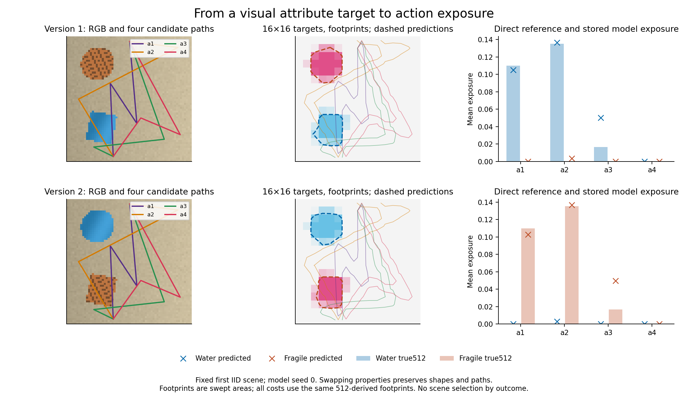
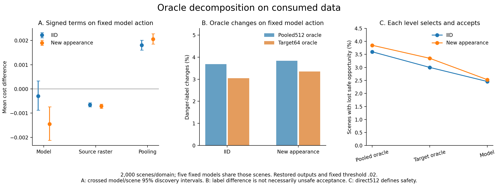
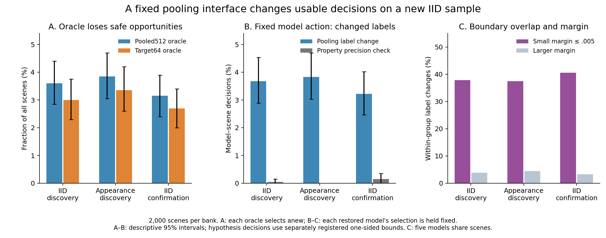
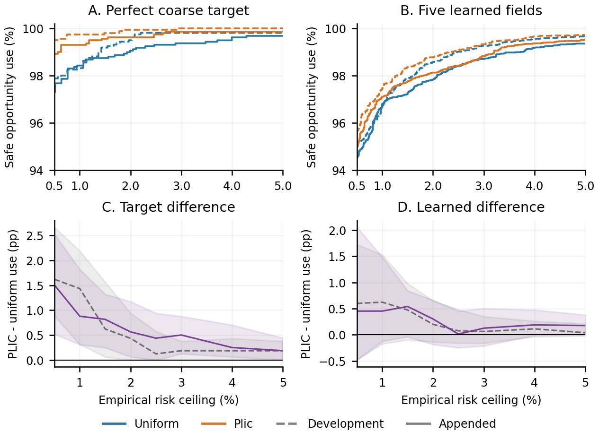

# When Perfect Coarse Predictions Are Not Enough for Action Evaluation

**Working manuscript, 12 September 2026.** Same-reference oracle discovery,
one prospective IID confirmation, the same-information intervention, and the
full-threshold comparison and a later separately frozen input-by-operator test
are complete. The score-superiority continuation screen remains failed; the new
interaction prediction is supported on its own independent bank. This version
remains a controlled diagnostic case study. The ICLR 2027 LaTeX working draft has nine main-text
pages; it has not been submitted. This remains a controlled study,
not a claim of universal prevalence.
The initial RELLIS-3D corridor construction does not pass its geometry qualification
screen and contributes no confirmed external mechanism result. ICLR 2027 is the
target under consideration; authorship and human review remain to be finalized.
This draft supersedes the earlier method-centered narrative;
the original manuscript and frozen reports remain unchanged.

## Abstract

We present a controlled diagnosis of a learned spatial-decision pipeline with two
attribute fields, four candidate footprints, and a public exposure-to-cost law.
Common-reference oracle replacements distinguish supervision-fit, source-raster,
and uniform-cell aggregation errors. One prospective 2,000-scene IID confirmation
finds 61 numerically stable safe-opportunity losses under separate pooling;
perfect prediction of the actual coarse target still loses 54 opportunities.
At fixed model-selected actions, pooling changes 3.22% of danger labels versus
0.15% for a fixed-footprint numerical check. Observed changes are conservative
and concentrate at overlapping boundaries and small margins. Retrospective
interventions then test the interpretation of this loss. An established
area-preserving reconstruction recovers 44 target-oracle opportunities but adds
16 unsafe accepts. Complete score-threshold families under identical empirical
risk ceilings give clearer gains for exact targets than for learned fields.
The complete threshold comparison does not establish stable learned superiority.
A later actual input-field by aggregator intervention freezes a separate
prediction: the reconstruction's safe-accept gain is attenuated with learned
rather than exact-target input. On one independent 2,000-scene bank, the contrast
is −2.16 percentage points of all scenes, with one-sided 95% upper bound −1.64,
supporting the fixed prediction. Full-cohort accounting distinguishes oracle
associations and algebraic residual substitutions from actual module interventions.
The evidence supports a case-specific attribution and a tested input–operator
interaction, while leaving deployment prediction and general decoder selection open.

## 1. Introduction

An action-conditioned visual cost is an interface between perception and a
decision rule. Its usefulness depends on more than average prediction error:
which actions are considered, which target defines danger, which errors a bound
must cover, and when a decision is accepted all matter. If these choices remain
implicit, a failure at the interface can be attributed to the learning component
that happens to precede it.

Our motivating case arose in a procedural visual risk study. Repairing a
position–attribute shortcut substantially improved decision ranking. Nevertheless,
adding a scene-level calibrated upper bound yielded zero action acceptance.
Possible explanations included a lack of feasible candidates, persistent
one-sided perception error, discretization differences, and protection of
outcomes irrelevant to the deployed selector. They imply different research
decisions. Only some would motivate a more complex perceptual or learned cost
model; none can be identified from a ranking score alone.

The main question is how to distinguish a learner's failure to realize its
supervision target from the target's current aggregation failing to realize the
intended action measurement. The paper has two contributions:

1. **Common-reference pipeline diagnosis:** attribute fixed-pipeline cost errors to supervision fit, source rasterization and spatial aggregation.
2. **Controlled mechanism and decision evidence:** measure residual losses, prospectively check their operating conditions, and use same-information interventions, including a separately frozen independent input-by-operator test, to delimit repair interpretation.

The reconstruction is an explanatory intervention within this evidence, not a
separate validated decoder-selection contribution. General task-sufficiency
conditions and a rule for choosing decoders remain open.

The positive empirical finding is a spatial-interface error that survives
perfect supervision-target prediction, affects actual decisions, and follows
predictions tested on a new sample. This changes what a component-accuracy
improvement would establish: it would not, by itself, validate the exposure
measurement. Existing certification can nevertheless make an imperfect pipeline
useful under a stated distribution and rule. These distinctions support retaining
a simple model while diagnosing its measurement interface; they do not show that
a richer model could never compensate. Cross-task transfer remains untested after
the external measurement-interface qualification attempt was stopped.

## 2. Decision objects and the audit design

### 2.1 Pipeline and target

Let an image be x, a capability/rule card be k, and the four fixed candidate
footprints be F_a. A visual predictor produces two spatial property fields.
Their mean exposure along a footprint is e=(e_w,e_f). The public synthetic cost
is g(e,k): e_w for card A, zero for B, e_w+e_f−e_we_f for C, and e_f for D.
The nontrivial deployment mixture uses A/C/D. Ground truth follows this same
equation. A learned relation cannot discover an unknown law from labels defined
by the public equation; its possible contribution would instead be error
compensation under predicted exposure.

For a frozen selector aπ(x,k), let A indicate acceptance and let cπ be the true
selected cost. We report

\[
C=\Pr(A=1),\quad J=\Pr(A=1,c_\pi>\tau),\quad
R_{\rm sel}=J/C,
\]

and

\[
C_{\rm oracle}=\Pr(\min_a c(x,a,k)\leq\tau),\qquad
\eta=\frac{\Pr(A=1,c_\pi\leq\tau)}{C_{\rm oracle}}.
\]

Unsafe acceptance never contributes to η. Conditional risk is undefined when
C=0. The oracle is restricted to the supplied four candidates, and acceptance
is a static decision, not successful physical execution.

Four parameters have different meanings: τ=0.02 defines dangerous synthetic
cost; ε=0.05 bounds the desired accepted-decision unsafe frequency; δ=0.05 is the
family certification error budget; α=0.05 is the residual-bound miscoverage
level. Conflating these quantities changes the claimed guarantee.

### 2.2 Visual task and learning setup

The task is a top-down procedural image with two nonoverlapping patches,
assigned water and fragile-surface properties. Appearance families render water
with wave texture and fragile surfaces with crack texture while varying color,
floor appearance and illumination. Each continuous scene supplies two images
with the property assignments exchanged; shapes and candidate paths stay fixed.
This is a controlled visual-attribute task, not a natural-image hazard detector.
Four randomly drawn polylines share a start and goal on opposite sides of the
scene, with two interior waypoints each. Their swept-radius masks define the
spatial union to average over; repeated traversal of a pixel is not counted twice.
Candidates are generated independently of property values and are not guaranteed
to include a safe action.

| Component | Fixed implementation and available supervision |
|---|---|
| Image | 64×64 RGB, two visible property patches, rendered from the source-64 fields |
| Predictor | Randomly initialized ResNet-18; four lateral 1×1 projections to 64 channels, bilinear top-down fusion, 3×3 refinement and a two-channel 1×1 output |
| Output / target | Two 16×16 sigmoid fields; area-pooled binary property masks from the training source raster |
| Loss | Mean binary cross entropy with logits plus soft Dice loss, on spatial properties only |
| Training | 800 images (one variant per scene), 24 epochs, batch 20, 960 AdamW steps, learning rate .001 and weight decay .0001; final checkpoint |
| Augmentation | Saturation, polarity, contrast, per-channel gain, brightness and channel permutations; geometry unchanged |
| Action input | Four supplied continuous polylines with radius .05–.10 in normalized scene coordinates; no learned planner |
| Cost / supervision access | Public A/C/D formula; model learns property fields, without high-resolution action-cost labels or candidate-conditioned training |
| Evaluation reference | Direct mean of property × footprint at 512; each coarse evaluation uses the same reference-derived footprint |

The geometry experiment varies source-48 versus source-64 targets with identical
RGB. The new oracle decomposition uses the five fixed source-64 models. High-
resolution properties and oracle costs are privileged diagnostic information.

*Figure 1. The first IID discovery scene, fixed before result inspection, and
model seed 0. Left: the two rendered versions and the four candidate centerlines.
Middle: source64-to16 targets (cyan: water; magenta: fragile), coarse footprint
contours and dashed predicted .5 contours. Right: direct512 exposures and stored
model exposures for all candidates. Contours use a verified CPU replay; exposure
markers use the original stored predictions. This example is illustrative, not
selected for a favorable outcome.*

### 2.3 Guarantee objects

| Object | Score or event | What it protects |
|---|---|---|
| Entire matched scene pair | Maximum positive underestimation over two versions, three cards, four candidates | All 24 entries jointly |
| Current observation and card | Maximum over the four current candidates | Subsequent choice among those candidates |
| Fixed selected action | Positive underestimation of the actual selected candidate | A marginal selected-action upper bound |
| Accepted decisions | True danger among decisions accepted by a fixed rule | Conditional unsafe rate, given valid calibration assumptions |

A valid joint upper bound can protect a later choice among its candidates.
That flexibility has value. A smaller bound for a frozen selector has a narrower
purpose. Neither the failure of joint bounds to allow action nor the success of
selective risk certification is evidence that conformal prediction is incorrect.
Ordinary marginal coverage also does not automatically control conditional risk
after acceptance.

### 2.4 Evidence separation

The no-training audit uses five previously frozen independent-geometry models
and already consumed datasets; it is diagnostic. The geometry experiment uses
five new paired seeds in each of four conditions and fixed final checkpoints.
The acceptance confirmation then fixes all five independent-geometry/source-64
models before calibration. No best-performing seed is chosen. Fresh development,
calibration, and test scenes are disjoint, including an additional audit of
anonymous continuous geometry rather than scene IDs alone.

All experimental computation, checkpoint replays and figures run on Quest.
Source freezes and stage manifests preserve the distinction between prospective
comparisons and later presentation refinements. No new relation head, VLM
teacher, actor or critic is trained in this round.

## 3. How much risk change is a measurement change?

### 3.1 What separate pooling discards

For one property field P and footprint F, let a coarse cell B have weight w_B.
Write cell means as p_B and f_B. Direct exposure and separate-pooling exposure
use the same denominator D=∑_B w_B f_B:

\[
e_{\rm ref}=D^{-1}\sum_B w_B\overline{PF}_B,\qquad
e_{\rm pool}=D^{-1}\sum_B w_Bp_Bf_B.
\]

Subtracting gives the elementary identity

\[
e_{\rm pool}-e_{\rm ref}
=-D^{-1}\sum_B w_B\operatorname{Cov}_B(P,F).
\]

This is within-cell spatial covariance, not correlation across training scenes.
It vanishes when either binary property or footprint is constant in each cell.
With half-cell property and footprint occupancy, overlap and disjointness yield
true exposures 1 and 0 respectively, whereas separate means give .5 in both
cases. This illustration is not a frequency estimate or an impossibility result
for the restricted procedural generator. A model with additional geometric
information or useful shape priors might compensate for this error.

For a fixed candidate we distinguish direct512 exposure, separately pooled512
exposure, the actual source64-to16 supervision target under the common footprint,
and the learned prediction under that footprint. Their signed differences obey

\[
\hat e-e_{\rm ref}=(\hat e-e_{\rm target64})
+(e_{\rm target64}-e_{\rm pool512})
+(e_{\rm pool512}-e_{\rm ref}).
\]

The three terms are model error relative to supervision, source-raster difference,
and loss of within-cell spatial coincidence. We apply g separately at each level
before telescoping cost differences; for C, adding channel exposure errors is
not the nonlinear cost difference. Signed terms may cancel. Summing absolute
terms cannot attribute a percentage of the final error to each component.

Let Π replace each field by its coarse-cell mean. Because ΠP is cellwise constant,

\[
\int (\Pi P)(\Pi F)=\int (\Pi P)F.
\]

Thus a finer footprint or constant upsampling of the same coarse property cannot
repair this aggregator. A decoder may nevertheless infer boundary geometry from
neighboring fractions; the residual error is not automatically an irreducible
limit of the coarse information. Section 4 tests one such decoder.

The identity is basic mathematics. The empirical question is whether this loss
changes actual selection and acceptance under the normal generator and restored
outputs, beyond the reference's numerical sensitivity. Historical native/common
tables cannot answer it because they changed the footprints as well as fields.

### 3.2 Same-reference oracle decomposition on consumed data

We reconstruct the two already consumed E3 test banks (2,000 scenes each) and
use stored predictions from all five E2 independent/source-64 checkpoints. Each
scene retains its original deployed variant, A/C/D card and tie variate. No new
training, threshold tuning or recertification is performed. Every attribution
arm uses the same 512 footprint or its exact 32×32 block averages.

First we freeze each restored model's actual selected action and evaluate that
action at every level. Separately pooled512 oracle fields change its danger
label in 3.68% of model–scene decisions on IID and 3.83% on new appearance.
All observed changes at these selected actions are reference-safe to pool-danger.
Crossed model/scene discovery intervals are [2.89%,4.53%] and [3.03%,4.70%].
They preserve correlation across the five models; there are 2,000 independent
scenes per domain, not 10,000 independent trials.

The precision check holds the footprint fixed, rasterizes the properties at
1024 and pools them to 512 before integration. It changes the fixed-action
reference label in 0.05% of IID decisions and none on new appearance. Pooling
changes stable to this check remain 3.63% and 3.83%. This is a sensitivity check
for property discretization conditional on the fixed footprint, not an exact
continuum or footprint-accuracy guarantee.

Then each level chooses and accepts independently at .02; direct512 always
evaluates the chosen action's true cost. The coarse oracles still discard usable
opportunities after this permitted reselection:

| IID discovery: each level selects | Acceptance | Unsafe among accepted | Safe opportunity use η |
|---|---:|---:|---:|
| Direct512 oracle | 80.20% | 0% | 100% |
| Separately pooled512 oracle | 76.60% | 0% observed | 95.51% |
| Perfect source64 supervision-target oracle | 77.25% | 0.06% | 96.26% |
| Restored learned model | 78.58% | 1.07% | 96.93% |

The pooled oracle loses 3.60 percentage points of all-scene safe acceptance on
IID and 3.85 on new appearance. Perfect prediction of the actual supervision
target still loses 3.00 and 3.35 points. The learned model accepts more safe
opportunities but also more unsafe actions: this is not an unconditional
performance improvement over the oracle representation.

Signed cost terms on fixed selected actions are +.001807 (pooling), −.000653
(source raster), and −.000292 (model) on IID. On new appearance they are +.002060,
−.000714 and −.001453, giving mean total error −.000108 despite mean absolute
error .003102. Model and net measurement errors oppose one another in 31.52%
and 32.49% of decisions. These signed cancellations preclude interpreting
absolute component magnitudes as additive shares of decision error.

Before opening these discovery results, we define a small margin as pooled cost
within .005 of τ and boundary overlap as simultaneous fractional property and
footprint occupancy in a coarse cell relevant to the card. Among overlapping
selected actions, label-change rates are 37.84% versus 3.87% for small versus
larger margins on IID; on new appearance they are 37.45% versus 4.45%. No change
occurs without joint boundary overlap, as the covariance identity requires for
binary fields. That zero is an algebraic check, not an independent discovery.
The empirical concentration and conservative direction motivate a prospective
test, rather than a claim that the elementary identity is novel theory.

*Discovery on consumed E3 test data, using the five E2 models. Fixed-selection
label comparisons and each-level reselection metrics are distinct analyses.
Exact per-model counts and signed exposure/channel decompositions are retained
in the supplement.*

### 3.3 One prospective confirmation of the predicted decision effect

After discovery, we freeze a single new IID bank of 2,000 scenes, the five
existing source-64 checkpoints, the original candidate generator and tie rule,
and three predictions. There is no new training. Anonymous continuous shape
and complete-scene identities have no exact overlap with the 10,200 E2/E3 scenes.
This is new data under the same normal generator, not an external-task test.

The predictions require (i) a stable-reference lost-opportunity probability
above .01 for the pooled oracle; (ii) more than .90 of fixed-selected pooling
label changes to be conservative; and (iii) more than .10 enrichment of label
changes in small- versus larger-margin overlapping-boundary actions. Each
one-sided claim uses γ=.05/3 (distinct from residual miscoverage α). The first uses an exact binomial bound; the third
uses an approximate crossed model/scene bootstrap with five model seeds.

A recorded strengthening after job submission but before any fresh outcome was
inspected adds an exact scene-level check for direction: conditional on a scene
having any selected-action change across the five models, every change in that
scene must be conservative. This avoids treating a degenerate zero-counterexample
bootstrap as proof of a population fraction of one. The original protocol and
outputs remain available; Appendix C records the timing and different estimands.

| Prospective prediction | Fresh observation | One-sided lower bound | Frozen criterion |
|---|---|---:|---:|
| Stable-reference lost safe opportunities | 61/2,000 scenes | 2.29% | >1% |
| All selected-action changes conservative within a changed scene | 68/68 changed scenes | 94.16% | >90% |
| Small-minus-larger margin label-change rate | 40.57% − 3.26% = 37.31 pp | 26.06 pp | >10 pp |

The pooled oracle loses 63/2,000 safe opportunities before the precision
restriction (3.15 pp); perfect source64 supervision-target prediction loses
54/2,000 (2.70 pp). Direct512 accepts 1,592 safe scenes; the pooled oracle accepts
1,529 with no unsafe outcome observed. The target oracle accepts 1,540, of which
two are unsafe. These observed zero/two counts are not new risk certificates.
The learned restored model has empirical unsafe rate 1.03% and η=96.77% in this
new bank; the separately established E3 certificates are not recalibrated here.

At fixed restored-model actions, 322/10,000 model–scene decisions change label
under pooling (3.22%, descriptive crossed 95% interval [2.47%,4.02%]). The 10,000
decisions share only 2,000 scenes. All observed changes are conservative; 312
remain when the finer-property check agrees with the reference label. The same
check changes only 15 fixed-action labels (0.15%). Across all nontrivial candidate
entries its p95 cost difference is .000509, passing the frozen numerical screen.

*The last bank was generated after the hypothesis freeze. All arms use a common
512 footprint; A permits each oracle to select anew, whereas B–C hold each
restored model's selection fixed. C conditions on joint boundary overlap. Figure
intervals are descriptive; the table uses the registered one-sided comparisons.*

This supports the predicted mechanism in the normal procedural distribution.
It does not isolate a universal direction of pooling error: the algebra permits
both signs, and selection changes which spatial configurations are observed.
It also does not establish a general information-theoretic impossibility for
models receiving richer inputs. The practical conclusion is narrower: making
this coarse supervision target exact does not remove its downstream decision
error, so component fidelity alone is an inadequate diagnosis of the bottleneck.

## 4. Same-information interventions and their limits

The consumed IID discovery and appended banks each contain 2,000 scenes. Perfect
source64-to16 fractions and all five existing learned fields receive the same
F512 action information. One fixed Parker–Youngs PLIC reconstruction estimates
normals from the coarse 3×3 neighborhood, conserves each cell fraction, and
integrates exact fine-square fractions. It receives no true property geometry,
fine property labels, or oracle normals. Zero-gradient cells stay uniform.

At the original .02 acceptance threshold, target PLIC recovers 44/54 safe
opportunities but adds 16 unsafe accepts; learned PLIC recovers 83 model–scene
opportunities and adds 43 unsafe accepts. No previously accepted safe opportunity
is newly lost on this bank. Conditional unsafe frequency rises .13%→1.13% for
targets and 1.03%→1.56% for learned fields. The original frozen scalar shift
recovers six target cases with three new unsafe accepts, and its shared learned
shift is zero. Its development unsafe-count constraint was not imposed on PLIC;
these selected points do not compare the capacity of the whole score families.

The newly accepted subsets have unsafe fractions 16/(44+16)=26.7% and
43/(83+43)=34.1%. These are retrospective subset descriptions, not risk among all
accepts or violations of the earlier 5% requirement. Large existing safe counts
can coexist with much higher danger among marginal additions.

### 4.1 Complete threshold families under identical empirical risk ceilings

Any global shift of a score is equivalent to an acceptance-threshold change.
The final analysis scans every distinct score of both operators, with exact ties
entering together. Truth remains reference cost >.02. The primary comparison
fixes the uniform-selected action and its truth; the secondary allows each
operator's selector to choose once. The pooled learned curve uses one shared
threshold across all five models, and all individual-model curves are retained.

For each ceiling, both operators maximize safe accepts among all thresholds with
empirical conditional unsafe frequency below that ceiling. Ties prefer fewer
unsafe accepts, then a smaller threshold. Conditional risk can be nonmonotonic,
so the complete family is scanned. Reject-all has undefined risk. These are
outcome-selected empirical envelopes on consumed labels, not out-of-sample
operating rules or certificates. Discrete attained risks can differ even under
the same ceiling; no randomization interpolates an exact risk match.

| Input, appended bank | Risk ceiling | Uniform η | PLIC η | Difference (pp) | Descriptive 95% interval (pp) |
|---|---:|---:|---:|---:|---|
| Perfect target | 1% | 98.43% | 99.31% | +.88 | [.31,1.82] |
| Learned | 1% | 96.66% | 97.11% | +.45 | [−.13,1.49] |
| Learned | 2% | 97.83% | 98.13% | +.30 | [−.19,.66] |
| Learned | 3% | 98.71% | 98.83% | +.13 | [−.22,.50] |
| Learned | 5% | 99.36% | 99.54% | +.18 | [.00,.38] |

*Primary fixed-action analysis. Upper panels show empirical envelopes; lower
panels show PLIC-minus-uniform differences. Both banks are consumed. Pointwise
paired bootstrap intervals preserve shared scenes and resample model indices
in the learned track; they do not remove selection optimism or provide a
simultaneous risk guarantee.*

Exact-target gains are clearer at low risk ceilings. Learned point estimates
are positive at all eight displayed ceilings, but intervals cross zero at every
.5–4% ceiling on both banks. Neither equivalence nor a stable learned advantage
is established. Complete raw paths, all eight ceilings, reselected analyses,
per-model curves and development-selected thresholds applied unchanged to the
consumed appended bank are preserved in the full report.

The operational continuation screen was fixed before reading the full curves,
while acknowledging prior use of both banks. It required at least three
consecutive ceilings spanning one percentage point within .5–3%, with a learned
η gain of at least .5 pp, positive interval lower bound, and positive differences
for at least four models, on both banks. No point meets all conditions. This is
a work-stopping convention, not a preregistered scientific test. That comparison
produces no score-superiority follow-up. The later independent intervention
question below is separately frozen and does not change this stopping decision.

### 4.2 Full-cohort accounting

The original 25/43 pattern is conditional on newly unsafe outcomes. On all
10,000 appended model–scene entries, 2,335 improve both absolute residual
components; 580 of these worsen total absolute error, and 25 become newly
unsafe. This separates a continuous-error event from a threshold crossing.

Among original rejections, opposition flags 1,025 cases, with 38 newly unsafe;
the unflagged count is 5/1,192. Fixed model/card/direction and coarsened predicted
margin/correction standardization gives a 1.66 pp harm-rate difference [.34,2.33]
on the consumed appended bank, versus .35 pp [−.36,1.15] on development. In the
later independent secondary analysis it is 1.35 pp [.00,2.01], with counts
47/1,085 versus 3/1,171. All definitions and bins were fixed before that bank.
These results do not establish a uniformly conclusive association, a causal
share or a deployment predictor: the opposition flag requires reference labels.

Algebraic scores holding one residual fixed sharpen the accounting. On the
consumed appended bank, replacing only the measurement residual gives 113 newly
unsafe accepts, replacing only the model-relative residual gives zero, and full
PLIC gives 43. The model-relative change removes 71 of the measurement-only
new harms, while one full new harm requires both changes. Of those hybrid
measurement-only scores, 1,655 leave [0,1]; they are not admissible module outputs
or candidate methods. This distinction prevents scalar bookkeeping from being
presented as independent physical-module causation.

### 4.3 Actual input-field × aggregator intervention and one independent prediction

The four scores t0/t1 (target uniform/PLIC) and q0/q1 (learned uniform/PLIC) are
actual outputs of the two unchanged operators applied to the two valid fields.
All use the same original learned-uniform-selected action, card and reference.
For safe-accept indicator S, the interaction is

I = [S(q1) − S(q0)] − [S(t1) − S(t0)].

The consumed development/appended interactions are −1.88/−1.45 percentage
points of all model–scene entries. A later, separately frozen protocol tests
E[I] < −.005 on one new 2,000-scene bank, averaging the five fixed models within
each independent scene. Protocol, code and checkpoint hashes precede generation;
exact anonymous identity checks find no overlap with the earlier 12,200 scenes.
Baseline scores and oracle flags are saved before PLIC computation.

| Actual input and aggregator, independent bank | Accepted | Safe accepted | Unsafe accepted |
|---|---:|---:|---:|
| Target uniform | 7,567 | 7,567 | 0 |
| Target PLIC | 7,964 | 7,868 | 96 |
| Learned uniform | 7,744 | 7,656 | 88 |
| Learned PLIC | 7,878 | 7,741 | 137 |

The PLIC safe-accept gain is 3.01 pp with target input and .85 pp with learned
input. Their interaction is **−2.16 pp**, with one-sided 95% bootstrap upper
bound **−1.64 pp**, below the frozen −.5 pp criterion. The finer-property/fixed-
footprint sensitivity gives −2.07 pp, upper −1.55 pp; numerical label disagreement
is .04583%, and p95 cost difference .000512. The single independent prediction
is supported, conditional on this fixed model bank and generator.

This is a computational input–operator interaction at fixed actions and score
threshold, not an equal-risk deployment advantage or a generally useful decoder
rule. It leaves the earlier failed score-superiority screen unchanged. No further
bank follows this test. Independent replay verifies 10,000 scalar records,
50,000 score values, the primary bootstrap, reference/PLIC recomputation and
80 fixed-model image predictions.

## 5. Supporting learning and decision-rule controls

The earlier geometry×source-raster study trains 20 fixed-budget models. Under
common scoring, independent geometry improves new-appearance regret at both
source sizes: crossed intervals [.003101,.006853] and [.002850,.017690], each
exceeding the predeclared .001 threshold. This supports a genuine learning-related
geometry effect, while the joint intervention does not isolate position alone.

| Earlier bank and rule | Acceptance | Unsafe among accepted | η |
|---|---:|---:|---:|
| E1 appearance: inherited −2 | 85.03% | 4.70% | 99.63% |
| E1 appearance: same weights restored | 80.97% | 1.73% | 97.83% |
| E3 IID: restored, fixed .02 | 78.58% | 1.07% | 96.93% |
| E3 IID: selected certified threshold | 81.29% | 2.51% | 98.82% |
| E3 IID: joint residual protection | 0% | Undefined | 0% |

E1 uses historical models and consumed diagnostics; E3 uses the five E2
independent/source64 models and new certification/test banks. Their detailed
quantiles, sample counts and checks are in Appendix D. A joint q>τ necessarily
rejects nonnegative costs; conditional risk control serves a different purpose.
The fixed E3 baseline already passes its original certificate/usefulness screen,
using established Learn then Test [3]. This makes an imperfect pipeline useful
under a stated rule, without validating the upstream measurement or supplying
certificates for the appended PLIC/shift rules.

## 6. External evidence boundary

An attempted real-image extension was stopped before mechanism evaluation
because the proposed geometric reference lacked independently validated error
bounds. It therefore supplies neither supporting nor refuting evidence for
cross-task transfer. The initial 24-frame interface screen and the subsequent
early prerequisite stop are documented in [Appendix A](appendix.md). The planned
new 48-frame set was never instantiated; this is not a 0/48 mechanism result.
The external extension is closed.

## 7. Related work and the remaining diagnostic question

VOF reconstruction [9] estimates material interfaces from neighboring cell
fractions. Pilliod and Puckett compare reconstruction accuracy, including the
first-order Parker–Youngs method. This establishes why uniform-cell failure
cannot identify the limits of every decoder. Our remaining question is what
happens when that intervention acts on learned fractions and thresholded action
queries. The exact-target and learned curves separate those outcomes in this
case; they do not characterize the whole VOF family.

Lambda-Field [10] constructs an occupancy representation and path-risk
calculation consistent with its collision-event model. Our mean-exposure law
is different and held fixed. We ask how to attribute a given pipeline's error
to learning, source rasterization and aggregation under a common footprint.
This is a diagnostic protocol and case, not a new physical-risk representation
or evidence that Lambda-Field suffers the measured error.

Task-based quantization [11] studies downstream estimation under limited-rate
representation and joint-design constraints; Smart Predict, then Optimize [8]
relates prediction and decision loss. Our continuous coarse fractions are spatial
averages, not the same finite-bit quantization model. We isolate a specific
spatial error and its interaction with learned errors under fixed queries.
General task-sufficiency conditions and a validated decoder-choice principle
remain open. Egocentric Conformal Prediction [1], Conformal Decision Theory [2]
and Learn then Test [3] likewise motivate distinguishing the validity of the
measurement from the object protected by the statistical guarantee.

## 8. Limitations, reproducibility, and conclusion

The controlled task uses synthetic properties and a known cost law. Numerical
reference stability is empirical, and the finer-property comparison conditions
on the same footprint. The appended reconstruction/shift comparison reuses consumed data and has no new
certificate. Its selected points have different risks; it cannot show a matched-risk
deployment advantage. One PLIC implementation cannot characterize every decoder.
Oracle boundary/margin features use privileged labels
and are not a deployable image-only detector. The direction check conditions on
five fixed models; crossed bootstrap inference has only five training seeds.
The four-candidate oracle is restricted,
and no static acceptance result measures physical task completion. The
geometry intervention changes multiple geometric factors. Diagnostic datasets
have been consumed; fresh tests supply confirmation only for their frozen
protocols. Statistical certificates depend on the stated distribution and
sampling assumptions. The external construction fails its initial observability
screen and supplies no confirmed cross-task mechanism result.

Reproduction details and independent numerical checks appear in
[Appendix B](appendix.md); the frozen experiment reports are retained.

In this controlled case, making a spatial supervision target exact does not
make the downstream exposure exact. A common-footprint oracle decomposition
identifies a separate-pooling effect that changes usable decisions, predicts
conservative boundary/margin failures, and survives one prospective confirmation.
Learning and source-raster errors can offset part of this measurement bias,
which makes aggregate accuracy an unreliable attribution tool. Earlier
experiments show that geometric learning improvements, fixed postprocessing and
the scope of risk protection also affect behavior. An imperfect component can
still be useful under an established risk-control procedure; that does not
validate every upstream measurement choice. Cross-task mechanism transfer
remains unestablished, and the external extension is closed. Complete threshold
families under identical empirical risk ceilings give clearer exact-target
gains, but no stable learned advantage across the inspected range. The earlier
score-superiority continuation screen fails. A later independently confirmed
input–operator interaction adds a precise computational response prediction.
This supports a controlled diagnostic case study;
it does not establish a generally useful decoder-selection principle.

## References

1. Jaeuk Shin, Jungjin Lee, and Insoon Yang. *Egocentric Conformal Prediction for Safe and Efficient Navigation in Dynamic Cluttered Environments.* 2025. [Primary paper](https://arxiv.org/html/2504.00447v1).
2. Jordan Lekeufack, Anastasios N. Angelopoulos, Andrea Bajcsy, Michael I. Jordan, and Jitendra Malik. *Conformal Decision Theory: Safe Autonomous Decisions from Imperfect Predictions.* ICRA, 2024. [Primary paper](https://arxiv.org/html/2310.05921v3).
3. Anastasios N. Angelopoulos, Stephen Bates, Emmanuel J. Candès, Michael I. Jordan, and Lihua Lei. *Learn then Test: Calibrating Predictive Algorithms to Achieve Risk Control.* [Primary paper, Section 3.2](https://arxiv.org/html/2110.01052v5).
4. Anushri Dixit, Zhiting Mei, Meghan Booker, Mariko Storey-Matsutani, Allen Z. Ren, and Anirudha Majumdar. *Perceive With Confidence: Statistical Safety Assurances for Navigation with Learning-Based Perception.* [Primary paper](https://arxiv.org/html/2403.08185v2).
5. Peng Jiang, Philip Osteen, Maggie Wigness, and Srikanth Saripalli. *RELLIS-3D Dataset: Data, Benchmarks and Analysis.* [Paper](https://arxiv.org/abs/2011.12954), [official data and baseline implementation](https://github.com/unmannedlab/RELLIS-3D/tree/c17a118fcaed1559f03cc32cc3a91dedc557f8b8).
6. Pang Wei Koh et al. *Concept Bottleneck Models.* ICML, 2020. [Primary paper](https://proceedings.mlr.press/v119/koh20a.html).
7. Robert Geirhos et al. *Shortcut learning in deep neural networks.* Nature Machine Intelligence, 2020. [Primary article](https://www.nature.com/articles/s42256-020-00257-z).
8. Adam N. Elmachtoub and Paul Grigas. *Smart "Predict, then Optimize".* [Primary paper](https://arxiv.org/abs/1710.08005v5).

9. James Edward Pilliod Jr. and Elbridge Gerry Puckett. *Second-order accurate volume-of-fluid algorithms for tracking material interfaces.* Journal of Computational Physics 199(2), 465–502, 2004. [Primary article](https://doi.org/10.1016/j.jcp.2003.12.023).
10. Johann Laconte et al. *Lambda-Field: A Continuous Counterpart of the Bayesian Occupancy Grid for Risk Assessment.* IROS, 2019. [Primary paper](https://arxiv.org/abs/1903.02285).
11. Nir Shlezinger, Yonina C. Eldar, and Miguel R. D. Rodrigues. *Asymptotic Task-Based Quantization With Application to Massive MIMO.* IEEE Transactions on Signal Processing 67(15), 3995–4012, 2019. [Primary paper](https://www.weizmann.ac.il/math/yonina/sites/math.yonina/files/2022-01/08736805_asymptotic%20task%20based.pdf).

## Supplement and artifact entry points

- [Nine-page ICLR-format manuscript source](iclr2027/main.tex) and [appendix](iclr2027/appendix.tex).
- [Full-cohort accounting and independent input–operator test](../../research/cancellation_audit_20260912/README.md).
- [Final full-threshold comparison, raw curves and stop decision](../../research/matched_risk_revision_20260912/README.md).
- [Same-information control: protocol, full events, freezes and verification](../../research/same_information_reconstruction_20260912/README.md).
- [New oracle study: protocols and reproduction](../../research/oracle_aggregation_20260912/README.md).
- [Discovery and prospective confirmation tables](../../research/oracle_aggregation_20260912/artifacts/final_publication/TABLES.md).
- [Supplementary scientific details](appendix.md).

- [Frozen three-experiment protocol and reproduction](../../research/pro_decision_round_20260912/README.md).
- [Detailed tables, certificates and supplementary figures](../../research/pro_decision_round_20260912/artifacts/publication/PAPER_ADDENDUM.md).
- [Machine-readable decision](../../research/pro_decision_round_20260912/artifacts/final_report/DECISION.json).
- [Independent verification](../../research/pro_decision_round_20260912/artifacts/final_report/VERIFICATION.json).
- [RELLIS-3D qualification protocol](../../research/rellis_external_20260912/qualification_protocol.json).
- [Bounded measurement-interface revision](../../research/rellis_revision_20260912/revision_protocol.json).
