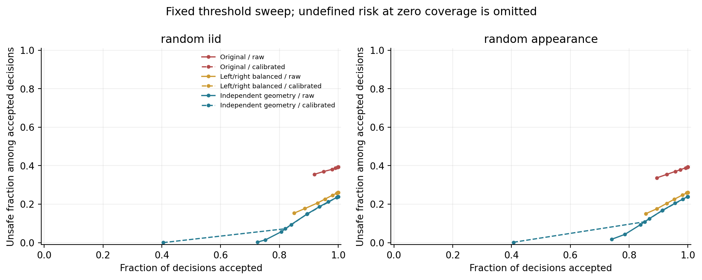

# Prospective follow-up: independent geometry, five seeds, and risk calibration

Companion to *Compositional Visual Risk Under Property Interventions*. Executed entirely on Quest on 2026-09-12.

## Study status and primary result

The predeclared joint confirmation claim **passes**. On random geometry with new appearance families, original minus left/right-balanced regret is 0.016017 (crossed seed-and-scene 95% interval [0.014060, 0.018157]). The upper interval endpoint for the balanced model's false-safe increase is -0.1901; the preregistered maximum increase was 0.01. The claim required both positive regret reduction and this guard.

This is a prospectively frozen procedural component study, following an adaptive pilot. It is not an independently administered robotics benchmark or a formal C3-Safe gate. Secondary contrasts below are descriptive, without multiplicity correction.

## Generator and controls

Each random scene has two anonymous, nonoverlapping visible patches. Position, size, rotation, and shape are sampled before a separate random property assignment. Four exchangeable paths use an independent random stream, common endpoints on opposite boundary sides, and two random interior waypoints. No rejection condition examines exposure, candidate rank, or desired action. A separate stream permutes candidate order. Paths can avoid both properties, and target ties remain in the dataset. The property intervention swaps visible property textures and target channels while retaining geometry, footprints, family, background noise, and cards. This samples factors independently subject to explicit nonoverlap/visibility constraints; it does not establish causal independence of learned features.

New masks and footprints are rasterized at 64x64 and area-pooled to 16x16; the RGB input is 64x64. Target cost uses mean exposure on these low-resolution arrays. The separate legacy-regression set retains the original 48x48 generator. Neither target is a physical-contact or q95 safety measure. The held-out shapes are diamonds and superellipses; training shapes are ellipses and boxes. The two new appearance families are amber_ice_v1 and rose_moss_v1, using the existing procedural renderer.

Three visual recipes use the same captured ResNet-18, loss, augmentation, optimizer, model seeds, 800 training and 100 validation images, and 24-epoch ceiling. The balanced recipe swaps half the original train and validation images; the independent recipe changes both training and validation geometry/property distributions. These are data-distribution comparisons, not isolated loss ablations. Early stopping is allowed by the shared recipe, so actual optimizer steps are recorded separately.

The learned relation heads reuse frozen historical checkpoints and receive exactly the formula arm's predicted exposures. The no-RGB spatial mean is estimated from each recipe's training targets and pooled along the legitimate query footprint. Cards-only assigns all candidates the same per-card value. Image shuffle uses the next scene's predicted field with the queried scene's footprints. All visual training is simulator supervised; no teacher call or actor training was performed.

## Metrics and sampling units

Primary regret and false-safe metrics average the nontrivial cards A/C/D; the zero-cost B card remains in raw arrays but is excluded from reported coverage and primary aggregates. This differs from the pilot's all-four-card regret. False-safe uses target cost >0.02 and predicted cost <=0.02. Pair correctness requires a unique optimum separated by at least 0.002 in each variant, and a changed optimal candidate. Ties in predictions are resolved uniformly in expectation. All unqualified pairs still contribute to ordinary regret, false-safe, and coverage.

Each of the three random tests contains 600 scene pairs; legacy regression contains 200. These are 2,000 pairs and 4,000 unique test images, evaluated by 15 models, not 60,000 independent scenes. Calibration has 300 separate scene pairs. The bootstrap independently resamples five paired training seeds and scene pairs 5,000 times, preserving both variants, all cards/candidates, and recipe pairing. Conditional scene-only intervals and individual seeds are also retained. Five seeds give limited precision for the distribution of newly trained models.

## Main results

| Test | Recipe | mIoU | Regret A/C/D | False-safe | Both correct on eligible pairs | Eligible card pairs |
|---|---|---:|---:|---:|---:|---:|
| random_iid | Original | 0.0838 | 0.023117 | 64.62% | 2.09% | 220 |
| random_iid | Left/right balanced | 0.3619 | 0.006763 | 35.04% | 71.45% | 220 |
| random_iid | Independent geometry | 0.8716 | 0.000215 | 6.03% | 95.82% | 220 |
| random_appearance | Original | 0.1013 | 0.020724 | 58.29% | 0.89% | 224 |
| random_appearance | Left/right balanced | 0.3900 | 0.004707 | 34.08% | 76.07% | 224 |
| random_appearance | Independent geometry | 0.8049 | 0.000348 | 9.85% | 97.77% | 224 |
| shape_appearance | Original | 0.1187 | 0.013626 | 55.72% | 0.91% | 154 |
| shape_appearance | Left/right balanced | 0.4153 | 0.003490 | 32.89% | 82.08% | 154 |
| shape_appearance | Independent geometry | 0.8051 | 0.000223 | 10.29% | 96.36% | 154 |
| legacy_regression | Original | 0.3213 | 0.022621 | 2.76% | 0.00% | 398 |
| legacy_regression | Left/right balanced | 0.9398 | 0.000831 | 2.65% | 90.40% | 398 |
| legacy_regression | Independent geometry | 0.9321 | 0.000897 | 2.66% | 90.90% | 398 |

Eligible counts describe the common scenes per model and are not multiplied by five. Counts and conditional metrics are retained for every seed in SUMMARY.json. Legacy-regression entries above average original and swapped layouts; the following table isolates the original layout to expose regression.

| Recipe | Original legacy-layout mIoU | Original legacy-layout regret |
|---|---:|---:|
| Original | 0.9446 | 0.000813 |
| Left/right balanced | 0.9364 | 0.000850 |
| Independent geometry | 0.9302 | 0.000917 |

## Same-perception composition and nonvisual controls

The following values use random_appearance. They assess this known synthetic cost equation, not the necessity of learning relations for unknown physical interactions.

| Recipe | Formula regret | Learned no-CF regret | Learned CF regret | No-RGB mean regret | Shuffled RGB regret | Cards-only regret |
|---|---:|---:|---:|---:|---:|---:|
| Original | 0.020724 | 0.018186 | 0.020185 | 0.046955 | 0.048594 | 0.054556 |
| Left/right balanced | 0.004707 | 0.005450 | 0.004815 | 0.045278 | 0.049980 | 0.054556 |
| Independent geometry | 0.000348 | 0.000366 | 0.000348 | 0.041119 | 0.051156 | 0.054556 |

## Calibration and risk-coverage

After exporting each checkpoint, we compute one positive underprediction score per calibration pair, maximizing over both images, all four actions and A/C/D. A fixed 5% level uses order statistic ceil(301*0.95)=286 of 300 scores. The resulting nonnegative offset is added to each predicted nontrivial cost before clipping to [0,1]. Calibration is persisted before opening test arrays. This is a split-conformal construction applied to a pair-block maximum score; its marginal coverage interpretation requires exchangeability with calibration, and is only intended for random_iid. No coverage guarantee is asserted for appearance shifts, new shapes, or legacy layouts. The construction follows [Angelopoulos and Bates](https://arxiv.org/html/2107.07511v6); the pair-block score is our application of that framework.

A decision is accepted if its minimum estimated upper cost is no more than the displayed threshold. At threshold 0.02, conditional unsafe rate measures target cost >0.02 among accepted decisions. Zero acceptance produces an undefined conditional rate, never a zero-risk success. Adding a common offset ordinarily preserves cost ranking; its purpose is to change acceptance. Clipping-induced ties use the same uniform rule.

| Test | Recipe | Raw coverage at .02 | Raw conditional unsafe | Calibrated coverage at .02 | Calibrated conditional unsafe | Pair upper-bound failure |
|---|---|---:|---:|---:|---:|---:|
| random_iid | Original | 97.89% | 38.08% | 0.00% | undefined (no acceptance) | 3.87% |
| random_iid | Left/right balanced | 93.00% | 20.63% | 0.00% | undefined (no acceptance) | 5.37% |
| random_iid | Independent geometry | 80.61% | 5.64% | 0.00% | undefined (no acceptance) | 5.97% |
| random_appearance | Original | 95.76% | 37.04% | 0.00% | undefined (no acceptance) | 2.97% |
| random_appearance | Left/right balanced | 92.84% | 20.45% | 0.00% | undefined (no acceptance) | 4.07% |
| random_appearance | Independent geometry | 83.86% | 9.32% | 0.00% | undefined (no acceptance) | 20.60% |
| shape_appearance | Original | 96.41% | 28.45% | 0.00% | undefined (no acceptance) | 1.13% |
| shape_appearance | Left/right balanced | 94.05% | 15.02% | 0.00% | undefined (no acceptance) | 1.43% |
| shape_appearance | Independent geometry | 87.69% | 6.46% | 0.00% | undefined (no acceptance) | 12.87% |

## Per-seed results and provenance

| Recipe | Seed | Epochs | Steps | Train seconds | Calibration offset | New-appearance regret | New-appearance false-safe |
|---|---:|---:|---:|---:|---:|---:|---:|
| Original | 20261011 | 24 | 960 | 14.3 | 0.281660 | 0.021289 | 59.74% |
| Original | 20261023 | 22 | 880 | 13.5 | 0.278421 | 0.021123 | 56.19% |
| Original | 20261037 | 24 | 960 | 14.4 | 0.287598 | 0.019339 | 55.65% |
| Original | 20261051 | 24 | 960 | 10.9 | 0.277679 | 0.019233 | 55.67% |
| Original | 20261069 | 24 | 960 | 12.3 | 0.291937 | 0.022637 | 64.22% |
| Left/right balanced | 20261011 | 24 | 960 | 12.4 | 0.238253 | 0.003398 | 28.15% |
| Left/right balanced | 20261023 | 24 | 960 | 11.6 | 0.252835 | 0.005765 | 38.72% |
| Left/right balanced | 20261037 | 24 | 960 | 11.6 | 0.252723 | 0.005368 | 37.11% |
| Left/right balanced | 20261051 | 24 | 960 | 10.8 | 0.241698 | 0.004161 | 33.61% |
| Left/right balanced | 20261069 | 17 | 680 | 8.1 | 0.243262 | 0.004844 | 32.81% |
| Independent geometry | 20261011 | 24 | 960 | 10.8 | 0.055415 | 0.000427 | 11.54% |
| Independent geometry | 20261023 | 24 | 960 | 10.9 | 0.049172 | 0.000400 | 9.88% |
| Independent geometry | 20261037 | 24 | 960 | 10.8 | 0.049085 | 0.000301 | 8.62% |
| Independent geometry | 20261051 | 24 | 960 | 10.8 | 0.051619 | 0.000342 | 10.39% |
| Independent geometry | 20261069 | 24 | 960 | 10.9 | 0.048715 | 0.000268 | 8.81% |

All 15 checkpoints and 208 manifest-listed data/run files were verified. An independent implementation reconstructed regret, false-safe counts, paired correctness, formula costs and coverage counts for every saved arm. Quest CPU replay checked 60 images across all checkpoints; GPU predictions remain the authoritative metric arrays. The preflight failure and retry logs are retained; both occurred before the prospective freeze and before study data generation.

Quest root: `/projects/p33100/siosio/hazard_independent_confirmation_20260912`. Protocol identity is retained in `FREEZE.json`; training histories, timestamps, calibration scores, raw fields, cost predictions and per-scene arrays are retained under each recipe/seed. The study does not modify protected historical sources, substitute simulated labels for VLM labels, or turn static candidate results into closed-loop safety claims.
